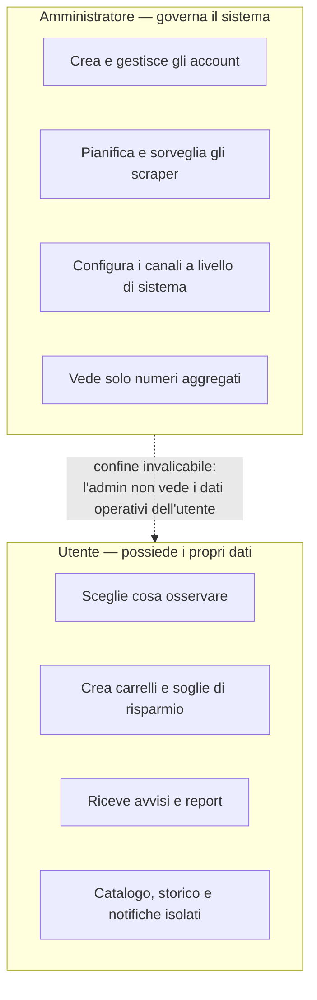

# Personas e ruoli

> **Layer 1 — Business** · Audience: tutti · Solo testo descrittivo.

Il sistema conosce due soli ruoli, con responsabilità nettamente separate. La separazione è una scelta deliberata: l'amministratore governa il sistema, l'utente governa i propri dati, e i due ambiti non si sovrappongono.

## L'utente

È la persona che vuole essere avvisata quando conviene comprare. Le sue responsabilità:

- **Decidere cosa osservare**: configura, per ogni sito supportato (scraper), i prodotti o le categorie da monitorare. Lo fa dalle pagine dedicate di ciascuno scraper.
- **Organizzare i carrelli**: raggruppa i prodotti del proprio catalogo in carrelli, imposta soglie di risparmio e sceglie quali tipi di avviso ricevere per ciascun carrello.
- **Decidere quando e come essere avvisato**: sceglie i giorni della settimana e l'orario delle notifiche, configura i propri canali di consegna personali (es. il proprio indirizzo email, il proprio canale Discord) e può attivare un report periodico riepilogativo.
- **Consultare**: storico prezzi, storico delle notifiche ricevute, stato dei carrelli.

L'utente vede **solo i propri dati**: catalogo, carrelli, notifiche e storici sono personali e isolati da quelli degli altri utenti.

## L'amministratore

È la persona che ospita e governa l'installazione (spesso coincide fisicamente con uno degli utenti, ma con un account separato). Le sue responsabilità:

- **Gestire gli utenti**: crea gli account (non esiste auto-registrazione), assegna i ruoli, disabilita gli account, reimposta le password.
- **Governare gli scraper**: decide **quante volte al giorno** e **a che ora** gira ciascuno scraper (orari indipendenti, esecuzione uno alla volta) e i limiti di "buona educazione" verso i siti osservati (il sistema non deve mai martellare un sito di richieste).
- **Sorvegliare il lavoro**: per ogni scraper vede statistiche di esecuzione — durata, prodotti trovati, variazioni rilevate, errori — e un registro degli eventi di sistema in tempo quasi reale.
- **Configurare i plugin a livello di sistema**: i parametri condivisi di scraper e notifier (es. il server di posta in uscita per le email) sono responsabilità dell'admin; ogni utente aggiunge poi i propri parametri personali.
- **Manutenzione**: pulizia degli storici per data, parametri operativi globali.

Per scelta di progetto l'amministratore **non accede ai dati operativi degli utenti**: non vede i loro carrelli né il contenuto delle loro notifiche. Può applicare regole di pulizia globali (per data) senza leggere i contenuti.

## Ruoli e account

- Un account ha esattamente un ruolo: `admin` oppure `user`.
- Un admin che voglia anche monitorare prezzi per sé usa **un secondo account** con ruolo `user`. Questa separazione mantiene semplici sia il modello dei permessi sia l'interfaccia.
- Al primo avvio il sistema crea l'account amministratore iniziale; gli utenti vengono creati dall'admin con password temporanea, da cambiare obbligatoriamente al primo accesso.

## Audience della documentazione (oltre i ruoli applicativi)

Questa documentazione serve anche figure che non usano l'applicazione ma ci lavorano sopra: lo **stakeholder** (Layer 1), l'**architetto software** e il **system engineer** (Layer 2-3), il **DevOps** ([infrastructure/](../infrastructure/)), il **developer** (Layer 4, [developer-rules/](../developer-rules/)) e il **plugin developer** ([plugin-development/](../plugin-development/)).
