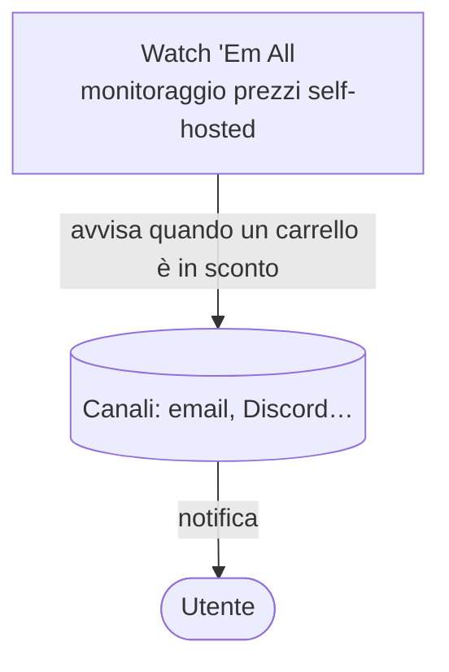
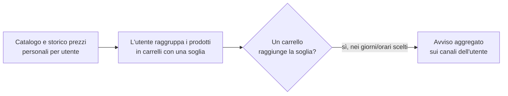

# Cos'è Watch 'Em All — visione ancora da realizzare

> **Layer 1 — Business** · Audience: tutti · Solo testo descrittivo.
>
> La parte **già realizzata** di questo documento (problema, soluzione al netto degli avvisi, concetti di scraper/catalogo/carrello, ruoli, "cosa non è") è stata migrata nella wiki inglese canonica: [`docs/1-business/product-overview.md`](../../docs/1-business/product-overview.md). Qui restano **solo le capacità non ancora costruite** (fase 6+): l'anello di notifica che chiude il cerchio, i canali di consegna, lo storico prezzi.

## Il cuore ancora da costruire: l'avviso

Il sistema oggi osserva, registra e calcola lo stato dei carrelli. Lo scopo finale, ancora da realizzare, è **avvisare l'utente** quando succede qualcosa di interessante: un prodotto entra in sconto, torna disponibile, oppure — il cuore del prodotto — **un intero carrello di prodotti raggiunge il risparmio desiderato**.

Lo scopo finale è sempre lo stesso: **informare l'utente che i suoi carrelli sono in sconto**, così da poter comprare nel momento di massimo risparmio.

### Il quadro d'insieme (parte da realizzare)

L'avviso all'utente attraverso i canali configurati:

## Concetti chiave non ancora realizzati

- **Notifica**: il sistema raccoglie tutto ciò che è cambiato e lo comunica all'utente in un **unico messaggio aggregato**, all'orario e nei giorni scelti dall'utente, tramite i canali configurati (es. email, Discord). Ogni notifica resta comunque consultabile nello storico interno dell'applicazione, anche senza canali configurati.
- **Storico prezzi**: ogni variazione di prezzo viene registrata per sempre; grafici interattivi mostrano l'andamento di ogni prodotto e di ogni carrello.

### Il ciclo di valore completo

Quando l'avviso sarà realizzato, il ciclo si chiude così:

