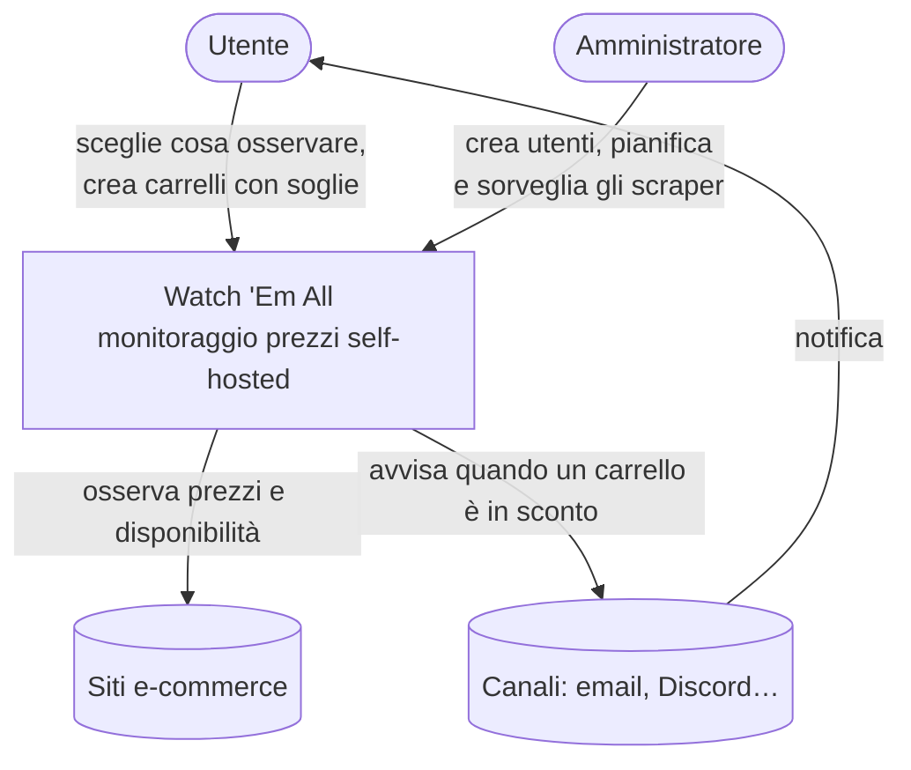
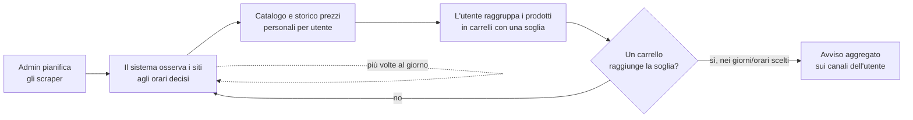

# Cos'è Watch 'Em All

> **Layer 1 — Business** · Audience: tutti · Solo testo descrittivo.

## Il problema

Chi acquista online con attenzione al risparmio si trova a controllare manualmente, giorno dopo giorno, gli stessi prodotti sugli stessi siti: il prezzo è sceso? È tornato disponibile? Conviene comprare adesso o aspettare? Quando i prodotti da tenere d'occhio diventano decine, il controllo manuale diventa impraticabile e le occasioni si perdono.

## La soluzione

Watch 'Em All automatizza questa sorveglianza. L'utente dice al sistema **quali prodotti osservare** e su **quali siti**; il sistema li controlla automaticamente più volte al giorno, ne registra prezzi e disponibilità nel tempo, e **avvisa l'utente** quando succede qualcosa di interessante: un prodotto entra in sconto, torna disponibile, oppure — il cuore del prodotto — **un intero carrello di prodotti raggiunge il risparmio desiderato**.

Lo scopo finale è sempre lo stesso: **informare l'utente che i suoi carrelli sono in sconto**, così da poter comprare nel momento di massimo risparmio.

### Il quadro d'insieme

Chi tocca il sistema e con cosa il sistema dialoga, a colpo d'occhio:

## I concetti chiave, in parole semplici

- **Scraper**: un "osservatore" specializzato per un singolo sito e-commerce. Ogni sito ha il suo scraper. Gli scraper sono moduli aggiuntivi (plugin): se ne possono aggiungere di nuovi senza toccare il resto del sistema.
- **Catalogo**: l'insieme dei prodotti che gli scraper hanno estratto per un utente. È personale: ogni utente vede solo il proprio catalogo.
- **Carrello**: un gruppo di prodotti del catalogo che l'utente vuole monitorare insieme. Su un carrello si impostano una **soglia di risparmio** e i **tipi di avviso** desiderati.
- **Notifica**: il sistema raccoglie tutto ciò che è cambiato e lo comunica all'utente in un **unico messaggio aggregato**, all'orario e nei giorni scelti dall'utente, tramite i canali configurati (es. email, Discord). Ogni notifica resta comunque consultabile nello storico interno dell'applicazione, anche senza canali configurati.
- **Storico prezzi**: ogni variazione di prezzo viene registrata per sempre; grafici interattivi mostrano l'andamento di ogni prodotto e di ogni carrello.

### Come funziona, dall'inizio alla fine

Il ciclo di valore, in termini semplici: l'admin prepara, il sistema osserva da solo, l'utente raccoglie in carrelli, e l'avviso scatta quando conviene comprare.

## A chi si rivolge

È un progetto personale e self-hosted: lo installa chi lo usa (tipicamente su un proprio server casalingo), per sé e per pochi altri utenti — familiari o amici. Non è pensato per un pubblico ampio né per usi commerciali. Due ruoli:

- l'**utente**, che configura cosa monitorare e riceve le notifiche;
- l'**amministratore**, che installa il sistema, crea gli utenti, decide quando e quanto lavorano gli scraper, e sorveglia la salute del sistema.

## Cosa NON è

- Non è un comparatore di prezzi pubblico: non ha ricerca globale né classifiche.
- Non acquista nulla per conto dell'utente: si ferma all'avviso.
- Non è un servizio cloud multi-organizzazione: è una singola installazione privata.

## Documenti del Layer 1

| Documento | Contenuto |
|---|---|
| [use-cases.md](use-cases.md) | I due casi d'uso principali, raccontati |
| [personas-and-roles.md](personas-and-roles.md) | Chi usa il sistema e con quali responsabilità |
| [user-experience.md](user-experience.md) | L'esperienza dell'utente, passo per passo |
| [admin-experience.md](admin-experience.md) | L'esperienza dell'amministratore |
| [glossary.md](glossary.md) | Glossario dei termini ricorrenti |
