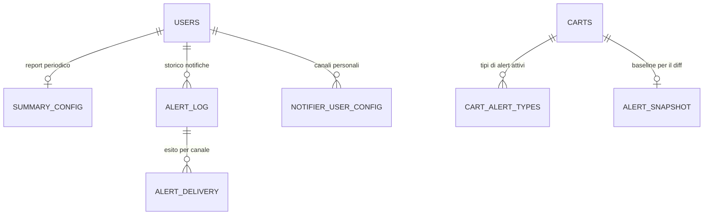

# Dati e multi-tenancy — modello dati spec-ahead (alert e notifiche)

> **Layer 2 — Architettura** · Audience: architetti SW, system engineer · Testo + Mermaid, niente codice.
>
> La parte **implementata** (principio di isolamento, identità del prodotto, ciclo di vita del catalogo, storico prezzi/disponibilità, configurazione DB-first) è stata migrata nella wiki inglese: [`docs/2-architecture/data-and-multitenancy.md`](../../docs/2-architecture/data-and-multitenancy.md). Qui resta solo il modello dati **spec-ahead** delle notifiche (fase alert), non ancora a codice.

## Le entità delle notifiche

Aree (schema completo nel [Layer 4 — database](../4-capabilities/database/schema.md)):

| Area | Dati | Owner del dato |
|---|---|---|
| Notifiche | storico, esiti di consegna per canale, baseline, report periodico (summary) | utente (config), core (storico) |
| Notifier config | config admin e config per-utente dei canali | admin + utente |

## Storico alert (fase alert)

- **Storico alert**: tutte le notifiche generate, con esito di consegna per canale e stato di lettura; purge globale per data a cura dell'admin.

Vedi anche l'[architettura delle notifiche](notification-architecture.md) per la semantica di baseline, diff, digest e canali.
