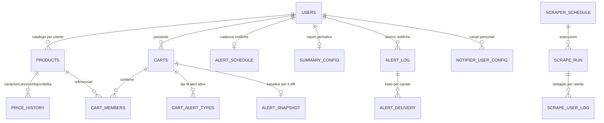
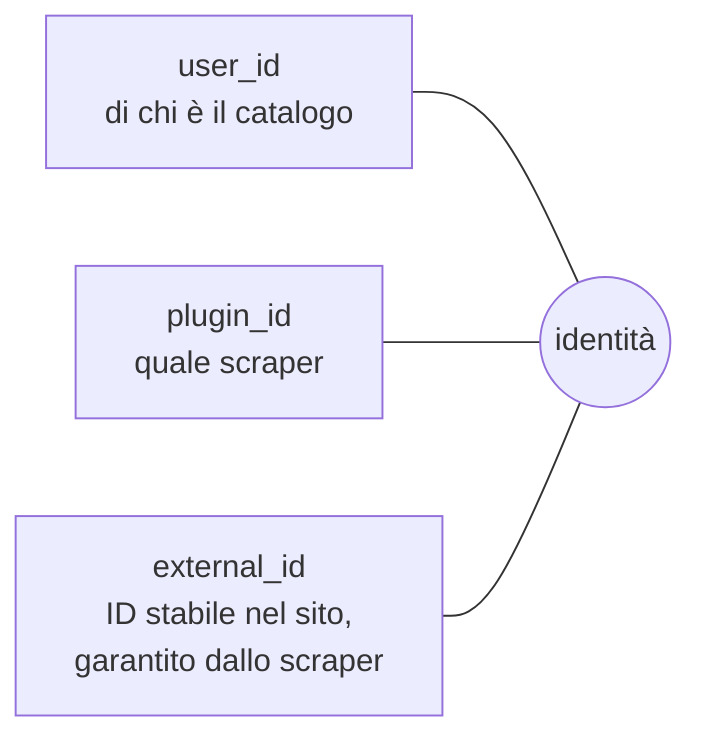
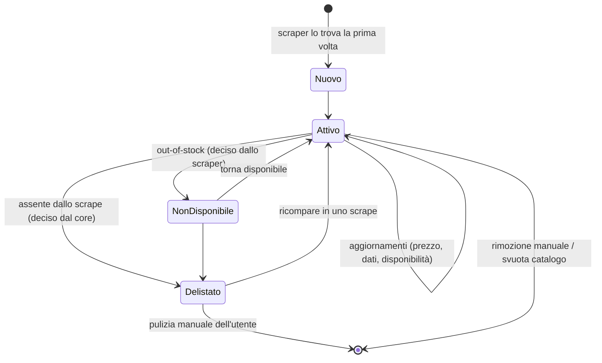

# Dati e multi-tenancy

> **Layer 2 — Architettura** · Audience: architetti SW, system engineer · Testo + Mermaid, niente codice.

## Principio

Ogni dato operativo appartiene a un utente (`user_id`) ed è completamente isolato da quello degli altri. L'unico stato condiviso del sistema è il database PostgreSQL; non esistono file di stato né comunicazione diretta tra processi.

## Mappa logica dei dati

Aree (schema completo nel [Layer 4 — database](../4-capabilities/database/schema.md)):

| Area | Dati | Owner del dato |
|---|---|---|
| Auth | utenti, ruoli, versioni token | admin (account), utente (password/lingua) |
| Catalogo | prodotti per-utente, storico prezzi/disponibilità | core (scritto via scraper) |
| Carrelli | carrelli, membri, soglie, tipi di alert | utente |
| Notifiche | storico, esiti di consegna per canale, baseline, cadenza, report | utente (config), core (storico) |
| Scheduling & monitoring | orari scraper, run, dettaglio per utente, log di sistema, impostazioni globali | admin |
| Notifier config | config admin e config per-utente dei canali | admin + utente |
| Tabelle dei plugin | input e parametri propri di ciascun plugin, namespaced | il plugin |

## L'identità del prodotto

Il riconoscimento di "stesso prodotto tra due osservazioni" è il fondamento di delta, storico e delisting. L'identità è la terna:

- L'`external_id` deve essere **stabile** tra run e **univoco** nel suo spazio. Lo scraper fornisce solo il **seme** site-specific (un metodo astratto obbligatorio); la sua trasformazione in id — normalizzazione e hashing deterministico — è imposta dal core, identica per tutti gli scraper. Se il seme non è stabile, il sistema vede un prodotto nuovo e lo storico si spezza: è il punto più delicato di ogni scraper.
- La chiave del database è solo un surrogato interno.
- Conseguenza per i carrelli cross: lo "stesso" prodotto su due siti è — correttamente — **due righe distinte** del catalogo (plugin diversi ⇒ identità diverse), il che rende naturale inserirlo due volte in un carrello cross, una per sito.

## Ciclo di vita del dato di catalogo

- **Non disponibile** ≠ **delistato**: il primo è temporaneo e deciso dallo scraper; il secondo è "sparito dal sito", deciso dal core, tenuto a vita finché l'utente non pulisce.
- **Eliminazione**: rimuovere un prodotto dal catalogo lo rimuove a cascata dai carrelli che lo contengono e ne elimina lo storico; la UI lo dichiara prima di confermare. (Decisione presa: cascata esplicita, niente orfani.)

## Storico: cosa si conserva e cosa no

- **Storico prezzi/disponibilità**: append-only, una entry **solo quando qualcosa cambia** (prezzo o disponibilità). Niente snapshot giornalieri: compatto per natura, si conserva per sempre.
- **Storico alert**: tutte le notifiche generate, con esito di consegna per canale e stato di lettura; purge globale per data a cura dell'admin.
- **Log operativi** (run di scrape, log di sistema): retention configurabile dall'admin, pulizia automatica.

## Configurazione: DB-first

La configurazione **operativa** (orari, limiti, parametri dei plugin, canali) vive nel DB ed è editabile dalla UI senza riavvii. Il file di configurazione contiene **solo il bootstrap** (connessione al DB, chiave di firma, durate dei token): ciò che serve prima che il DB sia raggiungibile. I segreti stanno in variabili d'ambiente. Dettagli: [infrastructure/configuration.md](../infrastructure/configuration.md).
