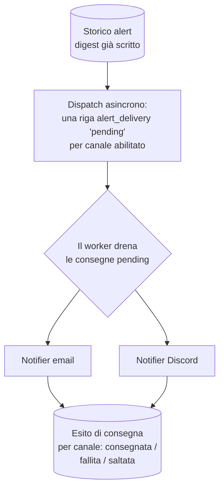

# Architettura delle notifiche (spec-ahead)

> **Layer 2 — Architettura** · Audience: architetti SW, system engineer · Testo + Mermaid, niente codice.
>
> La parte **implementata** (cosa notificare = diff su baseline, quando = event-driven a fine scrape, un solo digest aggregato scritto sempre nello storico interno) è ora nel mirror inglese canonico [`docs/2-architecture/notification-architecture.md`](../../docs/2-architecture/notification-architecture.md) (DOC-12). Questo file conserva solo ciò che **non è ancora costruito**: la **consegna sui canali esterni** (notifier, esito per canale, retry — fase 7), il **report periodico** (fase 11) e le **notifiche admin / categorie** (fase 10).

Il digest aggregato è già prodotto a ogni run e scritto **sempre** nello storico interno (la fonte primaria). Le sezioni seguenti descrivono i livelli *aggiuntivi* che vi si innestano sopra e che nessuna funzionalità già esistente richiede.

## Consegna: un solo digest, più canali

Decisioni di design:

1. **Multi-canale senza routing**: l'utente abilita i canali che vuole (ognuno con la propria config personale e un flag on/off); il digest va a tutti gli abilitati. Niente regole "gli sconti via email, la disponibilità su Discord": complessità non giustificata dai casi d'uso.
2. **Consegna asincrona**: alla scrittura del digest il core registra una riga `alert_delivery` in stato **`pending`** per ogni canale abilitato (o una sola riga `skipped_no_notifier` se nessun canale è configurato); il **worker** le **drena** fuori dal ciclo di scrape. Lo scrape non attende mai la rete di un notifier.
3. **Esito tracciato per canale**: ogni consegna registra il proprio esito (consegnata / fallita / saltata) separatamente. Un canale rotto non nasconde l'esito degli altri, e l'utente vede nello storico se un invio è fallito.
4. **Errori di consegna**: il retry (pochi tentativi, con attesa crescente) è responsabilità del plugin notifier; il core registra l'esito finale sulla riga `alert_delivery`. A questa scala, se un canale fallisce stasera, il contenuto resta comunque nello storico e gli eventi nuovi arriveranno col prossimo digest.
5. **Formattazione per canale, contenuto del core**: il core costruisce il payload strutturato e fornisce la lingua dell'utente; il plugin lo rende nel formato del canale. Il core non sa cosa sia HTML o un embed Discord.

## Il report periodico (summary)

Canale e infrastruttura identici, semantica opposta: una **fotografia** dello stato corrente di tutti i carrelli (non un diff), opt-in, settimanale o mensile. Distinto dal digest dal tipo di payload; il notifier li formatta diversamente. Serve a chi vuole "il polso della situazione" anche quando non cambia nulla.

## Le notifiche admin e le categorie

Le notifiche del sistema si dividono in **due categorie** (per ora le uniche): **sistema** (digest, summary e messaggi testuali generati dal motore) e **admin** (messaggi scritti da un amministratore per tutti gli utenti o per uno specifico). Il messaggio admin **riusa l'intera pipeline**: una riga nello storico interno per ogni destinatario — **sempre**, anche per chi non ha canali — e consegna sui canali abilitati dal destinatario, con esito per canale. Nello storico dell'utente la categoria admin è visivamente distinta (icona e colore dedicati). Dettagli: [3-features/admin/admin-notifications.md](../3-features/admin/admin-notifications.md).

**Tutti i messaggi testuali sono Markdown**: admin e sistema condividono lo stesso payload (titolo + body) e un'unica pipeline di render — il core fornisce gli helper (HTML sanificato / testo puro), ogni canale degrada con grazia ciò che non sa rendere, la consegna non fallisce mai per il formato. Una sola macchina di formattazione per tutto ciò che è testo libero; i digest e i summary restano payload strutturati, formattati dai notifier a partire dai dati.

L'admin governa anche la **disponibilità globale dei canali**: può disabilitare un notifier per tutti gli utenti a runtime (speculare alla sospensione di uno scraper), preservando le configurazioni personali.

## Cosa resta: esiti di consegna nello storico

- Esiti di consegna visibili **per canale** (con motivo del fallimento), accanto al digest già registrato.
- Pulizia: regole globali per data applicate dall'admin, che non legge i contenuti.

## Approfondimenti

- Comportamento implementato: [`docs/3-features/user/alerts-and-notifications.md`](../../docs/3-features/user/alerts-and-notifications.md)
- Requisiti spec-ahead (consegna, summary, categoria admin): [3-features/user/alerts-and-notifications.md](../3-features/user/alerts-and-notifications.md)
- Algoritmo del diff e pseudocodice: [4-capabilities/core/alert-engine.md](../4-capabilities/core/alert-engine.md)
- Contratto del payload: [4-capabilities/contracts/alert-event.md](../4-capabilities/contracts/alert-event.md)
