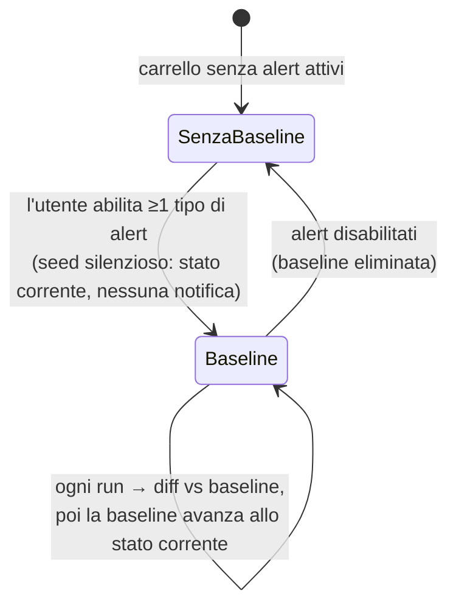
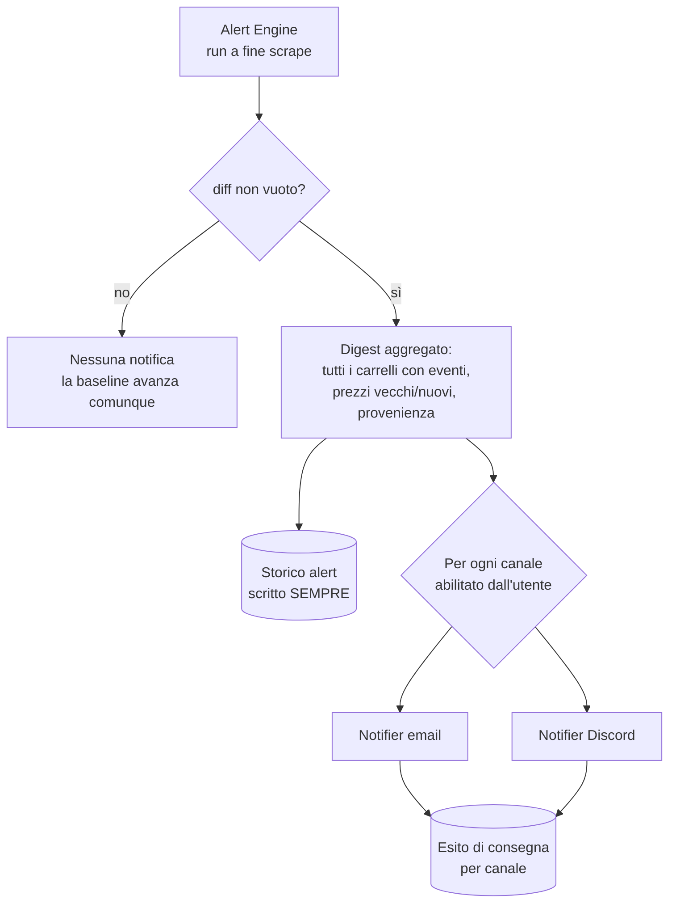

# Architettura delle notifiche

> **Layer 2 — Architettura** · Audience: architetti SW, system engineer · Testo + Mermaid, niente codice.

Le notifiche sono il prodotto: tutto il resto del sistema esiste per arrivare a questo momento. L'architettura risponde a quattro domande: **cosa** notificare, **quando**, **come consegnare**, **cosa resta**.

## Cosa: diff, non stato

Il sistema notifica **solo ciò che è cambiato** dall'ultima notifica, mai lo stato corrente ripetuto (niente "è ancora in offerta" ogni giorno). Il meccanismo è una **baseline**: una fotografia di riferimento per ogni carrello con alert attivi, contro cui si calcola il diff a ogni run.

Proprietà che ne derivano (tutte volute):

- **Prima run silenziosa**: appena attivati gli alert non parte nulla (nessun delta su baseline appena seminata).
- **Niente arretrati né flood**: spegnere e riaccendere riparte da "ora".
- **Indipendenza dagli scrape intermedi**: tra due notifiche possono esserci 1 o 10 scrape; il diff è sempre "vs ultima notifica". Un prezzo sceso e risalito tra due notifiche non produce rumore.
- **Elementi nuovi senza baseline** (es. prodotto appena aggiunto al carrello): seminati in silenzio alla prima run che li incontra.

## Quando: a ogni scrape (event-driven)

- *Quando* ricevere: **a fine scrape** — l'alert engine gira al termine di ogni scrape che ha cambiato il catalogo dell'utente (scrape schedulato nel worker, scrape-now manuale, "simula scrape" del TP). Nessuna configurazione per-account di giorni/orario. Ogni run di scrape produce **un solo digest aggregato per utente**: una cadenza per-carrello renderebbe impossibile il messaggio unico aggregato.
- *Cosa* ricevere: **per-carrello** — l'utente sceglie i tipi di evento che gli interessano su ciascun carrello (sconti, disponibilità, soglia…). Default: nessuno attivo.

## Come: un solo digest, più canali

Decisioni di design:

1. **Un solo messaggio per run** (`alert_digest`), che aggrega tutti i carrelli con eventi. Mai una notifica per carrello o per prodotto: l'utente con 10 carrelli riceve un messaggio, non dieci.
2. **Lo storico interno è la fonte primaria**: ogni notifica è registrata **sempre**, anche senza canali configurati. I notifier sono canali di consegna *aggiuntivi*. Nessuna funzionalità dipende dall'avere un canale.
3. **Multi-canale senza routing**: l'utente abilita i canali che vuole (ognuno con la propria config personale e un flag on/off); il digest va a tutti gli abilitati. Niente regole "gli sconti via email, la disponibilità su Discord": complessità non giustificata dai casi d'uso.
4. **Esito tracciato per canale**: ogni consegna registra il proprio esito (consegnata / fallita / saltata) separatamente. Un canale rotto non nasconde l'esito degli altri, e l'utente vede nello storico se un invio è fallito.
5. **Errori di consegna**: il retry (pochi tentativi, con attesa crescente) è responsabilità del plugin notifier; il core registra l'esito finale. Niente code asincrone né dead-letter: a questa scala, se un canale fallisce stasera, il contenuto resta nello storico e gli eventi nuovi arriveranno col prossimo digest.
6. **Contenuto utile da solo**: il digest contiene tutto ciò che serve per decidere senza aprire l'app — per ogni prodotto: tag dell'evento, prezzo precedente e attuale, sconto, **provenienza** (fondamentale nei carrelli cross), link al prodotto; per ogni carrello: totali e stato della soglia.
7. **Formattazione per canale, contenuto del core**: il core costruisce il payload strutturato e fornisce la lingua dell'utente; il plugin lo rende nel formato del canale. Il core non sa cosa sia HTML o un embed Discord.

## Il report periodico (summary)

Canale e infrastruttura identici, semantica opposta: una **fotografia** dello stato corrente di tutti i carrelli (non un diff), opt-in, settimanale o mensile. Distinto dal digest dal tipo di payload; il notifier li formatta diversamente. Serve a chi vuole "il polso della situazione" anche quando non cambia nulla.

## Le notifiche admin e le categorie

Le notifiche del sistema si dividono in **due categorie** (per ora le uniche): **sistema** (digest, summary e messaggi testuali generati dal motore) e **admin** (messaggi scritti da un amministratore per tutti gli utenti o per uno specifico). Il messaggio admin **riusa l'intera pipeline**: una riga nello storico interno per ogni destinatario — **sempre**, anche per chi non ha canali — e consegna sui canali abilitati dal destinatario, con esito per canale. Nello storico dell'utente la categoria admin è visivamente distinta (icona e colore dedicati). Dettagli: [3-features/admin/admin-notifications.md](../3-features/admin/admin-notifications.md).

**Tutti i messaggi testuali sono Markdown**: admin e sistema condividono lo stesso payload (titolo + body) e un'unica pipeline di render — il core fornisce gli helper (HTML sanificato / testo puro), ogni canale degrada con grazia ciò che non sa rendere, la consegna non fallisce mai per il formato. Una sola macchina di formattazione per tutto ciò che è testo libero; i digest e i summary restano payload strutturati, formattati dai notifier a partire dai dati.

L'admin governa anche la **disponibilità globale dei canali**: può disabilitare un notifier per tutti gli utenti a runtime (speculare alla sospensione di uno scraper), preservando le configurazioni personali.

## Cosa resta: lo storico alert

- Elenco consultabile in-app di tutti i digest e summary, con stato **letto/non letto** (badge in dashboard).
- Esiti di consegna visibili per canale (con motivo del fallimento).
- Pulizia: regole globali per data applicate dall'admin, che non legge i contenuti.

## Approfondimenti

- Comportamento dettagliato: [3-features/user/alerts-and-notifications.md](../3-features/user/alerts-and-notifications.md)
- Algoritmo del diff e pseudocodice: [4-capabilities/core/alert-engine.md](../4-capabilities/core/alert-engine.md)
- Contratto del payload: [4-capabilities/contracts/alert-event.md](../4-capabilities/contracts/alert-event.md)
