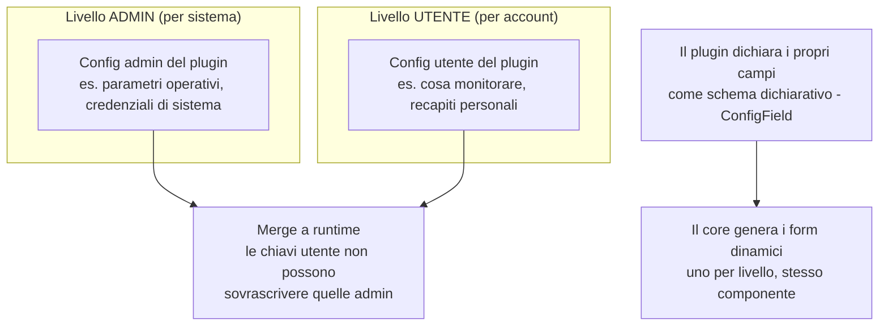

# Architettura dei plugin — contratti spec-ahead

> **Layer 2 — Architettura** · Audience: architetti SW, system engineer · Testo + Mermaid, niente codice.
>
> Il **backbone implementato** (principio plugin-first full-stack, integrazione dinamica backend/frontend, isolamento "sandbox soft", regole sui dati dei plugin, runtime dello scraper e `update_catalog`) è stato migrato nella wiki inglese: [`docs/2-architecture/plugin-architecture.md`](../../docs/2-architecture/plugin-architecture.md). Qui restano solo i contratti **spec-ahead** ancora da implementare: la **configurazione a due livelli** e i contratti del **notifier**.

## Configurazione a due livelli (sempre, per ogni plugin)

Ogni plugin — scraper o notifier — è configurabile su due piani **separati e complementari**:

- Il plugin **dichiara** i campi (tipo, obbligatorietà, segretezza); il core **disegna** i form senza conoscere il plugin. I campi segreti sono mascherati e write-only.
- Per gli **scraper**: la config admin governa il comportamento (timeout, ritmo, regole del sito); la config utente è *cosa osservare* e vive nelle tabelle del plugin.
- Per i **notifier**: la config admin è l'infrastruttura del canale (es. server di posta); la config utente è il recapito personale, con un flag di **attivazione per-utente** e un'azione di **test**.

> Nota di stato: oggi il core legge già le **chiavi riservate** della config admin dello scraper (politeness, timeout, emivita della cache) via `scraper_config`; l'infrastruttura `ConfigField` per i campi dichiarati dal plugin e la config utente arrivano in una fase successiva (7+).

## Contratti del notifier (spec-ahead)

La famiglia `NotifierPlugin` è oggi un marker: i metodi runtime arrivano più avanti.

- `send(notification, config)` — consegna il payload sul canale; il core costruisce il payload strutturato e fornisce la lingua dell'utente, il plugin lo rende nel formato del canale.
- `send_test(config)` — invio di prova dalla UI di configurazione del canale.
- `get_admin_config_schema()` / `get_user_config_schema()` — gli schemi dichiarativi dei due livelli di config del canale.

## Approfondimenti

- Dettaglio funzionale dei contratti: [Layer 3 — plugins](../3-features/plugins/)
- Contratti tecnici e pseudocodice: [Layer 4 — core](../../docs/4-capabilities/core/plugin-registry.md) e [contratti](../4-capabilities/contracts/)
- Guida per sviluppare un plugin: [plugin-development/](../plugin-development/README.md)
