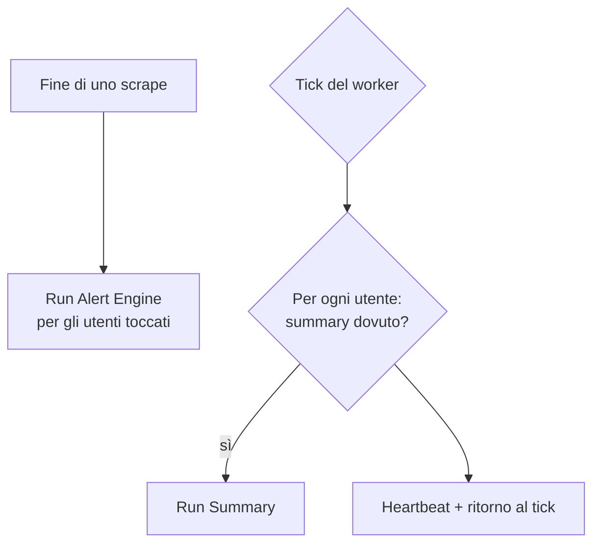

# Scheduling ed esecuzione — flussi spec-ahead (alert e summary)

> **Layer 2 — Architettura** · Audience: architetti SW, system engineer · Testo + Mermaid, niente codice.
>
> Lo scheduling **implementato** dello scraper (dispatcher, principio del "dovuto" e catch-up, runner seriale, regole di esecuzione, cache di scrape, osservabilità delle run, assunzioni temporali) è stato migrato nella wiki inglese: [`docs/2-architecture/scheduling-and-execution.md`](../../docs/2-architecture/scheduling-and-execution.md). Qui restano solo i flussi schedulati **spec-ahead** — alert e summary — di proprietà dell'utente, non ancora a codice.

## I flussi dell'utente

Lo scrape aggiorna i dati; poi ci sono due flussi di notifica, con tempistiche diverse:

| Flusso | Owner | Granularità | Frequenza |
|---|---|---|---|
| **Alert** | Utente | Per-account | **Event-driven**: a fine di ogni scrape che ha cambiato il catalogo (nessun orario) — vedi [notification-architecture](notification-architecture.md) |
| **Summary** | Utente | Per-account | Schedulato: settimanale (giorno scelto) o mensile (giorno 1), opt-in — spec-ahead (fase 11) |

L'alert **non** ha una cadenza a orario: appena uno scrape produce eventi, parte il digest aggregato (uno per utente per run di scrape). Il summary resta invece un flusso **schedulato**, disaccoppiato dallo scrape.

## Il dispatcher

Il dispatcher del worker accoda gli scraper dovuti e, **a fine di ogni scrape**, esegue l'Alert Engine per gli utenti che quello scrape ha toccato (event-driven). Il **summary** (spec-ahead) resta un flusso a cadenza valutato al tick:

Limiti onesti del catch-up (dichiarati, scelta da hobby project):

- **Alert**: essendo event-driven, girano ad ogni scrape con cambiamenti; nessun concetto di "giorno dovuto".
- **Summary** (spec-ahead): il recupero vale **entro il giorno dovuto**. Se il sistema resta fermo per l'intera giornata dovuta, quel report salta e i dati confluiranno nel successivo.

Vedi l'[architettura delle notifiche](notification-architecture.md) per la semantica di baseline, diff, digest, multi-canale e summary.
