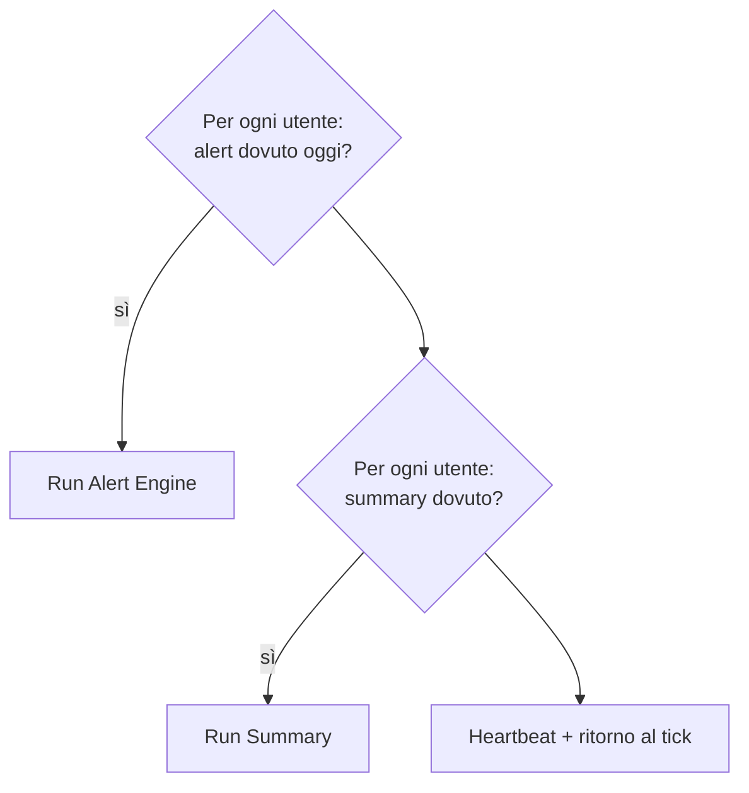

# Scheduling ed esecuzione — flussi spec-ahead (alert e summary)

> **Layer 2 — Architettura** · Audience: architetti SW, system engineer · Testo + Mermaid, niente codice.
>
> Lo scheduling **implementato** dello scraper (dispatcher, principio del "dovuto" e catch-up, runner seriale, regole di esecuzione, cache di scrape, osservabilità delle run, assunzioni temporali) è stato migrato nella wiki inglese: [`docs/2-architecture/scheduling-and-execution.md`](../../docs/2-architecture/scheduling-and-execution.md). Qui restano solo i flussi schedulati **spec-ahead** — alert e summary — di proprietà dell'utente, non ancora a codice.

## I flussi dell'utente

Lo scrape aggiorna i dati; la notifica arriva quando l'utente la vuole: i due flussi sono **deliberatamente disaccoppiati** dallo scrape. Sono per-account (una cadenza per-carrello renderebbe impossibile il messaggio unico aggregato).

| Flusso | Owner | Granularità | Frequenza |
|---|---|---|---|
| **Alert** | Utente | Per-account | Giorni della settimana scelti + un orario |
| **Summary** | Utente | Per-account | Settimanale (giorno scelto) o mensile (giorno 1), opt-in |

## Il dispatcher (estensione dei flussi utente)

Il dispatcher del worker, oltre ad accodare gli scraper dovuti, valuta a ogni tick i flussi utente e li esegue all'orario scelto:

Limiti onesti del catch-up (dichiarati, scelta da hobby project):

- **Alert e summary**: il recupero vale **entro il giorno dovuto**. Se il sistema resta fermo per l'intera giornata dovuta, quella notifica salta e gli eventi confluiranno nella successiva (il diff è cumulativo per natura: nulla va perso nei contenuti, solo nel momento della consegna).

Vedi l'[architettura delle notifiche](notification-architecture.md) per la semantica di baseline, diff, digest, multi-canale e summary.
