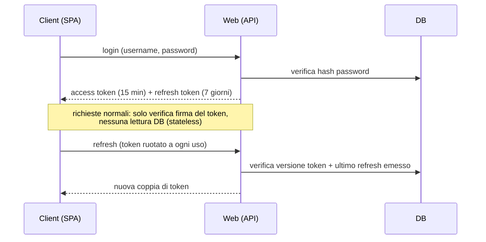

# Postura di sicurezza

> **Layer 2 — Architettura** · Audience: architetti SW, system engineer · Testo + Mermaid, niente codice.

## Premessa: il contesto è tutto

Watch 'Em All è un **personal project self-hosted**: una singola installazione privata, tipicamente su LAN casalinga, con un pugno di utenti che si conoscono (≤5 contemporanei). La sicurezza è progettata **per questo contesto**: si adottano i pattern moderni dove costano poco, e si accettano esplicitamente semplificazioni che in un prodotto production-ready sarebbero inaccettabili. Ogni semplificazione è **dichiarata**, mai implicita.

## Modello delle minacce (proporzionato)

| Minaccia | Rilevanza | Risposta |
|---|---|---|
| Accesso non autorizzato all'app esposta | Media | Autenticazione JWT, rate limit sul login, nessuna auto-registrazione |
| Un utente che accede ai dati di un altro | Media | Multi-tenancy rigorosa: ogni query è filtrata per utente |
| Un utente che altera la config di sistema | Media | Separazione ruoli; le chiavi admin non sono sovrascrivibili dalla config utente |
| Furto di token via XSS | Bassa (utenti fidati, niente contenuti terzi) | SPA senza contenuti user-generated esterni; token ad accesso breve |
| Intercettazione del traffico | Bassa su LAN | HTTP accettato; TLS via reverse proxy **solo se esposto** a Internet |
| Plugin malevolo | Fuori scope | I plugin sono codice first-party fidato (trust model dichiarato) |
| DoS, attori statali, supply chain | Fuori scope | Non proporzionati al contesto |

## Autenticazione: moderna ma leggera

Scelte (dettaglio tecnico in [4-capabilities/core/auth.md](../4-capabilities/core/auth.md)):

- **JWT firmati**, access a vita breve verificato senza DB; refresh **ruotato** a ogni uso, con l'ultimo emesso tracciato sul profilo utente (il vecchio diventa inutilizzabile, il riuso segnala un furto).
- Access e refresh **distinguibili per tipo**: un refresh non può essere speso come access.
- **Invalidazione globale** con un contatore di versione sul profilo: logout, cambio password e disabilitazione tagliano fuori tutti i token emessi.
- **Leggerezza accettata e dichiarata**: dopo logout/disabilitazione, un access token già emesso resta tecnicamente valido fino a 15 minuti. A questa scala è un rischio accettato in cambio della semplicità stateless.
- Password con hashing moderno (bcrypt/argon2), lunghezza minima; rate limit sul login con backoff. Niente OAuth/SSO, niente MFA: non proporzionati.

## Autorizzazione

- Due ruoli: `admin` (governo del sistema, **nessun accesso ai dati operativi degli utenti**) e `user` (solo i propri dati).
- La multi-tenancy è applicata **a livello di accesso ai dati**: ogni lettura/scrittura operativa è vincolata all'utente del token. È la barriera più importante del sistema e l'unica non negoziabile.
- La configurazione dei plugin a livello utente è **filtrata sulle sole chiavi dichiarate dallo schema utente**: mai sovrascrivibili i parametri admin (es. il server di posta).

## Trasporto e esposizione

- **HTTP in chiaro è accettato** per uso LAN/localhost: è la semplificazione più visibile della postura hobby.
- Se l'installazione viene esposta a Internet, la responsabilità del TLS è di un **reverse proxy** davanti all'app (Caddy/Traefik: due righe di config). La documentazione di [deployment](../infrastructure/deployment.md) lo indica come unico requisito per l'esposizione.
- Lo strumento di ispezione del DB esiste **solo nel profilo di sviluppo**, mai in produzione.

## Segreti

- I segreti di bootstrap (credenziali DB, chiave di firma, password admin iniziale) vivono in variabili d'ambiente, mai nel repo (file di esempio committato senza valori).
- I segreti dei plugin (es. credenziali SMTP) vivono **nel DB**, impostati dalla UI admin: compromesso dichiarato (comodità di configurazione senza toccare l'ambiente) accettabile perché il DB non è esposto e l'installazione è privata. I campi segreti sono mascherati in UI e mai rispediti al client.

## Cosa NON facciamo (e va bene così)

Niente audit log, niente cifratura at-rest, niente CSP elaborate, niente WAF, niente secret rotation, niente penetration testing. Sono tutte cose giuste in un prodotto vero e sproporzionate qui. Se il progetto cambiasse natura, questo documento è il primo da riscrivere — il punto di partenza è l'elenco dei [future improvements](../future-improvements/README.md).
