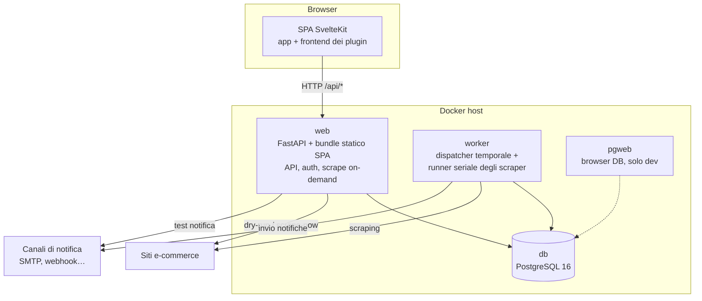
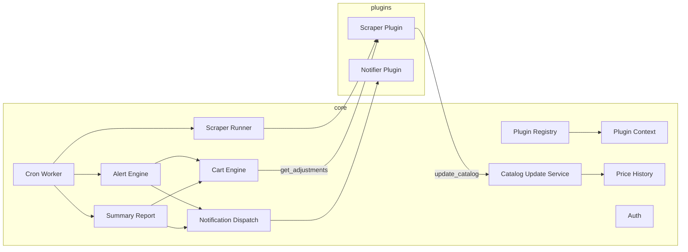
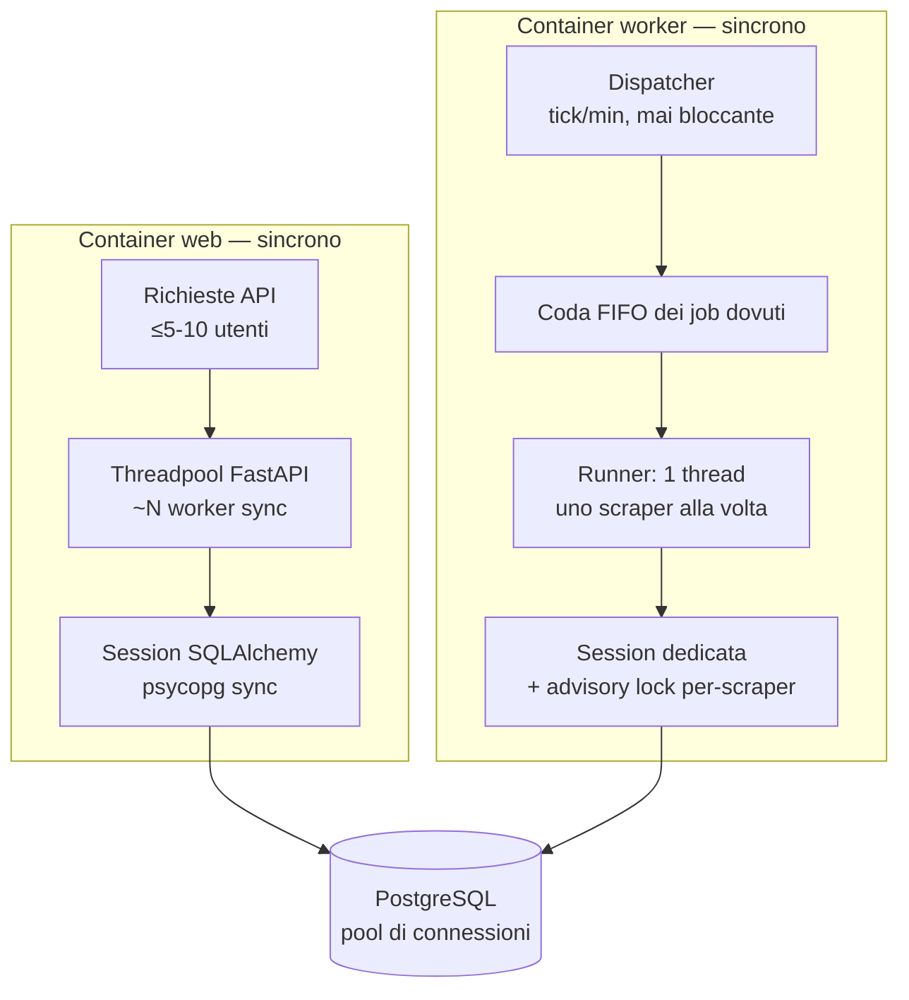
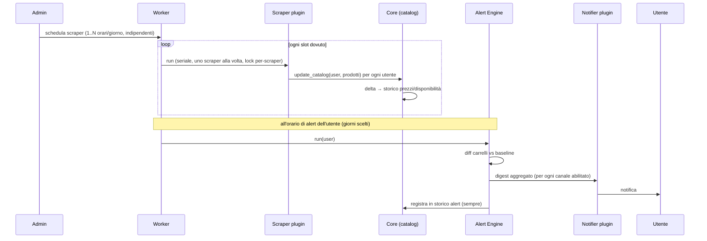

# Architettura di sistema

> **Layer 2 — Architettura** · Audience: architetti SW, system engineer · Testo + Mermaid, niente codice.

## Vista a container

Il sistema è composto da tre processi applicativi più il database, orchestrati con Docker Compose. `web` e `worker` non comunicano mai direttamente: **condividono solo il database**.

| Container | Responsabilità | Note |
|---|---|---|
| `web` | API HTTP, autenticazione, serve la SPA buildata, esegue gli **scrape on-demand** (dry-run, scrape-now, test notifier) come task in background | Carica i plugin per esporre le loro route e i loro schemi di config |
| `worker` | Dispatcher temporale (tick al minuto) + **runner seriale degli scraper** (uno alla volta, ciascuno al proprio orario); run di alert e summary; manutenzione giornaliera (purge utenti scaduti, retention); heartbeat | Carica i plugin per eseguirli |
| `db` | PostgreSQL: unico stato condiviso del sistema | MVCC gestisce le scritture concorrenti di web e worker |
| `pgweb` | Ispezione del DB dal browser | Solo nello stack di sviluppo (`compose-dev.yml`), assente dal release |

**Perché PostgreSQL e non SQLite**: due processi scrivono concorrentemente (web e worker); SQLite con lock su file condiviso tra container è fragile, Postgres con MVCC no.

**Perché entrambi i container caricano i plugin**: il worker esegue le run schedulate; il web espone le route dei plugin (UI, dry-run, schemi di config) ed esegue gli scrape on-demand richiesti dalla UI. Le esecuzioni si coordinano tramite **lock per-scraper sul DB** (mai due run dello stesso scraper in parallelo, da qualunque container partano).

## Vista a componenti del core

| Componente | Responsabilità | Dettaglio |
|---|---|---|
| Plugin Registry | Discovery, validazione manifest, caricamento, registrazione route | [L4](../4-capabilities/core/plugin-registry.md) |
| Plugin Context | Sandbox soft: tutto ciò che un plugin può usare | [L4](../4-capabilities/core/plugin-context.md) |
| Cron Worker | Dispatcher temporale dei tre flussi (scrape, alert, summary) + manutenzione giornaliera | [L4](../4-capabilities/core/cron-worker.md) |
| Scraper Runner | Esecuzione seriale degli scraper (uno alla volta, lock, timeout, cache) | [L4](../4-capabilities/core/scraper-pool.md) |
| Catalog Update Service | Riceve i prodotti dagli scraper, calcola i delta, scrive lo storico | [L4](../4-capabilities/core/catalog-update-service.md) |
| Cart Engine | Totali, adjustments, soglie dei carrelli | [L4](../4-capabilities/core/cart-engine.md) |
| Alert Engine | Diff vs baseline → notifica aggregata | [L4](../4-capabilities/core/alert-engine.md) |
| Summary Report | Fotografia periodica opt-in | [L4](../4-capabilities/core/summary-report.md) |
| Price History | Storico append-only di prezzi e disponibilità + serie per i grafici | [L4](../4-capabilities/core/price-history.md) |
| Auth | JWT (access breve + refresh ruotato), ruoli | [L4](../4-capabilities/core/auth.md) |
| Notification Dispatch | Consegna ai notifier abilitati, registrazione esiti per canale | [Notification architecture](notification-architecture.md) |

## Modello di esecuzione (concorrenza)

Il backend è **sincrono** (scelta dichiarata, [BE-21](../developer-rules/backend/rules.md); razionale nella tabella delle decisioni in fondo): nessun asyncio nel core né nei plugin. La concorrenza esiste solo in due punti, entrambi proprietà del sistema e non delle feature — il **threadpool** con cui FastAPI serve gli endpoint sincroni nel container `web`, e il **runner a thread singolo** del `worker` (un solo scraper alla volta, SCHED-R6). I plugin restano codice sequenziale semplice da scrivere.

Le manopole di scalabilità a parità di architettura sono due e di sola configurazione: dimensione del **threadpool** del web e del **pool di connessioni** verso Postgres. Oltre la postura attuale (decine→centinaia di richieste concorrenti, parallelismo tra scraper), l'evoluzione verso async e/o pool di esecuzione è un [future improvement](../future-improvements/platform.md).

## Confini core ↔ plugin

Il core comunica con i plugin **solo** attraverso contratti dichiarativi:

- riceve dati come modelli tipizzati: `Product`, `Adjustment` ([contratti, L4](../4-capabilities/contracts/));
- invoca i metodi astratti dei contratti (`run_for_user`, `send`, `get_adjustments`, gli schemi di config);
- non conosce: strategia di scraping, concetto di **categoria** (interno agli scraper), formato dei messaggi, retry di invio.

Il grafo delle dipendenze è aciclico: i plugin dipendono dal core, mai il contrario. Vedi [plugin-architecture.md](plugin-architecture.md).

## Flusso end-to-end (il giro completo)

## Decisioni architetturali chiave

| Decisione | Scelta | Razionale |
|---|---|---|
| Scrape e notifica | **Disaccoppiati** (orari indipendenti) | L'utente sceglie quando essere disturbato; gli scrape girano quando serve ai dati |
| Catalogo | **Per-utente** | Isolamento totale; il costo (scraping duplicato tra utenti) è accettabile a ≤5 utenti |
| Stato dei plugin | **Tabelle dedicate per plugin** | Nessuna tabella generica condivisa; il core non le conosce |
| Frontend | **SPA client-side** (no SSR) | App dietro login, niente SEO; il mounting dinamico dei plugin è naturale lato client |
| Notifiche mancate | **Storico interno sempre scritto** | Il notifier è un canale aggiuntivo, mai un single point of failure informativo |
| Modello di esecuzione backend | **Sincrono** (endpoint nel threadpool, psycopg sync, plugin sync) | A ≤5-10 utenti l'async non dà throughput; il runner è già a thread e i plugin restano semplici; si scala con tuning di threadpool/pool DB, async è un'evoluzione futura — vedi [Modello di esecuzione](#modello-di-esecuzione-concorrenza) |
| Concorrenza scraper | **Esecuzione seriale (un solo scraper alla volta); scraper internamente mono-thread** | Carico prevedibile, niente parametri di parallelismo da tarare; gli orari indipendenti per scraper distribuiscono il lavoro; vedi [scheduling-and-execution.md](scheduling-and-execution.md) |
| Riuso dei dati di scrape | **Cache per query con emivita per-plugin** | La stessa ricerca, tra utenti o run ravvicinate, costa una sola visita al sito; vedi [scheduling-and-execution.md](scheduling-and-execution.md) |
