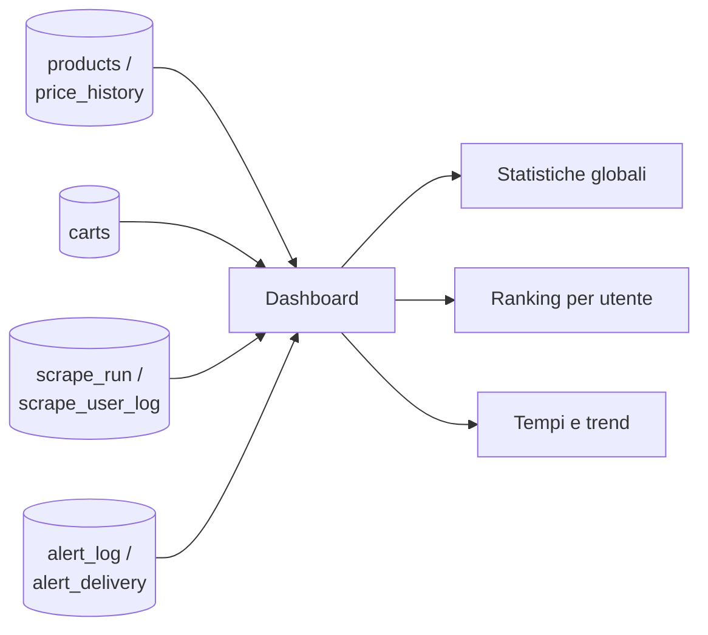

# Dashboard di sistema (admin)

> **Layer 3 — Feature admin** · Audience: architetti, developer · Testo + Mermaid, niente codice. Architettura: [data-and-multitenancy](../../2-architecture/data-and-multitenancy.md) · Capability: [database](../../4-capabilities/database/schema.md). Feature correlata: [scraper-monitoring](scraper-monitoring.md).

## Scopo

Dare all'admin una vista **quantitativa del carico del sistema**: quanto è grande l'installazione (prodotti, carrelli, storico), **chi** la fa lavorare (ranking per utente), **come** si comporta nel tempo (durate degli scrape, volumi di notifiche). È il complemento del [monitoraggio scraper](scraper-monitoring.md): quello risponde a "gli scraper stanno bene?", la dashboard risponde a "quanto pesa il sistema e da dove arriva il peso?".

## Il confine privacy

La dashboard mostra **solo numeri e metadati**, mai contenuti. L'admin vede che un utente ha 300 prodotti e 4 carrelli, **mai quali**: niente nomi di prodotti, nomi di carrelli, prezzi dei singoli articoli né testo delle notifiche. I ranking espongono lo username (che l'admin già conosce dalla [gestione utenti](user-management.md)) accanto a conteggi, durate ed esiti. È la stessa regola del resto dell'area admin: si governa il sistema, non si entra nei dati ([admin-experience](../../1-business/admin-experience.md)).

## Sezioni della dashboard

### Statistiche globali

| Indicatore | Contenuto |
|---|---|
| Dimensione | utenti attivi, prodotti a catalogo (totali e delistati), carrelli, entry di storico prezzi |
| Lavoro recente | run di scrape nelle ultime 24h / 7gg con esiti, richieste HTTP totali del periodo |
| Notifiche | notifiche generate nel periodo, esiti di consegna aggregati (consegnate / fallite / senza canale) |

### Ranking utenti per dati caricati

Per ogni utente: prodotti a catalogo, carrelli, entry di storico prezzi. Ordinabile per ciascuna colonna — risponde a "chi occupa più spazio e fa crescere il DB?".

### Ranking utenti per carico scraper

Per coppia (utente, scraper), su finestra selezionabile: **richieste HTTP generate**, durata cumulata, prodotti processati. Aggregato dal dettaglio per-utente delle run (`scrape_user_log`) — risponde a "chi fa lavorare di più quale scraper?" ed è lo strumento per individuare la configurazione patologica (es. una categoria enorme) prima ancora che diventi un problema di durata.

### Tempi di esecuzione

Statistiche su durata delle run, globali e scomposte: media e massimo per scraper, tempo per-utente dentro le run, trend sul periodo. La vista per-scraper dettagliata resta nel [monitoraggio](scraper-monitoring.md); qui c'è l'aggregato di sistema e il taglio per utente.

### Statistiche notifiche

Notifiche inviate: totale, per utente, per canale (notifier), con esiti di consegna e media per giorno nel periodo. Solo conteggi da `alert_log`/`alert_delivery` — il payload non è mai esposto.

## Fonti dei dati

Nessuna tabella nuova: la dashboard è **sola lettura**, aggregazioni su dati che il sistema già produce.

| Sezione | Fonte | Orizzonte |
|---|---|---|
| Dimensione (prodotti, carrelli, storico) | `products`, `carts`, `price_history` | stato attuale |
| Carico scraper, tempi | `scrape_run`, `scrape_user_log` | finestra 7/30 gg, entro la retention dei log |
| Notifiche | `alert_log`, `alert_delivery` | finestra, entro le purge admin |

## Requisiti

- **DASH-R1** — La dashboard espone le statistiche globali: utenti attivi, prodotti, carrelli, entry di storico, run recenti con esiti, richieste HTTP e notifiche del periodo.
- **DASH-R2** — Ranking degli utenti per dati caricati (prodotti, carrelli, entry di storico), ordinabile.
- **DASH-R3** — Ranking per coppia (utente, scraper) su richieste HTTP, durata cumulata e prodotti processati. Richiede l'**attribuzione per-utente delle richieste HTTP** (`http_requests` su `scrape_user_log`): banale perché la run è mono-thread e processa un utente alla volta.
- **DASH-R4** — Statistiche sui tempi di esecuzione, globali e per utente, su finestra selezionabile (7/30 giorni).
- **DASH-R5** — Statistiche sulle notifiche: totali, per utente, per notifier, esiti di consegna e medie di periodo.
- **DASH-R6** — **Solo aggregati e metadati**: la dashboard non espone mai nomi di prodotti o carrelli, prezzi di singoli articoli o payload di notifiche. I ranking mostrano username e numeri.
- **DASH-R7** — Sola lettura: nessuna azione parte dalla dashboard; per intervenire l'admin usa le pagine dedicate (scheduler, utenti, impostazioni).
- **DASH-R8** — Le statistiche basate su run e notifiche dichiarano l'orizzonte e rispettano le retention configurate; i conteggi di catalogo e carrelli sono lo stato attuale.
