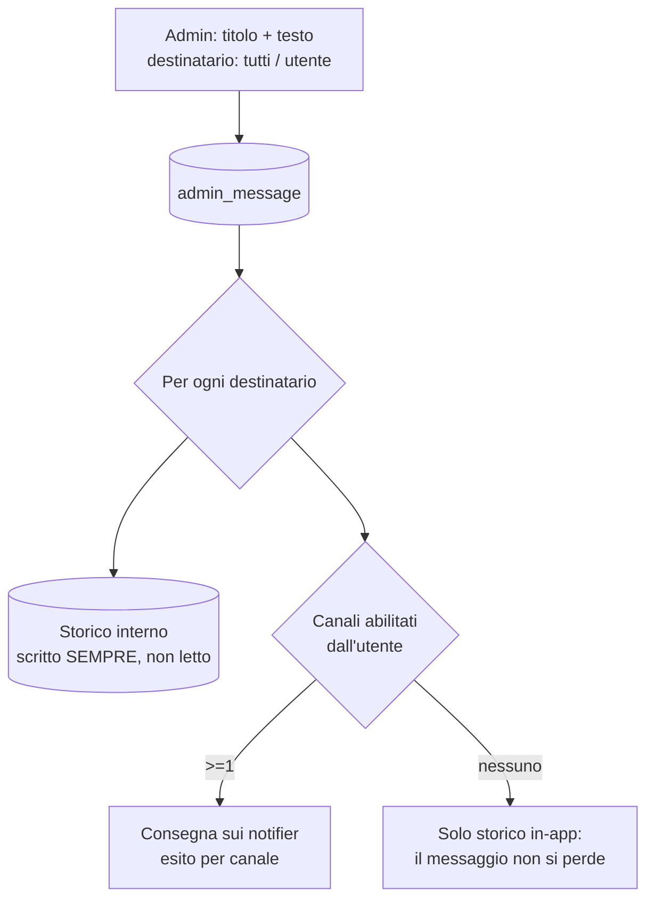

# Notifiche admin agli utenti

> **Layer 3 — Feature admin** · Audience: architetti, developer · Testo + Mermaid, niente codice. Architettura: [notification-architecture](../../2-architecture/notification-architecture.md) · Capability: [alert-event](../../4-capabilities/contracts/alert-event.md), [database](../../4-capabilities/database/schema.md). Feature correlate: [alerts-and-notifications](../user/alerts-and-notifications.md), [plugin-configuration](plugin-configuration.md).

## Scopo

Dare all'admin un canale di comunicazione verso gli utenti **dentro l'infrastruttura di notifica esistente**: una pagina da cui scrivere un messaggio (titolo + testo) e inviarlo a **tutti gli utenti** o a **un utente specifico**. Casi d'uso tipici: manutenzione programmata, novità del sistema, avviso a un singolo utente ("il tuo scraper X è sospeso, parliamone").

## Le due categorie di notifica

Le notifiche hanno **due categorie**, e per ora solo due:

| Categoria | Origine | Tipi (`kind`) |
|---|---|---|
| **Sistema** | generate dal motore (alert engine, summary, messaggi testuali del core — es. avviso di account disabilitato o marcato per cancellazione, USR-R11) | `alert_digest`, `summary`, `system_message` |
| **Admin** | scritte da un amministratore | `admin_message` |

I messaggi testuali — admin (`admin_message`) e di sistema (`system_message`) — condividono lo **stesso payload** (titolo + body) e la stessa pipeline di render: il body è **Markdown** ([alert-event](../../4-capabilities/contracts/alert-event.md), AEV-R7), reso da ogni canale tramite gli helper del core. Una sola macchina di formattazione per tutto ciò che è testo.

La categoria è il taglio che l'utente vede nello storico: le notifiche admin hanno **icona e colore dedicati** per essere immediatamente riconoscibili, e lo storico è filtrabile per categoria.

## Come viaggia il messaggio

Il messaggio admin **riusa la pipeline delle notifiche** ([notification-architecture](../../2-architecture/notification-architecture.md)): per ogni destinatario viene scritta una riga nello storico interno e tentata la consegna su ogni canale che **quell'utente** ha abilitato. Nessun canale nuovo, nessuna logica speciale.

La garanzia chiave è ereditata dal design esistente (ALERT-R13: storico scritto **sempre**): un utente con **tutti i notifier disattivati riceve comunque il messaggio** nella pagina delle notifiche ricevute, con badge non letto. I notifier restano canali di consegna aggiuntivi.

## Requisiti

- **ADMSG-R1** — L'admin dispone di una pagina per comporre un messaggio (**titolo + testo in Markdown**) e inviarlo a **tutti gli utenti attivi** o a **un utente specifico**. L'editor è una textbox con **anteprima live** del render, così quel che l'admin vede è quel che i canali HTML consegnano.
- **ADMSG-R2** — Per ogni destinatario il messaggio è registrato nello **storico interno** (categoria admin, stato non letto) — **sempre**, anche senza canali configurati — e consegnato su **tutti i canali abilitati** dal destinatario, con esito per canale (stessa semantica di ALERT-R13/R14).
- **ADMSG-R3** — Nello storico dell'utente la notifica admin è **visivamente distinta** (icona e colore dedicati alla categoria) e lo storico è filtrabile per categoria.
- **ADMSG-R4** — Le categorie sono due: **sistema** (`alert_digest`, `summary`, `system_message`) e **admin** (`admin_message`). Il `kind` determina la categoria; i messaggi testuali hanno payload piatto (titolo + body Markdown, niente struttura a carrelli) e ogni canale li rende con gli helper del core (NOT-R8: degradazione, mai fallimento).
- **ADMSG-R5** — L'admin vede l'elenco dei messaggi **che ha inviato** con gli **esiti di consegna** per destinatario e canale (consegnata / fallita / solo in-app). Non vede lo stato letto/non letto degli utenti né il resto del loro storico.
- **ADMSG-R6** — Il messaggio inviato è **immutabile** (niente modifica o richiamo); un errore si corregge inviando un nuovo messaggio. La purge globale per data ([manutenzione](system-logs-and-maintenance.md)) si applica anche alle notifiche admin.

## Messaggi di sistema personalizzabili

I messaggi testuali che il **core** invia agli utenti (`system_message` — es. l'avviso di account disabilitato o marcato per cancellazione, USR-R11) non sono cablati: vivono in un **catalogo di template** che l'admin può personalizzare.

- Ogni template ha una **chiave stabile** (es. `user.disabled`, `user.marked_for_deletion`), un **default** fornito dal core (in inglese, nei file di lingua come ogni stringa statica) e **placeholder dichiarati** (es. `{username}`).
- La pagina admin mostra la **lista completa** dei template; per ciascuno: il default, l'eventuale **override** (stesso editor Markdown con anteprima live dei messaggi admin) e il **ripristino al default**.
- Il sistema è **dinamico by design**: il DB persiste **solo gli override** — assenza di riga = default. Un nuovo messaggio aggiunto al core compare in lista da solo (nessuna migrazione); il ripristino è la cancellazione dell'override.

### Risoluzione e cucitura di traduzione

La risoluzione di un messaggio testuale segue sempre lo stesso ordine: **template (override se esiste, altrimenti default) → punto di traduzione → riempimento placeholder → storico + consegna**. Il *punto di traduzione* oggi restituisce il testo invariato (**V1 English-only**): è la cucitura dove un domani si innesta un traduttore per-lingua ([future improvement](../../future-improvements/platform.md)) — per questo i placeholder si riempiono **dopo**, così la traduzione resta una per lingua e mai una per utente.

### Requisiti

- **ADMSG-R7** — Catalogo dei messaggi di sistema: ogni template ha chiave stabile, default del core e placeholder dichiarati; la pagina admin li elenca tutti con stato (default/override).
- **ADMSG-R8** — Override per-template con l'editor Markdown ad anteprima live; i placeholder disponibili sono mostrati nell'editor e un placeholder sconosciuto nell'override è segnalato (resta letterale, mai errore a runtime). Ripristino al default in un click.
- **ADMSG-R9** — Persistenza **solo degli override** (assenza = default): l'aggiunta di un nuovo template al core non richiede migrazioni e appare automaticamente in lista.
- **ADMSG-R10** — La risoluzione passa sempre dal **punto di traduzione** (V1: identità) **prima** del riempimento dei placeholder; il testo risolto è poi scritto in storico e consegnato — una sola risoluzione per destinatario, mai logica di formato nei call-site.

## Interazione con i poteri di governo dei canali

L'admin **abilita o disabilita ogni notifier per tutti gli utenti** a runtime ([plugin-configuration](plugin-configuration.md), PCFG-R8) — speculare alla sospensione globale di uno scraper (SCHED-R2). Un canale disabilitato globalmente non consegna nulla, nemmeno i messaggi admin: in quel caso vale la garanzia dello storico in-app.
