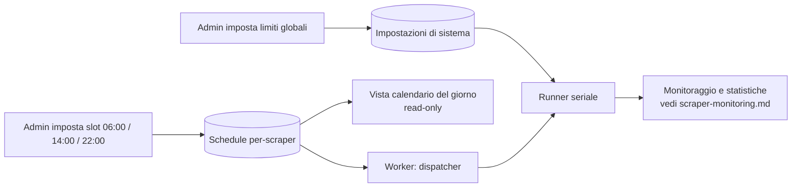

# Scheduling degli scraper e limiti di esecuzione (admin)

> **Layer 3 — Feature admin** · Audience: architetti, developer · Testo + Mermaid, niente codice. Architettura: [scheduling-and-execution](../../2-architecture/scheduling-and-execution.md) · Capability: [cron-worker](../../4-capabilities/core/cron-worker.md), [scraper-pool](../../4-capabilities/core/scraper-pool.md).

## Scopo

L'admin governa **quando** e **quanto** lavorano gli scraper: orari di esecuzione (da 1 a N volte al giorno per scraper, ciascuno indipendente dagli altri) e ritmo verso i siti osservati. Gli scraper girano **uno alla volta**: non esiste esecuzione concorrente tra scraper. Obiettivo dichiarato e non negoziabile: **mai martellare un sito** — il sistema deve essere un osservatore discreto, non un flood di richieste.

## Requisiti

### Schedule per-scraper
- **SCHED-R1** — Per ogni scraper l'admin imposta una **lista di orari** (slot), da **1 a N al giorno** (es. `06:00`, `14:00`, `22:00`), **indipendente dagli schedule degli altri scraper**. Lo schedule vale per tutti gli utenti che hanno configurato quello scraper.
- **SCHED-R2** — Ogni scraper ha un flag **enabled/sospeso** a livello di schedule: sospenderlo ferma le esecuzioni senza disinstallare il plugin né perdere lo schedule.
- **SCHED-R3** — Uno slot è **dovuto** quando il suo orario è passato e non è ancora stato eseguito; se il sistema era fermo, al riavvio si recupera **solo lo slot più recente** perso (mai il replay di tutti). Il recupero attraversa la mezzanotte.
- **SCHED-R4** — **Mai due run dello stesso scraper in parallelo** (lock per-scraper, valido anche per le esecuzioni on-demand partite dal web). Se uno slot scatta mentre la run precedente è in corso, lo slot è saltato e l'evento registrato come warning.
- **SCHED-R5** — In caso di **errore** della run, lo slot è comunque consumato (niente retry automatico al minuto successivo: il prossimo slot farà il suo lavoro). L'errore è registrato e visibile.

### Esecuzione seriale e limiti di sistema
- **SCHED-R6** — **Esecuzione strettamente seriale**: il runner esegue **un solo scraper alla volta**; i job dovuti nello stesso momento attendono in **coda FIFO**. Non esiste alcun parametro di parallelismo: la distribuzione del carico si governa **distanziando gli orari** degli scraper (con l'aiuto della vista calendario, SCHED-R10).
- **SCHED-R7** — **`scraper_run_timeout`**: durata massima di una run (default 30 minuti); oltre, la run è terminata e marcata in errore. Uno scraper appeso non deve mai bloccare il sistema (con l'esecuzione seriale, bloccherebbe anche la coda).
- **SCHED-R8** — **Politeness per-scraper**: ritardo minimo tra richieste HTTP consecutive dello stesso scraper (default 1–2 s, configurabile per scraper nella sua pagina admin). È imposto dal client HTTP fornito dal core, non lasciato alla buona volontà del plugin.
- **SCHED-R9** — Ogni scraper è **internamente mono-thread** (vincolo di contratto): una richiesta alla volta verso il sito. Con l'esecuzione seriale tra scraper, in ogni istante il sistema ha **al più una richiesta HTTP in volo** verso i siti osservati.

### Vista calendario
- **SCHED-R10** — Una pagina con **vista calendario del giorno** mostra tutte le run pianificate di **tutti gli scraper** (un blocco per slot, dimensionato sulla durata media delle run recenti). È **read-only**: gli slot si modificano dalla configurazione; un **click su uno scraper** rimanda alla sua pagina di configurazione. È lo strumento con cui l'admin distribuisce gli orari evitando sovrapposizioni in coda.

## Il modello di esecuzione, visivamente

```mermaid
gantt
    dateFormat HH:mm
    axisFormat %H:%M
    title Runner seriale - un solo scraper alla volta
    section Mattina
    Scraper A (sito A) - slot 06:00     :a, 06:00, 25m
    Scraper B (sito B) - slot 06:00, parte quando A finisce :b, 06:25, 40m
    Scraper C (sito C) - slot 08:00     :c, 08:00, 20m
```

A e B sono dovuti alle 06:00: B attende in coda la fine di A. C ha il suo orario indipendente alle 08:00 e gira da solo. Dentro ogni barra, le richieste al sito sono **sequenziali e cadenzate** dal ritardo di politeness.

## Pagina admin "Scheduler scrapers"

| Elemento | Contenuto |
|---|---|
| Riga per scraper | nome+icona, stato (attivo/sospeso/in coda/in esecuzione), slot configurati, esito e durata dell'ultima run, prossimo slot |
| Azioni per riga | modifica slot (aggiungi/rimuovi orari), sospendi/riattiva, vai al monitoraggio |
| Vista calendario | la giornata con i blocchi delle run pianificate di tutti gli scraper (SCHED-R10), read-only, click → pagina di configurazione dello scraper |
| Impostazioni globali | `scraper_run_timeout`, soglia di ritardo per i recuperi, retention dei log |



## Razionale delle scelte

- **Slot espliciti, non intervalli** ("ogni 4 ore"): l'admin ragiona per momenti della giornata utili ai dati (i prezzi cambiano la mattina; le offerte lampo richiedono uno slot in più), e gli slot rendono banale il calcolo del "dovuto" e del recupero.
- **Seriale, non parallelo**: a poche decine di run al giorno il parallelismo non compra nulla e complica tutto (limiti da tarare, picchi di carico, contese). Un solo scraper alla volta rende il carico prevedibile e la vista calendario una fotografia fedele della giornata. (La reintroduzione del parallelismo è un [future improvement](../../future-improvements/platform.md) se gli slot dovessero saturare la giornata.)
- **Limiti centralizzati**: la politeness non è delegata ai plugin (un plugin scritto male non può violarla, il client HTTP la impone) e la serialità è una proprietà del sistema, non dei singoli scraper.
- **Errore = slot consumato**: il retry immediato trasformerebbe un sito in manutenzione in un bombardamento di tentativi al minuto; la cadenza naturale degli slot è il retry giusto.
