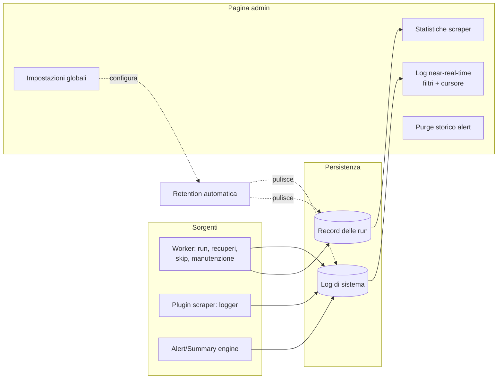

# Log di sistema e manutenzione (admin)

> **Layer 3 — Feature admin** · Audience: architetti, developer · Testo + Mermaid, niente codice.

## Log di sistema

Il registro degli eventi operativi del sistema, consultabile in near-real-time dalla pagina admin (polling incrementale con cursore, auto-scroll pausabile, filtri per livello e origine).

- **LOG-R1** — Origini **implementate**: `worker` (dispatcher: esecuzioni, recuperi, skip per overlap, manutenzione giornaliera — purge dei log/run oltre la retention) e `scraper` (eventi emessi dai plugin scraper via logger del contesto). Solo i record `wea.worker.*` e `wea.plugin.*` sono persistiti; il resto resta su stdout. Le origini `alert`/`summary` arriveranno con notifiche/summary (fasi 6+). Livelli: `info`, `warning`, `error`.
- **LOG-R2** — Eventi notevoli sempre registrati: run eseguita (con ritardo rispetto allo slot; oltre soglia → warning "recupero"), slot saltato per overlap (warning), errore/timeout di run (error). **Niente riga di heartbeat** (decisione 2026-06-26): la liveness del worker resta su `/api/health` + file di heartbeat, non come log ricorrente.
- **LOG-R3** — Il polling usa un cursore (id dell'ultima riga vista): il server restituisce solo le righe successive.
- **LOG-R4** — I messaggi non contengono mai contenuti operativi degli utenti (titoli dei prodotti, contenuto delle notifiche): solo identificativi e metriche — coerente con il principio che l'admin non legge i dati degli utenti.

## Pagina System logs (4.F3/4.F4)

Voce admin top-level **`/admin/logs`**, modello **ibrido**: **Live ON** = tail a cursore (`GET /api/admin/logs?since=<maxId>`, auto-refresh ~5 s, paginazione nascosta); **Live OFF** = storico a **numeri di pagina** (`GET /api/admin/logs/page?page=&size=` → `{items, total, counts, sources}`). Filtri: **tab per livello con conteggi** (Tutti/INFO/WARN/ERR), **chip sorgente multipli** (dinamici dalle sorgenti presenti — oggi worker/scraper), **ricerca** `q` (ILIKE sul messaggio), **righe/pagina** 25/50/100. Tabella ora · sorgente · livello · messaggio + **`{ }`** che apre il `context_json` in una modale.

## Manutenzione e impostazioni globali

- **MNT-R1** — **Purge dello storico alert**: regola globale per data ("elimina le notifiche di tutti gli utenti precedenti a X / più vecchie di N giorni"), applicata senza accesso ai contenuti.
- **MNT-R2** — **Retention automatica dei log operativi**: log di sistema e record delle run sono puliti automaticamente oltre la finestra configurata (default 90 giorni). Lo **storico prezzi non ha retention**: è il valore del sistema e si conserva per sempre.
- **MNT-R3** — **Impostazioni di sistema** modificabili da UI senza riavvio: `scraper_run_timeout_min`, soglia di ritardo per i recuperi (`catchup_warning_min`), giorni di retention (`log_retention_days`), periodo di grazia della cancellazione utenti (`user_deletion_retention_days`). Persistite nel DB (config DB-first), con default sicuri al primo avvio. **Implementato (4.F7)**: pagina **Admin → Settings** (`/admin/settings`, top-level con *Feature flags* come figlia) via `GET`/`PATCH /api/admin/settings` (chiavi note, range validati → 422); il worker rilegge i valori a ogni run/purge.
- **MNT-R4** — **Salute**: l'app espone un controllo di vita (applicazione + raggiungibilità del DB) usato dal monitoraggio dei container; il worker è sorvegliato tramite heartbeat ([scraper-monitoring](scraper-monitoring.md)).
- **MNT-R5** — **Backup**: script di backup/export/ripristino versionati nel repo (`ops/`), distribuiti con l'immagine `ops` ed eseguibili a mano come container effimero; l'archivio include dump completo (dati + configurazioni DB-first) e file di bootstrap locali ([backup-and-restore](../../infrastructure/backup-and-restore.md)). Lo storico prezzi non è ricostruibile: la cadenza la decide chi hosta.

## Vista d'insieme

