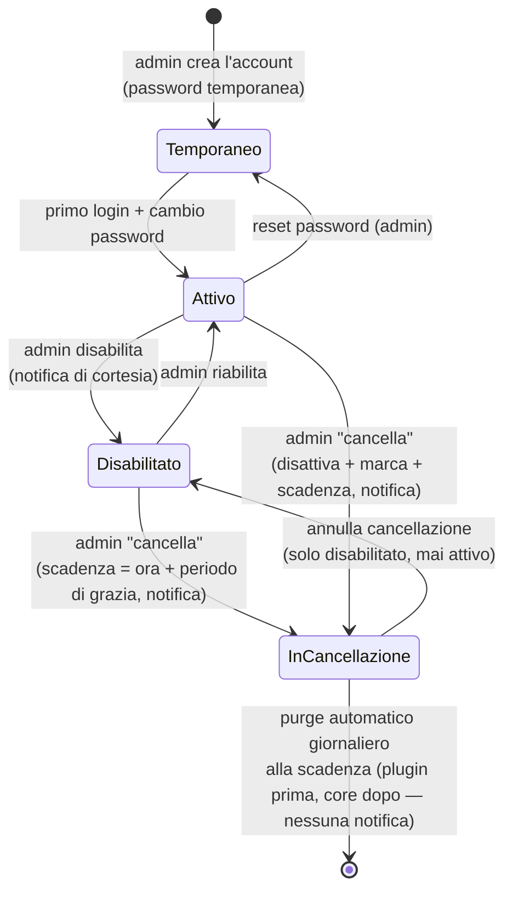

# Gestione utenti — ciclo di vita completo (admin)

> **Layer 3 — Feature admin** · Audience: architetti, developer · Testo + Mermaid, niente codice. Capability: [auth](../../../docs/4-capabilities/core/auth.md).
>
> **Spec-ahead (fase 10).** L'MVP **crea + elenca account** (con nome/cognome obbligatori, ruoli non sovrapposti, admin iniziale al primo avvio) è implementato ed è documentato in inglese: [`docs/3-features/admin/user-management.md`](../../../docs/3-features/admin/user-management.md). Questo file conserva solo la parte **non ancora implementata**: il ciclo di vita ricco — reset password, disabilita/riabilita, cancellazione differita con purge, notifiche di cortesia, filtri e ordinamenti.

## Requisiti

- **USR-R3** — L'admin può **reimpostare la password** di un utente (nuova temporanea + cambio forzato): è il flusso di recupero per password dimenticata — non esiste reset self-service via email, scelta coerente con la postura hobby.
- **USR-R4** — L'admin può **disabilitare/riabilitare** un account. La disabilitazione invalida le sessioni (con la tolleranza dichiarata di pochi minuti dell'access token, vedi [security posture](../../../docs/2-architecture/security-posture.md)).

### Cancellazione differita
- **USR-R7** — **"Cancella" è soft e a scadenza**: l'azione (singola o su più account selezionati) disattiva l'account, lo marca **"in cancellazione"** (`deletion_marked_at` = ora) e fissa la **data di scadenza** `deletion_due_at` = ora + periodo di grazia. Nessun dato viene eliminato in questa fase. Conferma con riepilogo di cosa verrà perso e la data di eliminazione programmata.
- **USR-R8** — **Annullamento con un tasto**: finché la scadenza non è passata, l'admin può annullare la cancellazione; l'account torna a **solo disabilitato** (marcatura e scadenza decadono), e da lì la riabilitazione standard (USR-R4) lo riporta attivo. **Due passi, mai direttamente attivo.**
- **USR-R9** — Il **purge è automatico**: una volta al giorno il worker elimina definitivamente gli account la cui scadenza è passata ([cron-worker](../../../docs/4-capabilities/core/cron-worker.md), CRON-R10). Il **periodo di grazia** è configurabile dall'admin (`user_deletion_retention_days`, default **30 giorni**); la scadenza è fissata **al momento della marcatura** — cambiare l'impostazione vale solo per le marcature future. Non esiste un purge manuale. Il purge non genera notifiche.
- **USR-R10** — **Ordine del purge**, per ogni utente scaduto: prima ogni plugin riceve `delete_user_data(user_id)` (hook **idempotente**: elimina le righe dell'utente dalle tabelle del plugin, es. gli input degli scraper), in sequenza; **solo se tutti completano** il core elimina i dati centralizzati con la cascata (DB-R2: catalogo, storici, carrelli, config notifier con recapiti personali, notifiche). Se un plugin fallisce: l'utente **resta in cancellazione**, errore in `system_log`, e il job giornaliero **ritenta il giorno successivo**. Mai dati orfani dei plugin.
- **USR-R11** — **Notifiche di cortesia** (kind `system_message`, [admin-notifications](admin-notifications.md)): alla **disabilitazione** e alla **marcatura per cancellazione** l'utente riceve un avviso sui suoi canali attivi. I testi provengono dal **catalogo dei messaggi di sistema** (chiavi `user.disabled`, `user.marked_for_deletion`), personalizzabili dall'admin (ADMSG-R7); il template di marcatura dichiara anche il placeholder `{deletion_due_date}` con la data di eliminazione programmata. Senza canali configurati non riceve nulla all'esterno; la riga in-app viene comunque scritta (la troverà se ripristinato). Il purge definitivo non notifica.
- **USR-R12** — **Login negato con messaggio**: un utente disabilitato o in cancellazione che tenta il login **con credenziali corrette** riceve un messaggio dedicato ("l'accesso non è più possibile, contatta l'amministratore"). Con credenziali errate: errore generico, identico a un account inesistente (nessuna enumerazione dello stato).

### Visibilità e filtri
- **USR-R13** — **Ultimo accesso**: la tabella mostra per ogni utente la data dell'ultimo login (`last_login_at`, vuota = mai entrato) e la colonna è **ordinabile**, per individuare a colpo d'occhio gli account inattivi.
- **USR-R14** — **Filtro rapido per stato**: la lista è filtrabile con un click tra **attivo**, **disabilitato** e **in cancellazione**. Un account disabilitato resta tale **a tempo indefinito** (nessuna scadenza automatica): solo la cancellazione esplicita avvia il conto alla rovescia.

## Flusso di vita di un account

## Pagina admin (ciclo di vita completo)

| Elemento | Contenuto |
|---|---|
| Tabella account | username, ruolo, stato (attivo/disabilitato/**in cancellazione**/cambio password pendente), lingua, data creazione, **ultimo accesso** (colonna ordinabile, USR-R13), data marcatura e **scadenza** per i marcati |
| Filtro stato | un click tra **attivo / disabilitato / in cancellazione** (USR-R14) |
| Azioni per riga (icone) | reset password · **abilita/disabilita** · **cancella** (= marca con scadenza) · **annulla cancellazione** (solo per i marcati, → disabilitato) |
| Creazione | form: username, **nome, cognome**, ruolo, password temporanea (o generata) |

L'admin **non vede**: cataloghi, carrelli, notifiche, configurazioni personali dei canali.
