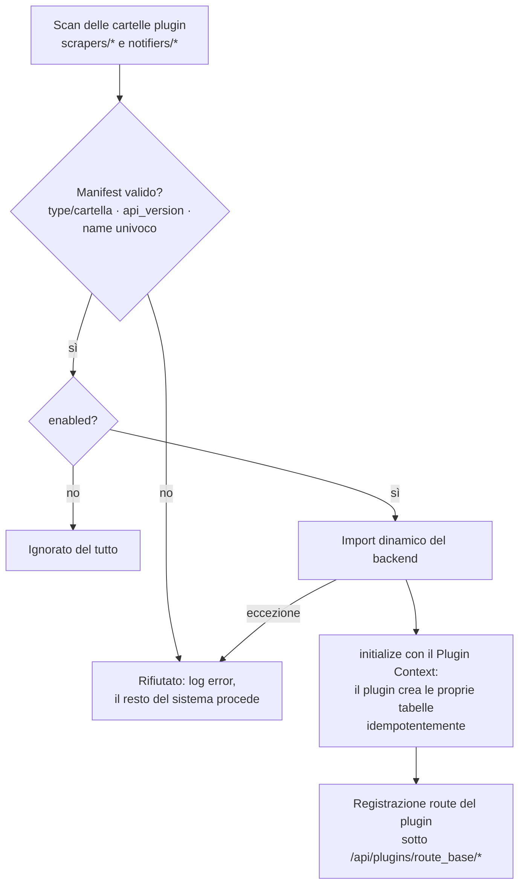
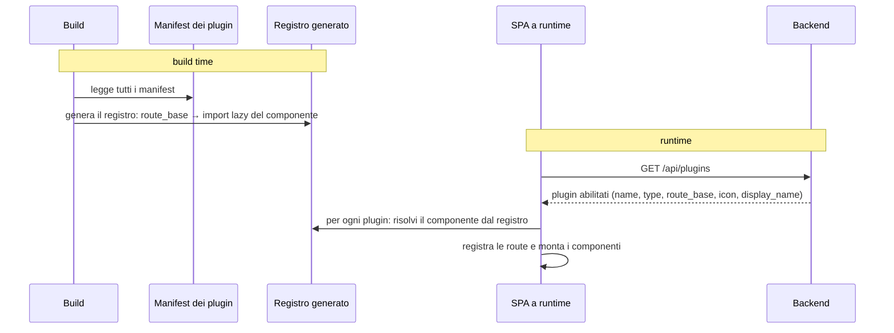
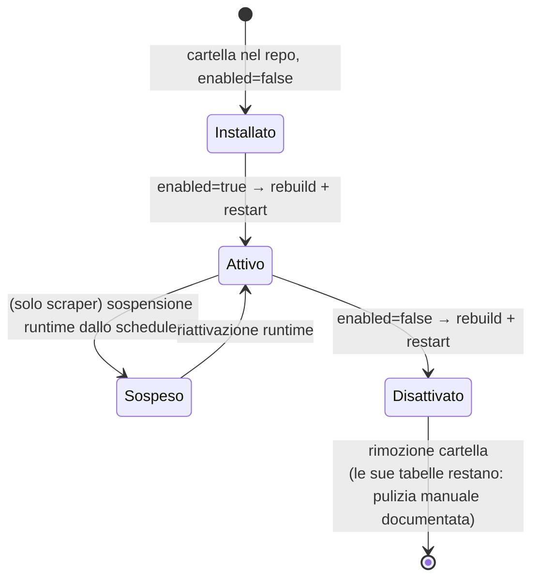

# Integrazione dinamica dei plugin (dettaglio)

> **Layer 3 — Feature plugin** · Audience: architetti, plugin developer · Testo + Mermaid, niente codice. Vista architetturale: [2-architecture/plugin-architecture.md](../../2-architecture/plugin-architecture.md) · Dettaglio tecnico: [4-capabilities/core/plugin-registry.md](../../4-capabilities/core/plugin-registry.md).

## Il manifest: carta d'identità del plugin

Ogni plugin dichiara nel proprio `manifest.json` tutto ciò che il sistema deve sapere **senza eseguirlo**:

| Campo | Significato | Regole |
|---|---|---|
| `name` | Identità del plugin in tutto il sistema (`plugin_id`) | Univoco; coincide con l'identità dichiarata dal codice (validato al load) |
| `type` | `scraper` o `notifier` | Deve combaciare con la cartella di discovery, altrimenti rifiutato |
| `version` | Versione del plugin | Informativa |
| `api_version` | Versione del **contratto** plugin supportata | Se incompatibile col core → rifiutato con errore esplicito |
| `enabled` | Attivazione | Unica source of truth; `false` = ignorato ovunque |
| `icon` | Immagine statica del plugin | Usata per la **provenienza** in tutta la UI; se assente, icona neutra |
| `display_name` | Nome leggibile | Mostrato in UI e hover |
| `backend.entry` | Entry point Python | **Relativo alla cartella del plugin** |
| `frontend.entry` | Entry point Svelte | Relativo; esporta il componente |
| `frontend.route_base` | Base delle route del plugin | Unica fonte della route (l'entry non la ridichiara) |
| `frontend.i18n` | Cartella traduzioni frontend | Namespace dedicato per plugin; `en.json` sempre presente (fallback) |
| `backend.i18n` | Cartella traduzioni backend (notifier) | Testi delle notifiche nella lingua dell'utente; `en.json` sempre presente (fallback) |

## Discovery backend (web e worker, identica)

Garanzia centrale: **il fallimento di un plugin non impatta il core né gli altri plugin** — al load (plugin rifiutato) come a runtime (errori isolati, timeout di run).

## Discovery frontend (build + runtime)

Due fasi alimentate dalla **stessa fonte** (i manifest), quindi coerenti per costruzione:

- Il registro generato non si scrive mai a mano.
- La risposta di discovery **non espone percorsi interni** del filesystem: solo ciò che serve al client.
- Poiché il registro è cucinato nel bundle, **abilitare/disabilitare un plugin richiede rebuild + restart** — dichiarato e accettato ([build system](../../infrastructure/build-system.md)).

## Dove compare un plugin nella UI

| Superficie | Scraper | Notifier |
|---|---|---|
| Sidebar | Gruppo **SCRAPERS** in fondo (collassabile, icona + nome, route del plugin) | Mai in sidebar |
| Pagina utente del plugin | Scelta di cosa osservare + dry-run | — (la config utente sta in Profilo) |
| Pagina admin del plugin | Parametri operativi + Test Scraper | Config di sistema + test del canale |
| Profilo utente | — | Form personale + flag attivo + Test |
| Product Picker / carrelli / notifiche | Icona di **provenienza** su ogni prodotto | — |

La sidebar tiene il gruppo SCRAPERS per ultimo così può crescere senza spostare le voci core; le voci sono dinamiche (un plugin nuovo appare da solo dopo il deploy).

## Ciclo di vita di un plugin (operativo)

