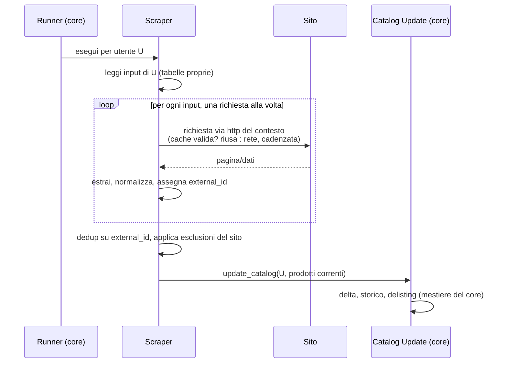

# Scraper Plugin (contratto generico)

> **Layer 3 — Feature plugin** · Audience: architetti, plugin developer · Testo + Mermaid, niente codice. Contratto tecnico: [4-capabilities/contracts/product.md](../../4-capabilities/contracts/product.md) · Guida pratica: [plugin-development/scraper-development-guide.md](../../plugin-development/scraper-development-guide.md).

Questo documento descrive **lo scraper astratto**: tutto ciò che ogni scraper è e deve fare, indipendentemente dal sito. Nessun riferimento a siti reali — i plugin concreti sono documentati in [implemented-plugins/](../../implemented-plugins/).

## Cos'è uno scraper

Un produttore **stateless** e **internamente mono-thread** di prodotti: legge i propri input (cosa osservare, per quale utente), visita il sito con calma — una richiesta alla volta, cadenzata — e consegna al core la lista corrente dei prodotti trovati. Tutto ciò che riguarda il sito (struttura, navigazione, categorie, paginazione, stati speciali dei prodotti) è **interno al plugin**: il core non ne sa nulla.

## Responsabilità: scraper vs core

| Responsabilità | Scraper | Core |
|---|---|---|
| Sapere cosa osservare per ogni utente (input propri) | ✅ | — |
| Strategia di scraping (DOM, chiamate interne, browser) | ✅ | — |
| Concetto di categoria, paginazione, filtri del sito | ✅ | — |
| Identità del prodotto: **seme** (`identity_seed`) | ✅ (fornirlo) | usa |
| Identità del prodotto: **hashing/normalizzazione** in `external_id` | — | ✅ (imposto, uniforme) |
| Decidere la disponibilità (`is_available`) | ✅ | — |
| Tag del prodotto (`product_properties`) | ✅ (popola) | persiste (non interpreta) |
| Marca (`brand`: testo + link) | ✅ (estrae) | persiste |
| Categoria (`category`: breadcrumb) | ✅ (costruisce) | persiste |
| Esclusioni specifiche del sito (stati speciali del prodotto) | ✅ | — |
| Calcolo adjustments del carrello (regole del sito) | ✅ | applica |
| Storico, delta, delisting | — | ✅ |
| Scrittura nel catalogo | — | ✅ (unica via: callback) |
| Quando girare, serialità tra scraper, politeness, timeout | — | ✅ |
| Cache delle risposte (riuso tra utenti e run ravvicinate) | — | ✅ (trasparente, nel client HTTP) |

## Requisiti del contratto

### Input e configurazione
- **SCR-R1** — Lo scraper possiede i **propri input** in tabelle dedicate (namespaced per plugin), per utente, che crea da sé se non esistono. Ogni configurazione utente (dalla pagina del plugin) crea una o più entry.
- **SCR-R2** — Configurazione a due livelli come ogni plugin: **admin** (parametri operativi: timeout, identificazione, politeness, regole del sito) e **utente** (cosa osservare). Entrambe descritte da schemi dichiarativi per i form dinamici.
- **SCR-R3** — Lo scraper sa rispondere al core **quali utenti l'hanno configurato** (serve al **runner schedulato**, che itera gli utenti senza che il core legga le tabelle del plugin). Lo scrape-now manuale non passa di qui: è per-scraper, parte dalla sua pagina e lo scraper conosce già l'utente richiedente (SCR-R15).

### Esecuzione
- **SCR-R4** — L'unità di esecuzione è **per utente**: il core invoca lo scraper per ciascun utente configurato. La **run schedulata** itera tutti gli utenti; lo **scrape-now** (manuale, dalla pagina dello scraper) gira per il **solo utente richiedente**. Lo scraper non decide mai *quando* girare.
- **SCR-R5** — Lo scraper è **stateless**: produce solo lo stato corrente, non conosce lo storico né i delta (mestiere del core).
- **SCR-R6** — Lo scraper è **internamente mono-thread**: nessun parallelismo interno verso il sito. Usa **esclusivamente il client HTTP fornito dal contesto**, che impone il ritmo (politeness), conta le richieste per il monitoraggio e può servire una risposta dalla **cache di scrape** in modo trasparente (stessa query entro l'emivita → niente chiamata al sito, [plugin-context](../../4-capabilities/core/plugin-context.md) CTX-R9).
- **SCR-R7** — Restituisce **anche i prodotti non disponibili** (marcati); non li filtra mai. Le esclusioni specifiche del sito (es. prodotti in stati speciali che l'utente non vuole) avvengono dentro il plugin, e i prodotti esclusi sono conteggiati per il monitoraggio.
- **SCR-R8** — La lista consegnata è **piatta e deduplicata** sull'identità: se lo stesso prodotto emerge da più input (es. input singolo + categoria che lo contiene), compare una volta sola.

### Product properties (tag) e categoria
- **SCR-R16** — La base scraper fornisce il **meccanismo** per attaccare a un prodotto una lista di **tag** (`product_properties`, [product](../../4-capabilities/contracts/product.md) PROD-R5): due metodi `add_property(value)` (aggiunge una stringa, già **trimmata** e **deduplicata**) e `get_properties()` (restituisce la lista). Operano sul **prodotto in costruzione**, non come stato dell'istanza del plugin (che è un **singleton condiviso**): le property di un prodotto/utente non devono mai sbordare su un altro. **Cosa** mettere nei tag è scelta del plugin (un'etichetta ripulita dal titolo, uno stato di disponibilità particolare, …); uno scraper a cui non serve non chiama nulla e la lista resta vuota. Il core non interpreta i tag: li persiste e la UI li mostra (visione a lungo termine: tag grafici). Le regole *site-specific* (quali etichette esistono, come riconoscerle) restano nel plugin concreto, mai nella base.
- **SCR-R17** — Stessa filosofia per la **categoria** (`category`, PROD-R7): la base fornisce un costruttore di **breadcrumb** — `add_child(name, url)` (chiamato root → leaf man mano che lo scraper scopre il percorso) e `get_path()` (restituisce la lista ordinata di `CategoryRef`). Per-prodotto (mai sull'istanza singleton). Dove e come si scopre il breadcrumb è site-specific (DOM, JSON-LD `BreadcrumbList`, …); uno scraper senza categoria non chiama nulla e la lista resta vuota. Il core la persiste e la UI la mostra (`testo / testo / …`, l'ultima senza `/`).

### Identità del prodotto (il punto più delicato)
- **SCR-R9** — Ogni prodotto porta un **`external_id` stabile tra run e univoco** nello spazio del plugin. È l'aggancio di tutto: riconoscimento, storico, disponibilità, delisting. Se cambia, il core vede un prodotto nuovo e lo storico si spezza.
- **SCR-R10** — La derivazione è un **template method** ([product](../../4-capabilities/contracts/product.md)): il plugin **deve** implementare il solo **seme** (`identity_seed`, metodo astratto — SKU/ID nativo se esiste, altrimenti `None` per il fallback all'URL; mai titoli o descrizioni); l'**hashing e la normalizzazione** sono imposti dalla base (`final`, non sovrascrivibili) e identici per tutti gli scraper. Il plugin non riempie mai `external_id` a mano e non reimplementa l'hashing — è ciò che garantisce stabilità e uniformità senza affidarsi alla buona volontà del plugin. Uno scraper che non fornisce il seme non si carica (l'astratto fallisce al load).

### Dry-run / Test
- **SCR-R11** — Ogni scraper implementa una funzione di **test**: uno scrape on-demand che restituisce i prodotti trovati **senza scrivere nulla** (né catalogo né input). Parametrizzata dall'input raccolto dalla UI del plugin.
- **SCR-R12** — La visualizzazione dei risultati del test è **comune** (componente tabella del design system alimentato dal risultato): il plugin non reimplementa la tabella. Il dry-run serve sia all'utente (anteprima di cosa osserverà) sia all'admin (verifica di funzionamento dalla pagina admin del plugin).

### Adjustments
- **SCR-R13** — Lo scraper espone il calcolo degli **adjustments** per i carrelli a lui legati: dato il totale, restituisce le voci correttive secondo le regole del sito (sconti a soglia, spedizione). Il core le applica senza conoscerne la logica. Contratto: [adjustment](../../4-capabilities/contracts/adjustment.md).

### Cancellazione dati utente
- **SCR-R14** — Lo scraper implementa `delete_user_data(context, user_id)`: elimina **tutte** le righe di quell'utente dalle proprie tabelle (input, parametri personali), in modo **idempotente** (invocabile più volte senza errore). È invocato dal core durante il purge di un account, **prima** della cascata sui dati centrali ([user-management](../admin/user-management.md), USR-R10).

### Scrape manuale (scrape-now)
- **SCR-R15** — Ogni scraper espone, sulla **propria pagina utente**, un comando di **scrape immediato** per il **solo utente richiedente** (popola il catalogo — a differenza del dry-run, che non scrive). È soggetto a un **intervallo minimo per-scraper** (*cooldown*): un parametro **admin riservato** (SCR-R2, imposto dal core e uniforme, non lasciato al singolo plugin — stessa filosofia della politeness), con **default 1 ora**. Il blocco è **lato server**: una richiesta entro l'intervallo è **rifiutata** dichiarando il **tempo rimanente** (HTTP 429), mai solo nascosta in UI. La UI **disabilita** il bottone finché il cooldown non è trascorso, mostrando un **conto alla rovescia** alimentato dallo stato letto dal server; un **popup di conferma** alla pressione ricorda ogni quanto lo scrape è disponibile. Lo scrape-now condivide il **lock per-scraper** con le run schedulate ([SCHED-R4](../admin/scraper-scheduling-and-limits.md)). Il cooldown si appoggia a un **anchor "ultimo scrape" per *(scraper, utente)***, con un'asimmetria precisa: l'anchor è **scritto all'avvio di *ogni* scrape — manuale o schedulato — ma letto (e quindi vincolante) solo dallo scrape manuale**. Conseguenze volute: dopo una run **schedulata** non si può forzare subito un manuale (la run ha scritto l'anchor), mentre un **manuale** non blocca mai la run schedulata successiva (che l'anchor non lo legge); scrivere l'anchor **all'avvio** (non al termine) fa contare il cooldown dall'inizio e chiude la doppia-pressione ravvicinata. La meccanica (cooldown, anchor, dispatch alla run) è **fornita dalla base** comune agli scraper, non reimplementata dai plugin.

## Flusso di una run (vista contrattuale)

## La pagina utente del plugin

Come l'utente sceglie *cosa osservare* è una scelta libera del plugin (navigazione per categorie, inserimento URL, ricerca…), con tre vincoli:

1. usa il **design system** del core;
2. offre il **dry-run** di anteprima (senza persistenza);
3. la selezione confermata crea le entry negli input del plugin.

La pagina ospita inoltre il comando **Scrape ora** per-scraper (SCR-R15) che — a differenza del dry-run — **scrive** nel catalogo, con il suo bottone soggetto a cooldown (disabilitato + conto alla rovescia quando non disponibile).

È **distinta** dal Product Picker del core (che lavora sul catalogo già estratto). La pagina **admin** del plugin è a sua volta distinta: parametri operativi (incluso l'intervallo dello Scrape ora) + test, mai selezione di contenuti.
