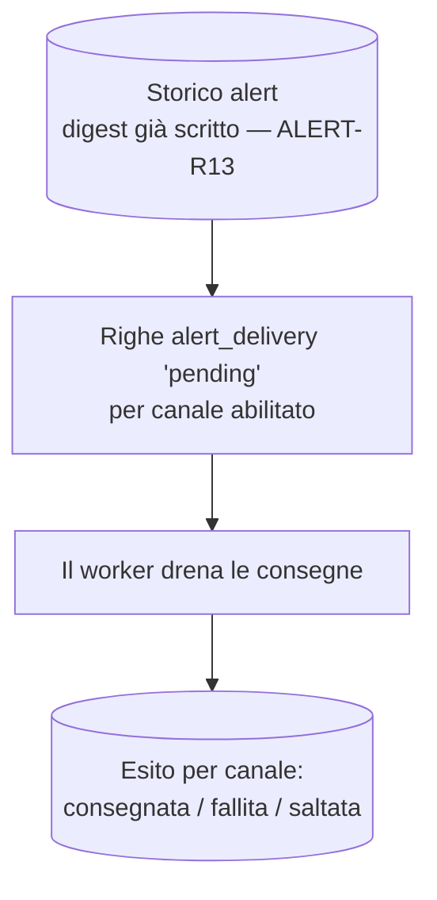

# Alert e notifiche — lato utente (spec-ahead)

> **Layer 3 — Feature utente** · Audience: architetti, developer · Testo + Mermaid, niente codice.
>
> I requisiti **implementati** (trigger event-driven, tipi di alert per-carrello, diff su baseline, digest aggregato unico, prima run silenziosa, tag prodotto/carrello, storico con letto/non letto e cancellazione multipla) sono ora nel mirror inglese canonico [`docs/3-features/user/alerts-and-notifications.md`](../../../docs/3-features/user/alerts-and-notifications.md) (DOC-12). Questo file conserva solo i requisiti **non ancora costruiti**. Architettura: [notification-architecture](../../2-architecture/notification-architecture.md) · Capability: [alert-engine](../../4-capabilities/core/alert-engine.md).

## Requisiti (spec-ahead)

### Tipi di alert
- **ALERT-R9 (estensione)** — Tag di **prodotto** aggiuntivo: **minimo storico** (un ribasso ha portato il prezzo al minimo mai registrato). Dipende dalle price analytics — vedi [price-analytics](price-analytics.md) (fase 11). I quattro tag già attivi (entrato/uscito di offerta, diventato indisponibile/tornato disponibile) sono implementati e documentati nel mirror inglese.

### Storico e consegna
- **ALERT-R14** — La consegna avviene su **tutti i canali abilitati** dall'utente ed è **asincrona**: alla scrittura del digest il core registra una riga `alert_delivery` in stato **`pending`** per ogni canale abilitato (o `skipped_no_notifier` se nessun canale è configurato), che il **worker drena** fuori dal ciclo di scrape. L'esito è registrato **per canale** (consegnata / fallita con motivo / nessun canale). Un fallimento di consegna non blocca né nasconde nulla (il digest è già nello storico interno — ALERT-R13).
- **ALERT-R16** — Lo storico distingue **due categorie**: notifiche di **sistema** (digest, summary) e notifiche **admin** (messaggi inviati dall'amministratore — [admin-notifications](../admin/admin-notifications.md)). Le notifiche admin hanno **icona e colore dedicati** e lo storico è filtrabile per categoria. Anche per le notifiche admin valgono ALERT-R13/R14: sempre in storico, consegna sui canali abilitati.

### Report periodico
- Il **summary** (fase 11) è una fotografia periodica opt-in dello stato dei carrelli (non un diff). Riusa la stessa pipeline: una riga nello storico interno **sempre** e consegna sui canali abilitati (ALERT-R14). È distinto dal digest per tipo di payload; i notifier lo formattano diversamente.

## Consegna di una run (spec-ahead)

## Interazioni UI (spec-ahead)

- **Profilo → Notifiche**: configurazione canali con flag on/off e bottone **Test** per ciascuno ([profile-and-notifiers.md](profile-and-notifiers.md)). Nessun picker di giorni/orario: gli alert sono event-driven (a fine scrape).
- **Storico alert (parti spec-ahead)**: filtro per categoria (sistema/admin) e per tipo (digest/summary), notifiche admin evidenziate con icona e colore dedicati, messaggi testuali resi in Markdown (sanificato), dettaglio con esiti di consegna per canale. La lista base, il badge non letto e la cancellazione multipla sono implementati (mirror inglese).
