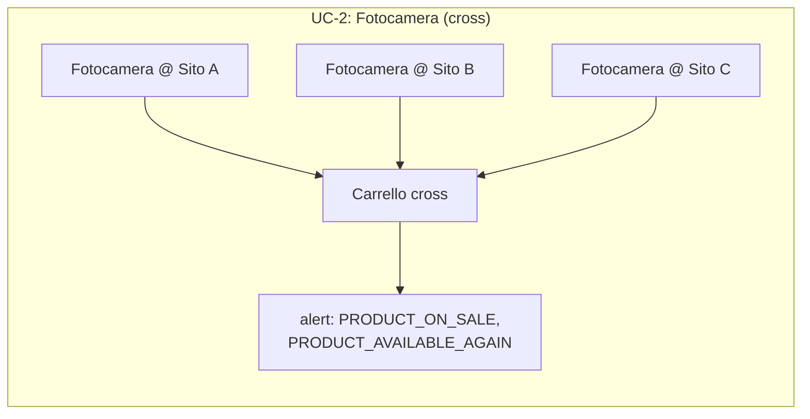

# Carrelli — tipi di alert (lato utente)

> **Layer 3 — Feature utente** · Audience: architetti, developer · Testo + Mermaid, niente codice. Capability: [cart-engine](../../../docs/4-capabilities/core/cart-engine.md).
>
> **Spec-ahead (fase 6).** La feature carrello — le due modalità, l'appartenenza, lo stato calcolato (totali, adjustments, stima finale, flag di salute) e la soglia di risparmio in € — è implementata in fase 5 ed è documentata in inglese: [`docs/3-features/user/carts.md`](../../../docs/3-features/user/carts.md). Questo file conserva solo la parte **non ancora implementata**: la scelta **per-carrello dei tipi di alert** (e la baseline che ne consegue), che arriva con gli [alert in-app](alerts-and-notifications.md) in fase 6.

## Requisiti — Alert

- **CART-R13** — Su ogni carrello l'utente sceglie **quali tipi di alert** ricevere; di default **nessuno** è attivo. *Quando* riceverli è per-account ([alerts-and-notifications.md](alerts-and-notifications.md)). L'insieme si imposta con `PUT /api/carts/{id}/alert-types` (set completo).
- **CART-R14** — Abilitare il primo tipo di alert **semina la baseline** del carrello; disabilitarli tutti la elimina. Non esistono alert su prodotti fuori dai carrelli.

## Interazione con lo stato del carrello

I tipi di alert si innestano sullo stato che il Cart Engine già calcola (implementato, vedi la versione inglese). In particolare, la soglia di risparmio: quando scatta **con prodotti esclusi** (non disponibili o delistati), lo stato della soglia è marcato **`partial`** e la notifica di fase 6 lo dichiara con l'elenco degli esclusi.

## Esempio (use case cross)

