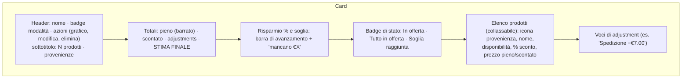
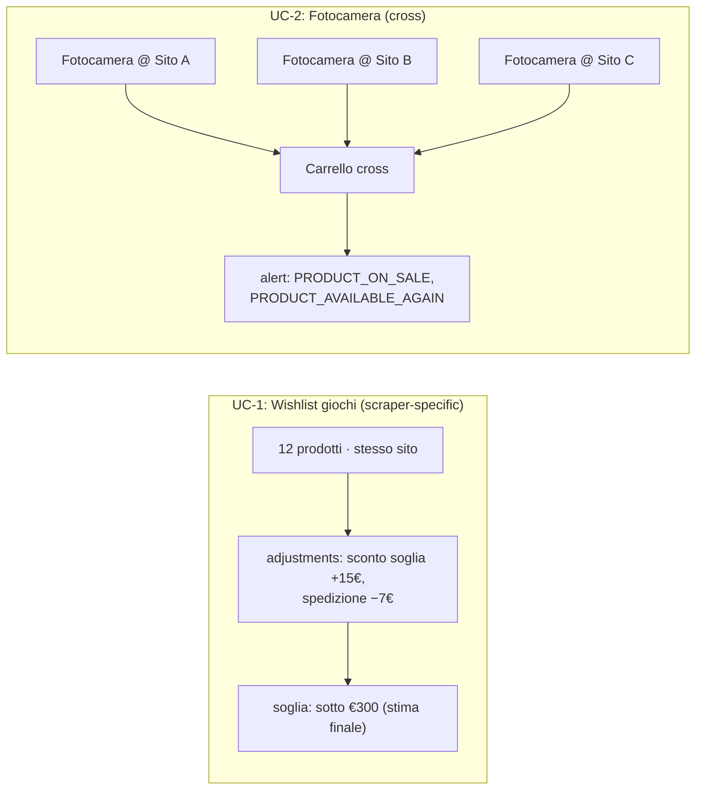

# Carrelli

> **Layer 3 — Feature utente** · Audience: architetti, developer · Testo + Mermaid, niente codice. Capability: [cart-engine](../../4-capabilities/core/cart-engine.md).

## Scopo

Il carrello è l'unità di monitoraggio con notifica: un gruppo di prodotti del catalogo con totali calcolati, una soglia di risparmio e i tipi di alert scelti. Serve i due use case fondanti: l'**acquisto in blocco al massimo risparmio** (UC-1) e il **monitoraggio multi-sito dello stesso prodotto** (UC-2).

## Requisiti

### Struttura
- **CART-R1** — Un carrello referenzia solo prodotti già nel catalogo dell'utente; un prodotto può appartenere a più carrelli.
- **CART-R2** — Alla creazione si scelgono **nome** e **modalità**; la modalità è **immutabile** (cambiarla invaliderebbe adjustments e baseline: si ricrea il carrello).
- **CART-R3** — La cancellazione elimina solo il carrello (mai i prodotti del catalogo), con conferma.

### Modalità
- **CART-R4** — **Scraper-specific**: prodotti di un solo scraper; gli **adjustments** del plugin (sconti a soglia, spedizione) sono applicati al totale — il totale è "quello che pagheresti davvero su quel sito".
- **CART-R5** — **Cross**: prodotti da qualunque scraper; nessun adjustment (nessuna logica di sconto è comune a siti diversi). Lo "stesso" prodotto può comparire **più volte, una per sito** (sono righe di catalogo distinte): è il modo previsto per il monitoraggio multi-sito.
- **CART-R6** — Nei carrelli cross la **provenienza è sempre esplicita** su ogni riga (icona + nome scraper), nella card, nel dettaglio e nelle notifiche.

### Calcoli
- **CART-R7** — Il Cart Engine calcola: totale pieno (somma listini), totale scontato (somma prezzi correnti), elenco adjustments (solo scraper-specific), **stima finale** = totale scontato − somma adjustments.
- **CART-R8** — I prodotti **non disponibili** o **delistati** restano nel carrello ma sono **esclusi da tutti i totali** finché non tornano attivi.

### Soglia
- **CART-R9** — La soglia si imposta e si memorizza come **valore assoluto in €** (`threshold_amount`); `null` = nessuna soglia, valore `> 0`. *(Decisione 2026-06-29 — inverte la versione precedente "salvata come %".)* La **percentuale è solo un aiuto di input nella UI**: i campi **€ e %** si **specchiano a vicenda** (modificando uno, l'altro si aggiorna sul totale pieno corrente dei prodotti attivi, con `soglia€ = totale · (1 − %/100)`); al backend si invia **solo il valore in €**.
- **CART-R10** — La soglia in € è **fissa**: una volta impostata non si ricalcola al variare del perimetro (è il numero scelto dall'utente). Il backend non conosce la percentuale; ragiona solo sull'importo.
- **CART-R11** — La soglia si confronta con la **stima finale** (adjustments inclusi, quando presenti): è il prezzo reale che l'utente pagherebbe — coerente con UC-1.
- **CART-R12** — Nessun evento di soglia se il carrello non ha **alcun prodotto attivo** (un confronto su totale 0 sarebbe sempre vero e privo di significato).

### Alert
- **CART-R13** — Su ogni carrello l'utente sceglie **quali tipi di alert** ricevere; di default **nessuno** è attivo. *Quando* riceverli è per-account ([alerts-and-notifications.md](alerts-and-notifications.md)).
- **CART-R14** — Abilitare il primo tipo di alert **semina la baseline** del carrello; disabilitarli tutti la elimina. Non esistono alert su prodotti fuori dai carrelli.

## La card del carrello

## Esempio dei due use case

## Soglia e prodotti esclusi (esempio normativo)

La soglia è un importo in € **fisso**; il confronto è sulla **stima finale** dei soli prodotti attivi (CART-R11). Quando un prodotto diventa indisponibile o delistato esce dai totali (CART-R8): la stima finale cambia e la soglia può scattare con un perimetro ridotto. Se scatta **con prodotti esclusi**, lo stato della soglia è marcato **`partial`** (e la notifica, in fase 6, lo dichiara con l'elenco degli esclusi).

| Scenario | Stima finale attiva | Soglia € | Raggiunta? |
|---|---|---|---|
| 5 prodotti disponibili | €90 | €80 | no |
| Uno (da €20) diventa indisponibile | €72 | €80 | sì (`partial`, 1 escluso) |
