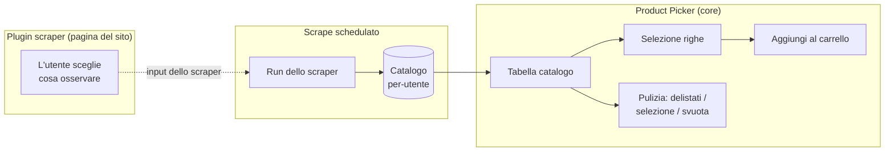
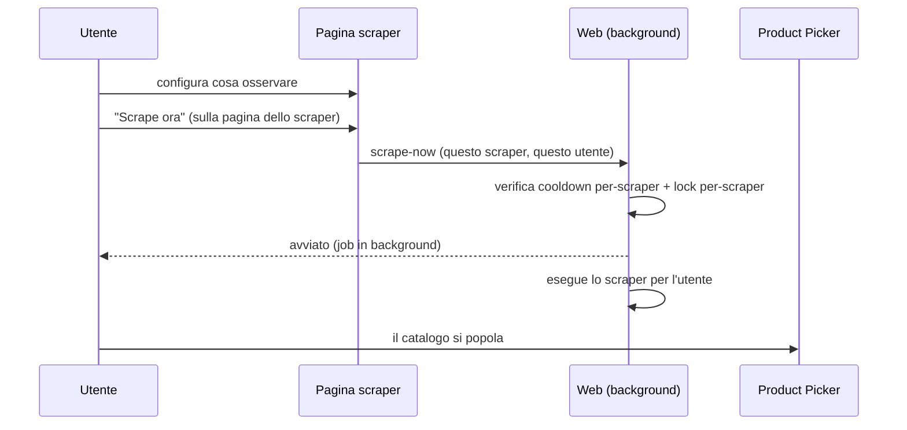

# Catalogo e Product Picker

> **Layer 3 — Feature utente** · Audience: architetti, developer · Testo + Mermaid, niente codice. Capability: [catalog-update-service](../../4-capabilities/core/catalog-update-service.md).

## Scopo

Il catalogo è l'insieme dei prodotti estratti dagli scraper per l'utente. Il **Product Picker** è la tabella con cui l'utente lo consulta, lo pulisce e seleziona i prodotti da mettere nei carrelli. Non esegue scraping: è pura selezione su dati già nel DB (le anteprime live sono delle pagine dei singoli plugin).

## Requisiti

- **CAT-R1** — Il catalogo è per-utente: contiene la somma dei prodotti estratti dagli scraper che l'utente ha configurato.
- **CAT-R2** — Ogni prodotto mostra sempre la **provenienza** (icona + nome dello scraper). Fondamentale per i carrelli cross ([use case 2](../../1-business/use-cases.md)).
- **CAT-R3** — I prodotti **non disponibili** restano nel catalogo (indicatore visivo), non vengono mai esclusi automaticamente.
- **CAT-R4** — I prodotti **delistati** (`removed`, assenti dall'ultimo scrape) restano in tabella grigiati, esclusi da carrelli e alert, finché l'utente non li pulisce. Se ricompaiono in uno scrape, tornano attivi.
- **CAT-R5** — La tabella è **paginata lato server**, ordinabile (titolo, prezzi, % sconto, scraper), filtrabile per scraper e ricercabile per titolo.
- **CAT-R6** — Azioni di pulizia: rimuovi delistati, rimozione selettiva (modalità delete), svuota catalogo. Tutte con conferma; la conferma **dichiara le conseguenze** (rimozione dai carrelli e perdita dello storico dei prodotti coinvolti).
- **CAT-R7** — **Empty-state del catalogo**: a catalogo vuoto il Product Picker non offre azioni di scraping, ma **rimanda alle pagine degli scraper** per configurare cosa osservare e avviare il primo popolamento. Lo **Scrape ora** è **per-scraper** e vive sulla pagina dello scraper, non qui ([scraper-plugin](../plugins/scraper-plugin.md), SCR-R15).
- **CAT-R8** — L'eliminazione di un prodotto dal catalogo lo rimuove **a cascata** dai carrelli e ne elimina lo storico prezzi.

## La tabella

| Colonna | Contenuto |
|---|---|
| Provenienza | Icona dello scraper (dal manifest), nome in hover |
| Foto | Immagine remota, dimensione fissa |
| Titolo | Nome prodotto |
| Prezzo pieno | Listino (o ultimo noto) |
| Prezzo scontato | Prezzo corrente |
| % sconto | Badge |
| Disponibilità | Indicatore (disponibile / esaurito / delistato) |
| Apri | Link alla pagina del prodotto sul sito (nuova tab) |

## Flussi

Distinzione da tenere ferma (fonte frequente di confusione):

| | Pagina del plugin | Product Picker (core) |
|---|---|---|
| Scopo | Decidere **cosa osservare sul sito** | Scegliere prodotti **già nel catalogo** per i carrelli |
| Dati | Anteprima live dal sito (dry-run) | DB |
| Scrive | Input dello scraper (tabelle del plugin) | Membri dei carrelli |

## Ciclo "catalogo vuoto → primo popolamento"

A catalogo vuoto il Product Picker invita a configurare uno scraper e avviarne il primo scrape **dalla sua pagina**: lo "Scrape ora" è **per-scraper** e vive lì ([scraper-plugin](../plugins/scraper-plugin.md), SCR-R15). Nasce per non far attendere ore il primo popolamento, ma resta disponibile in ogni momento entro il cooldown del singolo scraper. Negli altri casi il catalogo si aggiorna ai normali scrape schedulati.
