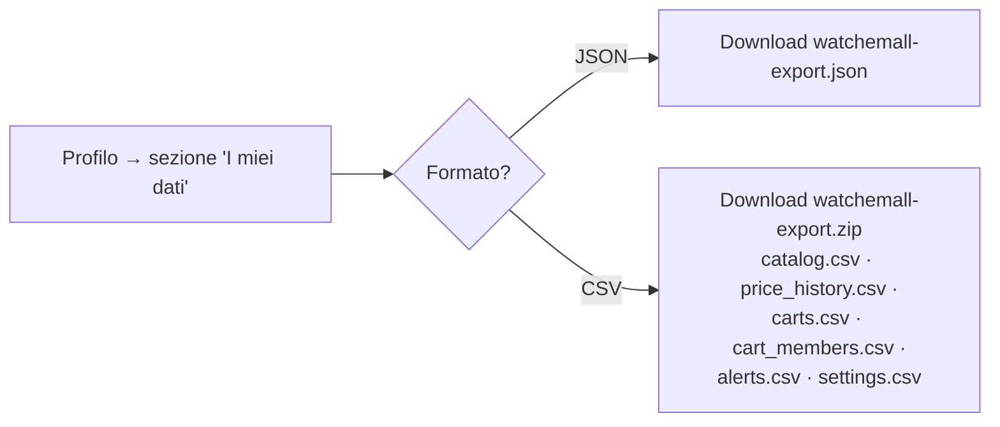

# Esportazione dei propri dati

> **Layer 3 — Feature utente** · Audience: architetti, developer · Testo + Mermaid, niente codice. API: [endpoints](../../api/endpoints.md#profilo-me).

## Scopo

L'utente può portarsi via **tutti i propri dati** in formati aperti, in autonomia, dal Profilo. È la garanzia di non-lock-in di un sistema il cui valore cresce col tempo (lo storico prezzi): i dati sono dell'utente, non dell'installazione.

## Requisiti

- **EXP-R1** — Export **self-service** dal Profilo, senza coinvolgere l'admin. Riguarda esclusivamente i dati dell'utente autenticato.
- **EXP-R2** — Dataset inclusi: **catalogo** (prodotti con stato e provenienza), **storico prezzi** completo, **carrelli** (definizione, membri, soglie, tipi di alert), **storico alert** (payload e esiti di consegna), **configurazioni personali** (cadenza, summary, canali — **esclusi i campi segreti**, mai esportati).
- **EXP-R3** — Due formati: **JSON** (un singolo file strutturato, fedele ai modelli) e **CSV** (un archivio zip con un file per dataset, header in prima riga) — il primo per le macchine, il secondo per i fogli di calcolo.
- **EXP-R4** — Esecuzione **sincrona** (download diretto): a questa scala i dati di un utente sono piccoli; niente job asincroni né email con link. Scelta dichiarata.
- **EXP-R5** — Convenzioni dei dati: `Decimal` come stringa, `datetime` ISO-8601 UTC, encoding UTF-8, nomi colonna in inglese coerenti coi contratti. Il file include un'intestazione con versione del formato e data di generazione.
- **EXP-R6** — Nessun **import** in V1 (dichiarato): l'export serve a portabilità e analisi personale, non a migrazione tra installazioni.

## Flusso

## Confini dichiarati

- L'export non è un backup del sistema (quello è il dump del DB, responsabilità dell'host — [deployment](../../../docs/infrastructure/deployment.md)): è la vista *di un utente* sui *propri* dati.
- I segreti (es. password SMTP non c'è a livello utente, ma eventuali campi secret dei canali) non compaiono mai, nemmeno mascherati.
- L'admin non ha un export dei dati degli utenti (coerente con il principio che non li legge).
