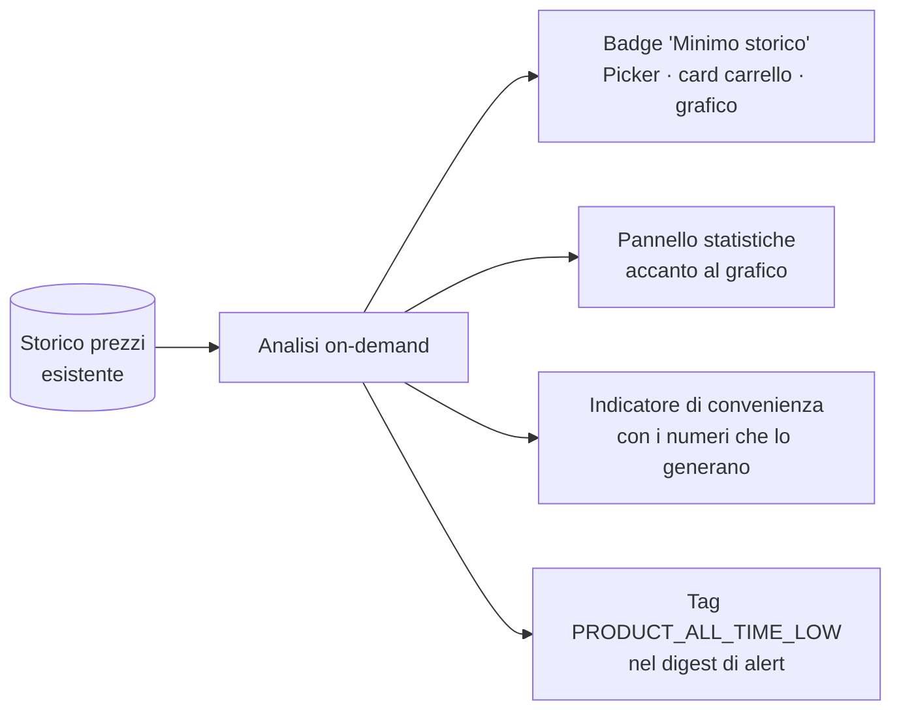

# Analisi dei prezzi (minimo storico e convenienza)

> **Layer 3 — Feature utente** · Audience: architetti, developer · Testo + Mermaid, niente codice. Capability: [price-analytics](../../4-capabilities/core/price-analytics.md) · Dati: [price-history](price-history.md).

## Scopo

Rispondere alla domanda che lo storico da solo lascia all'occhio dell'utente: **"è il momento giusto per comprare?"**. Statistiche derivate dallo storico prezzi (minimo/massimo storico, medie, tempo in offerta) e un **indicatore di convenienza** dichiaratamente euristico. Serve direttamente UC-1: comprare in blocco al massimo risparmio con cognizione di causa.

## Requisiti

- **ANLZ-R1** — Per ogni prodotto il sistema sa calcolare, **on-demand dallo storico esistente** (nessuna tabella nuova, nessun impatto sullo scraping): minimo e massimo storico, media degli ultimi 30/90 giorni, numero di variazioni registrate, percentuale di tempo in offerta.
- **ANLZ-R2** — **Badge "Minimo storico"** quando il prezzo corrente è il più basso mai registrato per quel prodotto. Visibile ovunque il prodotto compaia: Product Picker, card del carrello, grafico.
- **ANLZ-R3** — Accanto al grafico dello storico, un **pannello statistiche**: minimo/massimo storico (con data), media 30/90 giorni, distanza del prezzo corrente dal minimo, percentuale di tempo in offerta.
- **ANLZ-R4** — Nuovo tipo di alert per carrello: **minimo storico** (`PRODUCT_ALL_TIME_LOW`) — scatta quando un ribasso porta un prodotto del carrello al prezzo più basso mai registrato. Opzionale come tutti i tipi, scelto per-carrello ([alert-event](../../4-capabilities/contracts/alert-event.md)).
- **ANLZ-R5** — **Indicatore di convenienza**: un'etichetta sintetica (*Ottimo momento* / *Nella media* / *Conviene aspettare*) calcolata con euristiche statistiche trasparenti (sconto attuale vs sconto medio storico, vicinanza al minimo, frequenza delle offerte). **Mai presentato come previsione certa**: l'etichetta mostra sempre i numeri che la generano ("sconto attuale 18% vs medio 12%; minimo storico €19,90 il 3/2"). Niente machine learning: postura hobby, dati spiegabili.
- **ANLZ-R6** — **Significatività dichiarata**: con storico insufficiente (meno di 30 giorni o meno di 3 variazioni) gli indicatori mostrano "storico insufficiente" invece di numeri fuorvianti. Il badge minimo storico richiede la stessa soglia.
- **ANLZ-R7** — Le statistiche sono calcolate dal backend e servite pronte ([API](../../api/endpoints.md#storico-prezzi--price-history)); il client non aggrega.

## Dove compare

## Esempio (pannello statistiche)

> **Necronomicon** — €19,90 🏆 *Minimo storico*
> Min €19,90 (oggi) · Max €29,90 (12/1) · Media 30gg €24,50
> In offerta il 22% del tempo · Sconto attuale 20% vs medio 12%
> **Ottimo momento** — il prezzo è al minimo mai registrato

## Confini dichiarati

- Le analisi valgono **per prodotto nel catalogo dell'utente**: due utenti con storici diversi vedono numeri diversi (coerente con il catalogo per-utente).
- Nessuna analisi cross-utente o cross-sito ("il minimo tra i tre negozi" emerge naturalmente dal carrello cross con i badge per riga, non da una feature dedicata).
- L'indicatore di convenienza non è una previsione di prezzo futuro: è una lettura statistica del passato, e si presenta come tale.
