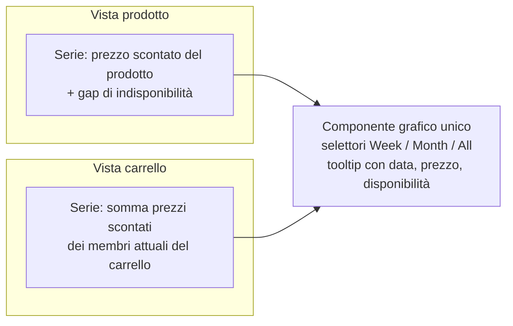

# Storico prezzi — grafici (lato utente)

> **Layer 3 — Feature utente** · Audience: architetti, developer · Testo + Mermaid, niente codice. Capability: [price-history](../../4-capabilities/core/price-history.md).
>
> **Spec-ahead (fase 8).** La **registrazione append-only** dello storico (il principio di registrazione e la scrittura lato core al cambio di prezzo/disponibilità) è già implementata in fase 3 ed è documentata in inglese: [`docs/3-features/user/price-history.md`](../../../docs/3-features/user/price-history.md). Questo file conserva solo la parte **non ancora implementata**: le **viste a grafico** che leggono lo storico.

## Scopo

Mostrare l'andamento nel tempo di prezzi e disponibilità, per giudicare se l'offerta di oggi è un minimo reale. Due viste — **per prodotto** e **per carrello** — rese dallo **stesso componente grafico** (cambia solo la serie di dati). Gli indicatori derivati (minimo storico, statistiche, convenienza) sono una feature a sé: [price-analytics.md](price-analytics.md).

## Requisiti (grafici)

- **HIST-R2** — Il grafico prodotto mostra la linea del **prezzo scontato**; nei periodi in cui il prodotto risulta non disponibile la linea mostra un **gap esplicito** (nessuna interpolazione), derivato dallo stato di disponibilità registrato nelle entry.
- **HIST-R3** — Selettori temporali: **Week** (7 giorni), **Month** (30 giorni), **All**.
- **HIST-R4** — Il grafico di **carrello** proietta la **composizione attuale** del carrello sullo storico: somma dei prezzi scontati dei membri correnti, con i prodotti non disponibili esclusi nei rispettivi intervalli. *Semplificazione dichiarata*: non si ricostruisce la composizione passata del carrello (chi c'era e chi no in una certa data) — servirebbe lo storico delle appartenenze, complessità non giustificata.
- **HIST-R6** — Accesso dal Product Picker (riga → grafico prodotto), dalla card del carrello (azione → grafico carrello) e dalla pagina Storico prezzi.

## Viste

## Lettura delle serie

Le entry sono **punti di variazione**: il grafico li unisce a gradini (il prezzo resta costante tra due variazioni). Un intervallo senza entry non significa "dati mancanti": significa "niente è cambiato" — che è esattamente l'informazione che il selettore *All* rende leggibile sulle lunghe distanze.
