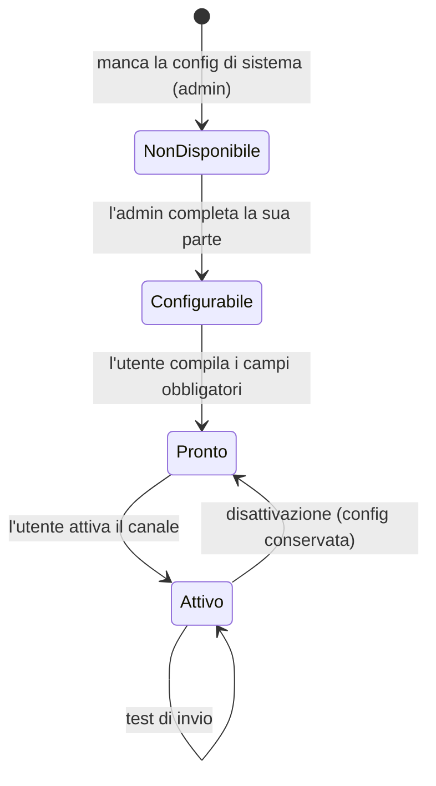

# Profilo — consegna notifiche e notifier (lato utente)

> **Layer 3 — Feature utente** · Audience: architetti, developer · Testo + Mermaid, niente codice.
>
> **Spec-ahead (fasi 6/7/11).** La parte **account** della pagina Profilo (identità in sola lettura, lingua dell'interfaccia, tema, cambio password) è già implementata in fase 1 ed è documentata in inglese: [`docs/3-features/user/profile-and-notifiers.md`](../../../docs/3-features/user/profile-and-notifiers.md). Questo file conserva solo la parte **non ancora implementata**: la **consegna delle notifiche** — cadenza alert, report periodico, esportazione dati, e i **canali notifier** personali.

## Scopo

La pagina Profilo concentra anche tutto ciò che riguarda la consegna delle notifiche: cadenza alert, report periodico, esportazione dei propri dati e canali di notifica personali. I notifier stanno qui (non nella barra di navigazione) per alleggerire la nav.

## Requisiti

### Notifiche
- **PROF-R4** — Cadenza alert: picker dei giorni della settimana + orario ([dettagli](alerts-and-notifications.md)).
- **PROF-R5** — Report periodico: on/off, frequenza, giorno, orario ([dettagli](summary-report.md)).

### I miei dati
- **PROF-R11** — Sezione "I miei dati": esportazione self-service di tutti i propri dati in JSON o CSV ([dettagli](data-export.md)).

### Canali (notifier)
- **PROF-R6** — La pagina elenca **tutti i notifier abilitati nel sistema**; per ciascuno l'utente vede: stato di configurazione di sistema (se l'admin non ha configurato la sua parte, il canale è mostrato come "non disponibile"), il **form dei propri campi personali** (generato dallo schema dichiarato dal plugin) e un flag **attivo/non attivo**.
- **PROF-R7** — Un canale consegna solo se: abilitato nel sistema (manifest) **e** configurato dall'admin **e** configurato dall'utente (campi obbligatori validi) **e** attivato dall'utente. Lo stato composito è mostrato chiaramente.
- **PROF-R8** — Ogni canale ha un bottone **Test**: invia una notifica di prova con la configurazione corrente (merge sistema+utente) e mostra l'esito. Nessuna persistenza del test.
- **PROF-R9** — I campi segreti sono mascherati e write-only (mai rispediti al client); un valore già impostato è indicato senza rivelarlo.
- **PROF-R10** — Disattivare un canale **non** ne cancella la configurazione (si può riattivare senza reinserire i dati).

## Stato composito di un canale

## Banner di dashboard

Finché l'utente non ha **alcun canale attivo**, la dashboard mostra un banner informativo: *"Nessun notifier configurato — non riceverai notifiche (le trovi nello Storico alert)"*. Nessuna funzionalità è bloccata: lo storico interno è sempre la fonte primaria.
