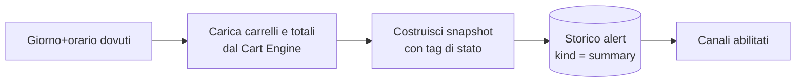

# Report periodico (Summary)

> **Layer 3 — Feature utente** · Audience: architetti, developer · Testo + Mermaid, niente codice. Capability: [summary-report](../../4-capabilities/core/summary-report.md).

## Scopo

Una **fotografia periodica** dello stato di tutti i carrelli dell'utente, indipendente dagli eventi: serve a mantenere il polso della situazione anche quando non cambia nulla. È l'opposto semantico del digest di alert (snapshot vs diff); condividono canali di consegna e storico.

## Requisiti

- **SUM-R1** — Opt-in per utente, disattivato di default.
- **SUM-R2** — Frequenza: **settimanale** (giorno della settimana a scelta) o **mensile** (giorno 1 del mese), con orario a scelta. Configurato dal Profilo.
- **SUM-R3** — Il contenuto è uno **snapshot** dello stato corrente di tutti i carrelli dell'utente che hanno almeno un prodotto: per ogni carrello, prodotti con prezzo pieno/scontato e provenienza, totali, stima finale, stato della soglia; per ogni prodotto i soli tag **di stato** (in offerta / non disponibile — non sono eventi, è una fotografia).
- **SUM-R4** — Nessun confronto col passato nel summary (le variazioni sono il mestiere del digest; i trend, dei grafici dello storico prezzi).
- **SUM-R5** — Consegna sugli stessi canali abilitati per gli alert; **sempre** registrato nello storico interno (tipo `summary`), con stato di lettura. Esiti di consegna per canale come per i digest.
- **SUM-R6** — Se il giorno dovuto il sistema era fermo, il recupero vale entro quel giorno; oltre, il summary salta al periodo successivo (scelta dichiarata, vedi [scheduling](../../2-architecture/scheduling-and-execution.md)).

## Differenze digest vs summary (tabella normativa)

| | Alert digest | Summary |
|---|---|---|
| Semantica | **Diff** (cosa è cambiato) | **Snapshot** (come stanno le cose) |
| Trigger | Cadenza alert + almeno un evento | Calendario (sempre, anche senza eventi) |
| Carrelli inclusi | Solo quelli con eventi | Tutti (non vuoti) |
| Tag prodotto | Eventi (entrato in offerta, tornato disponibile…) | Stati (in offerta, non disponibile) |
| Baseline | Usa e avanza la baseline | Non tocca la baseline |
| Opt | Implicito nei tipi di alert per carrello | Opt-in esplicito |

## Flusso

