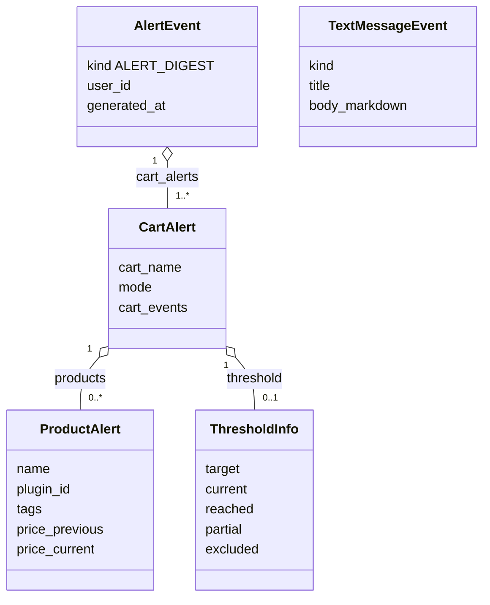

# Contratto — `AlertEvent` / notifiche

> **Layer 4 — Contratto** · Audience: developer, plugin developer · Pseudocodice ammesso. Feature: [alerts-and-notifications](../../3-features/user/alerts-and-notifications.md) · Architettura: [notification-architecture](../../2-architecture/notification-architecture.md).

## Scopo

Il payload che il core consegna ai notifier e registra nello storico. Confine tra valutazione (core) e formattazione/invio (plugin).



Due famiglie di payload sullo **stesso canale**, distinte dal `kind`: il **digest** strutturato — `AlertEvent` (tag `CART_*` su `cart_events`, `PRODUCT_*` su `tags`) e l'analogo `SummaryReport` — e il **messaggio testuale** piatto `TextMessageEvent` (`kind` = `ADMIN_MESSAGE` o `SYSTEM_MESSAGE`, body Markdown).

## Enum

```python
from enum import StrEnum

class AlertType(StrEnum):
    # tag di prodotto (validi dentro ProductAlert.tags)
    PRODUCT_ON_SALE         = "PRODUCT_ON_SALE"          # entrato in offerta o ulteriore ribasso
    PRODUCT_OFF_SALE        = "PRODUCT_OFF_SALE"
    PRODUCT_UNAVAILABLE     = "PRODUCT_UNAVAILABLE"
    PRODUCT_AVAILABLE_AGAIN = "PRODUCT_AVAILABLE_AGAIN"
    PRODUCT_ALL_TIME_LOW    = "PRODUCT_ALL_TIME_LOW"     # ribasso al minimo mai registrato
    # eventi di carrello (validi dentro CartAlert.cart_events)
    CART_ALL_ON_SALE               = "CART_ALL_ON_SALE"
    CART_THRESHOLD_REACHED         = "CART_THRESHOLD_REACHED"
    CART_THRESHOLD_REACHED_PARTIAL = "CART_THRESHOLD_REACHED_PARTIAL"

class NotificationKind(StrEnum):
    ALERT_DIGEST   = "alert_digest"    # diff vs baseline                    (categoria: sistema)
    SUMMARY        = "summary"         # snapshot (summary-report)           (categoria: sistema)
    SYSTEM_MESSAGE = "system_message"  # messaggio testuale generato dal core (categoria: sistema)
    ADMIN_MESSAGE  = "admin_message"   # messaggio scritto dall'admin         (categoria: admin)
```

Un solo enum per i tipi: la distinzione prodotto/carrello è data dalla **posizione** nel modello, garantita da validatori.

## Modello del digest

```python
class ThresholdInfo(BaseModel):
    target: Decimal       # soglia € — importo fisso salvato (CART-R9: la % è solo input UI)
    current: Decimal      # stima finale corrente
    reached: bool         # stima finale ≤ target
    partial: bool         # raggiunta mentre alcuni prodotti sono esclusi (non attivi)
    excluded: list[str] = []   # nomi dei prodotti esclusi (per il caso PARTIAL)

class ProductAlert(BaseModel):
    product_id: int
    name: str
    url: str
    plugin_id: str                    # PROVENIENZA: sempre presente (carrelli cross!)
    tags: list[AlertType]             # solo PRODUCT_*, uno o più
    price_previous: Decimal | None    # dal confronto con la baseline
    price_current: Decimal
    discount_pct: Decimal
    currency: str = "EUR"

class CartAlert(BaseModel):
    cart_id: int
    cart_name: str
    mode: str                         # "cross" | "scraper_specific"
    cart_events: list[AlertType] = [] # solo CART_*
    products: list[ProductAlert] = []
    totals: CartTotals                # pieno, scontato, adjustments, stima finale
    threshold: ThresholdInfo | None = None

class AlertEvent(BaseModel):
    kind: NotificationKind = NotificationKind.ALERT_DIGEST
    user_id: int
    generated_at: datetime
    cart_alerts: list[CartAlert]      # solo carrelli con almeno un evento

class TextMessageEvent(BaseModel):    # payload unico dei messaggi testuali (admin E sistema)
    kind: NotificationKind            # ADMIN_MESSAGE o SYSTEM_MESSAGE
    user_id: int                      # il destinatario di QUESTA consegna
    generated_at: datetime
    title: str
    body: str                         # MARKDOWN (sottoinsieme CommonMark) — vedi AEV-R7
```

## Regole

- **AEV-R1** — Una run produce **al più un** `AlertEvent` per utente (aggregazione di tutti i carrelli con eventi).
- **AEV-R2** — Il payload è **autosufficiente per decidere**: tag, prezzi prima/dopo, provenienza, link, totali e soglia (vedi ALERT-R7). Il notifier non deve interrogare nulla.
- **AEV-R3** — I tag sono resi graficamente dal canale (badge/emoji), mai come stringhe con underscore.
- **AEV-R4** — `Decimal` serializzato come **stringa** nel JSON (storico e API), `datetime` ISO-8601 UTC.
- **AEV-R5** — Il summary usa lo stesso `NotificationKind` e lo stesso canale ma payload diverso ([summary-report](../core/summary-report.md)); il notifier distingue da `kind`.
- **AEV-R6** — I messaggi testuali (`TextMessageEvent`) viaggiano sullo stesso canale con payload minimale (titolo + body), senza struttura a carrelli: `admin_message` per i messaggi scritti dall'admin ([admin-notifications](../../3-features/admin/admin-notifications.md)), `system_message` per i messaggi testuali generati dal core. La **categoria** (sistema/admin) è derivata dal `kind`, non è un campo.
- **AEV-R7** — Il `body` di ogni messaggio testuale è **Markdown** (sottoinsieme CommonMark: grassetto, corsivo, liste, link). Il notifier lo rende nel formato del canale usando gli **helper del plugin context** (`markdown.to_html()` sanificato / `markdown.strip()`), mai con parsing proprio. **Degradazione, mai fallimento**: un costrutto non supportato dal canale viene degradato a testo, la consegna non fallisce per ragioni di formato.

## Esempio

```python
CartAlert(cart_name="Cthulhu Starter", mode="scraper_specific",
    cart_events=[CART_THRESHOLD_REACHED],
    products=[ProductAlert(name="Necronomicon", plugin_id="store_a",
                           tags=[PRODUCT_AVAILABLE_AGAIN, PRODUCT_ON_SALE],
                           price_previous=Decimal("25.00"),
                           price_current=Decimal("19.90"), discount_pct=Decimal("20"))],
    totals=CartTotals(full="100.00", discounted="85.00", final="78.00"),
    threshold=ThresholdInfo(target=Decimal("80.00"), current=Decimal("78.00"),
                            reached=True, partial=False))
```
