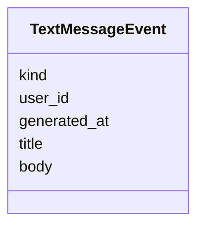

# Contratto — payload non-digest e tag pianificati (spec-ahead)

> **Layer 4 — Contratto** · Audience: developer, plugin developer · Pseudocodice ammesso. Il contratto **implementato** del digest (`AlertEvent` / `CartAlertPayload` / `ProductAlertPayload` / `ThresholdInfo` / `CartTotals`, enum `AlertType` di fase 6, `NotificationKind.ALERT_DIGEST`, regole AEV-R1..R4) è in inglese: [alert-event](../../../docs/4-capabilities/contracts/alert-event.md). Qui restano solo le parti **non ancora implementate**: il tag minimo storico (fase 11), gli altri `NotificationKind`, il payload `TextMessageEvent` e le regole AEV-R5..R7 (fasi 10/11). Feature: [alerts-and-notifications](../../3-features/user/alerts-and-notifications.md) · Architettura: [notification-architecture](../../2-architecture/notification-architecture.md).

## Scopo

Sullo **stesso canale** e nello stesso storico del digest viaggiano altre due famiglie di payload, distinte dal `kind`: il **summary** strutturato (`SummaryReport`) e il **messaggio testuale** piatto `TextMessageEvent` (`kind` = `ADMIN_MESSAGE` o `SYSTEM_MESSAGE`, body Markdown). Il notifier le distingue dal `kind`.



## Tag minimo storico (fase 11)

Alla `AlertType` si aggiunge, quando arrivano le analitiche di prezzo:

```python
    PRODUCT_ALL_TIME_LOW = "PRODUCT_ALL_TIME_LOW"   # ribasso al minimo mai registrato ([price-analytics](../core/price-analytics.md))
```

## Altri NotificationKind (fasi 10/11)

Oltre ad `ALERT_DIGEST` (fase 6), l'enum riserva:

```python
    SUMMARY        = "summary"         # snapshot (summary-report)           (categoria: sistema)
    SYSTEM_MESSAGE = "system_message"  # messaggio testuale generato dal core (categoria: sistema)
    ADMIN_MESSAGE  = "admin_message"   # messaggio scritto dall'admin         (categoria: admin)
```

## Payload messaggio testuale (fasi 10/11)

```python
class TextMessageEvent(BaseModel):    # payload unico dei messaggi testuali (admin E sistema)
    kind: NotificationKind            # ADMIN_MESSAGE o SYSTEM_MESSAGE
    user_id: int                      # il destinatario di QUESTA consegna
    generated_at: datetime
    title: str
    body: str                         # MARKDOWN (sottoinsieme CommonMark) — vedi AEV-R7
```

## Regole (spec-ahead)

- **AEV-R5** — Il summary usa lo stesso `NotificationKind` e lo stesso canale ma payload diverso ([summary-report](../core/summary-report.md)); il notifier distingue da `kind`.
- **AEV-R6** — I messaggi testuali (`TextMessageEvent`) viaggiano sullo stesso canale con payload minimale (titolo + body), senza struttura a carrelli: `admin_message` per i messaggi scritti dall'admin ([admin-notifications](../../3-features/admin/admin-notifications.md)), `system_message` per i messaggi testuali generati dal core. La **categoria** (sistema/admin) è derivata dal `kind`, non è un campo.
- **AEV-R7** — Il `body` di ogni messaggio testuale è **Markdown** (sottoinsieme CommonMark: grassetto, corsivo, liste, link). Il notifier lo rende nel formato del canale usando gli **helper del plugin context** (`markdown.to_html()` sanificato / `markdown.strip()`), mai con parsing proprio. **Degradazione, mai fallimento**: un costrutto non supportato dal canale viene degradato a testo, la consegna non fallisce per ragioni di formato.
