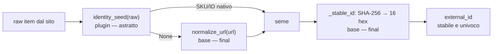

# Contratto — `Product`

> **Layer 4 — Contratto** · Audience: developer, plugin developer · Pseudocodice ammesso. Feature: [scraper-plugin](../../3-features/plugins/scraper-plugin.md).

## Scopo

Il confine tra scraper e core: ogni scraper produce esclusivamente istanze di `Product` (via `update_catalog`); il core non vede altro dello scraping.

## Modello

```python
from pydantic import BaseModel
from decimal import Decimal
from datetime import datetime

class BrandRef(BaseModel):
    text: str                   # nome della marca
    link: str | None = None     # URL (assoluto) alla pagina marca; opzionale

class Product(BaseModel):
    plugin_id: str
    external_id: str            # ID STABILE e UNIVOCO nello spazio del plugin (vedi sotto)
    url: str
    name: str                   # titolo già "sanificato" dallo scraper (vedi product_properties)
    image_url: str | None       # URL remoto, mai scaricata localmente
    brand: BrandRef | None = None   # marca: testo + link opzionale; None se assente

    product_properties: list[str] = []
    # "tag" del prodotto (es. "Edizione Limitata", "Offerta Raven Prime", "Pre Order").
    # Lista generica popolata dallo scraper (vuota se non gli serve); vedi PROD-R5.

    price_current: Decimal      # prezzo scontato/corrente
    price_original: Decimal | None
    # None → il core usa l'ultimo listino noto dallo storico; senza storico, price_current
    discount_pct: Decimal | None
    # None → il core lo calcola da original/current
    currency: str = "EUR"       # ISO 4217; V1 non converte né aggrega valute diverse

    is_available: bool          # deciso dallo SCRAPER (out-of-stock temporaneo)
    scraped_at: datetime
    extra: dict = {}            # dati plugin-specific, persistiti in products.extra_json
```

## Regole del contratto

- **PROD-R1** — Lo scraper non conosce lo storico: passa solo lo stato corrente; la risoluzione dei campi `None` è del core ([catalog-update-service](../core/catalog-update-service.md)).
- **PROD-R2** — Lo scraper restituisce **anche** i non disponibili (`is_available = false`); mai filtrarli.
- **PROD-R3** — La lista consegnata è piatta e **deduplicata su `external_id`**.
- **PROD-R4** — `currency` esiste per non rendere breaking l'arrivo di scraper esteri; la UI rende il simbolo (default €).
- **PROD-R5** — `product_properties` è una lista (array JSON) di stringhe = **"tag" del prodotto**, generica e **opzionale** (default vuota). Lo scraper la popola da qualunque sorgente decida (etichette estratte dal titolo, stato di disponibilità, …); uno scraper a cui non serve la lascia vuota. Il core la **persiste soltanto**, non la interpreta; la UI la mostra come elenco (visione a lungo termine: tag grafici). Il **meccanismo** per accumularla è fornito dalla base scraper ([scraper-plugin](../../3-features/plugins/scraper-plugin.md) SCR-R16); le stringhe sono già **trimmate** e **deduplicate**.
- **PROD-R6** — `brand` è un oggetto `{text, link?}` (`BrandRef`): `text` obbligatorio, `link` **opzionale** (URL assoluto alla pagina marca). La UI rende testo semplice, o testo **cliccabile** (apre una nuova tab) quando il link c'è. `None` se lo scraper non estrae la marca. È un attributo strutturato a sé, **distinto** dai tag di `product_properties`.

## `external_id`: identità del prodotto

Insieme a `plugin_id` e `user_id` forma l'identità nel catalogo (UNIQUE sul DB). Obblighi del contratto: **stabile** tra run (stesso prodotto → sempre lo stesso id; se cambia, il core vede un prodotto nuovo e lo storico si spezza) e **univoco** nello spazio del plugin.

La derivazione è un **template method**: la base separa ciò che è site-specific (il **seme**, che il plugin **deve** fornire) da ciò che dev'essere identico ovunque (l'**hashing/normalizzazione**, che la base impone e il plugin non può sovrascrivere). Così tutti gli scraper condividono la stessa logica di identità ad alto livello, e l'unico bug davvero pericoloso — un hashing non deterministico tra processi (`worker` vs `web`) — diventa impossibile per costruzione, non solo "testato".



```python
class ScraperPlugin(ABC):

    @abstractmethod
    def identity_seed(self, raw) -> str | None:
        """Seme dell'identità, ESCLUSIVO punto site-specific. OBBLIGATORIO.
        Restituisce lo SKU/ID nativo del sito (preferito, stabile per costruzione),
        oppure None per derivare dall'URL. MAI titoli/descrizioni: cambiano."""

    # --- logica uniforme: FINAL, mai sovrascritta dal plugin ---
    @final
    @staticmethod
    def normalize_url(url: str) -> str:
        # rimuove query/fragment volatili, trailing slash, normalizza il case dell'host
        ...

    @final
    @staticmethod
    def _stable_id(seed: str) -> str:
        # stringa qualunque → id FISSO di 16 hex (64 bit), deterministico tra processi
        import hashlib
        return hashlib.sha256(seed.encode("utf-8")).hexdigest()[:16]
        # MAI hash() built-in: randomizzata da PYTHONHASHSEED

    @final
    def external_id_for(self, raw, url: str) -> str:
        # l'orchestrazione: seme del plugin → fallback URL → hashing uniforme
        return self._stable_id(self.identity_seed(raw) or self.normalize_url(url))
```

Il plugin **non riempie mai `external_id` a mano**: lo ottiene da `external_id_for(...)` quando costruisce il `Product`. L'unica scelta che gli resta è il **seme** (`identity_seed`); il resto è imposto. Essendo `identity_seed` astratto, uno scraper che lo dimentica **non istanzia** (fallimento al load nel registry, non in produzione a storico già spezzato).
