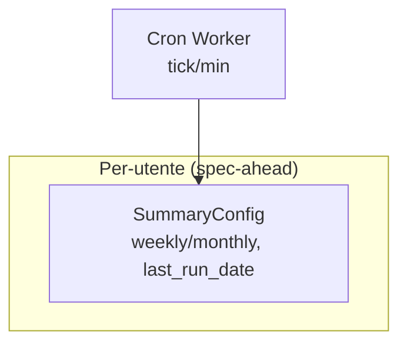

# Contratti — Modelli di scheduling per-utente (summary)

> **Layer 4 — Contratto** · Audience: developer · Pseudocodice ammesso. Feature: [scraper-scheduling-and-limits](../../../docs/3-features/admin/scraper-scheduling-and-limits.md), [scraper-monitoring](../../3-features/admin/scraper-monitoring.md).
>
> Resta qui solo il modello di scheduling **per-utente** ancora spec-ahead (fase 6+): la cadenza del summary. Gli alert **non** hanno cadenza calendariale: sono event-driven (girano a fine scrape — vedi [alert-engine](../core/alert-engine.md)). I modelli già rilasciati — `ScraperSchedule`, `SystemSettings`, `ScrapeRun`, `ScrapeUserLog` — sono documentati in inglese in [`docs/4-capabilities/contracts/scheduling-models.md`](../../../docs/4-capabilities/contracts/scheduling-models.md).

Uno schedule per-utente letto dal [Cron Worker](../../../docs/4-capabilities/core/cron-worker.md); il dispatcher lo valuta ogni minuto insieme agli slot degli scraper:



## Schedule per-utente

```python
# Summary — per-utente: cadenza calendariale, vedi SummaryConfig in core/summary-report.md
```

Note normative:

- Il Cron Worker valuta questo schedule ogni minuto: **summary** con regola weekly (giorno scelto) / monthly (giorno 1). Recupero entro il giorno dovuto (oltre, salta: scelta dichiarata).
- Il marcatore `last_run_date` è aggiornato **anche in caso di errore** della run: niente retry-storm al minuto successivo.
