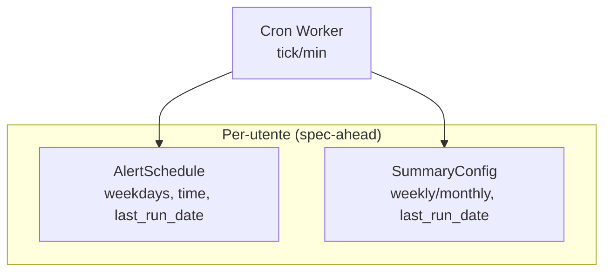

# Contratti — Modelli di scheduling per-utente (alert e summary)

> **Layer 4 — Contratto** · Audience: developer · Pseudocodice ammesso. Feature: [scraper-scheduling-and-limits](../../../docs/3-features/admin/scraper-scheduling-and-limits.md), [scraper-monitoring](../../3-features/admin/scraper-monitoring.md).
>
> Restano qui solo i modelli di scheduling **per-utente** ancora spec-ahead (fase 6+): la cadenza degli alert e del summary. I modelli già rilasciati — `ScraperSchedule`, `SystemSettings`, `ScrapeRun`, `ScrapeUserLog` — sono documentati in inglese in [`docs/4-capabilities/contracts/scheduling-models.md`](../../../docs/4-capabilities/contracts/scheduling-models.md).

Due schedule per-utente letti dal [Cron Worker](../../../docs/4-capabilities/core/cron-worker.md); il dispatcher li valuta ogni minuto insieme agli slot degli scraper:



## Schedule per-utente

```python
# Alert — per-utente: cadenza calendariale
class AlertSchedule(BaseModel):
    user_id: int
    scheduled_time: time
    weekdays: list[int] = []           # 0=lun..6=dom (convenzione Python date.weekday();
                                       # ⚠ JS Date.getDay() parte da domenica: la UI mappa)
                                       # [] = off · 7 giorni = giornaliera
    last_run_date: date | None = None  # guardia anti-doppione + recupero intra-day

# Summary — per-utente: vedi SummaryConfig in core/summary-report.md
```

Note normative:

- Il Cron Worker valuta questi schedule ogni minuto: **alert** dovuto se oggi è un giorno scelto, `now ≥ orario` e non già eseguito oggi; **summary** con regola weekly (giorno scelto) / monthly (giorno 1). Recupero entro il giorno dovuto (oltre, salta: scelta dichiarata).
- Il marcatore `last_run_date` è aggiornato **anche in caso di errore** della run: niente retry-storm al minuto successivo.
