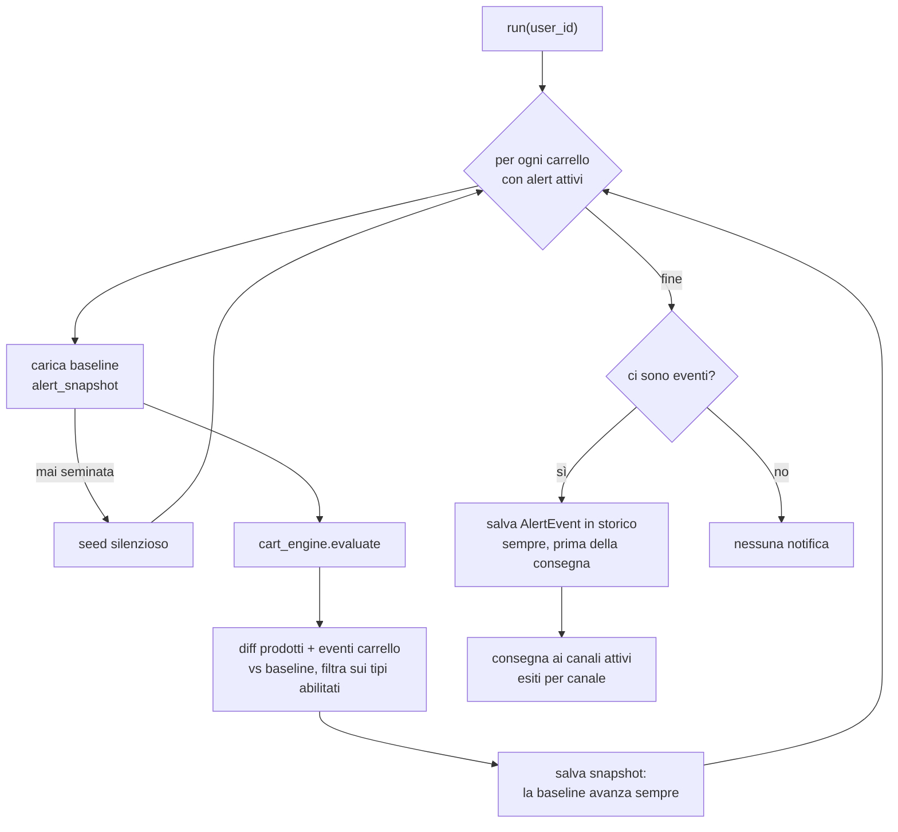

# Alert Engine

> **Layer 4 — Capability** · Audience: developer · Pseudocodice ammesso. Feature: [alerts-and-notifications](../../3-features/user/alerts-and-notifications.md) · Architettura: [notification-architecture](../../2-architecture/notification-architecture.md) · Contratto: [alert-event](../contracts/alert-event.md).

## Scopo

All'orario di alert dell'utente: calcolare il **diff** di ogni carrello con alert attivi rispetto alla **baseline**, aggregare gli eventi in un solo digest, registrarlo nello storico, consegnarlo ai canali attivi, avanzare la baseline.



## Input / Output

| | |
|---|---|
| **Input** | `user_id` (dal Cron Worker, nei giorni dovuti) |
| **Output** | 0 o 1 `AlertEvent` (digest) in `alert_log` + esiti per canale in `alert_delivery`; baseline avanzata |

## La baseline

Una riga per **(utente, carrello)** in `alert_snapshot`: per ogni prodotto del carrello `{on_sale: bool, available: bool, price_current}` + stato soglia `{reached: bool}`. Gestita da eventi utente (fuori da `run()`):

```
on enable_first_alert_type(cart):   seed_snapshot(cart)        # stato corrente, nessuna notifica
on disable_all_alert_types(cart):   delete_snapshot(cart)
on cadenza_off(user):               delete_snapshots(user)
on cadenza_riattivata(user):        seed_snapshot(c) for c in carts_with_alerts(user)
```

## Pseudocodice della run

```
def run(user_id):
    digest_carts = []
    for cart in carts_with_enabled_alert_types(user_id):
        snap  = load_snapshot(cart)                  # None se mai seminata (rete di sicurezza: seed)
        state = cart_engine.evaluate(cart)
        if snap is None:
            save_snapshot(cart, state); continue     # seed silenzioso

        enabled  = alert_types(cart)
        products, events = {}, []

        for m in cart.members where not m.removed:   # ALERT-R12: delistati ignorati
            prev = snap.products.get(m.id)
            if prev is None:                          # nuovo nel carrello: seed silenzioso
                continue
            tags = []
            now_sale = m.discount_pct > 0
            if now_sale and (not prev.on_sale or m.price_current < prev.price_current):
                tags.append(PRODUCT_ON_SALE)          # entrato in offerta O ulteriore ribasso (ALERT-R11)
            if prev.on_sale and not now_sale:
                tags.append(PRODUCT_OFF_SALE)
            if prev.available and not m.is_available:
                tags.append(PRODUCT_UNAVAILABLE)
            if not prev.available and m.is_available:
                tags.append(PRODUCT_AVAILABLE_AGAIN)
            if m.price_current < prev.price_current and analytics.is_all_time_low(m):
                tags.append(PRODUCT_ALL_TIME_LOW)         # ribasso al minimo mai registrato (ANLZ-R4)
            tags = [t for t in tags if t in enabled]
            if tags:
                products[m.id] = ProductAlert(m, tags,
                    price_previous=prev.price_current, price_current=m.price_current)

        if CART_ALL_ON_SALE in enabled:
            all_now  = state.active and all(p.discount_pct > 0 for p in state.active)
            all_prev = snap.all_on_sale
            if all_now and not all_prev: events.append(CART_ALL_ON_SALE)
        if state.threshold and state.threshold.reached and not snap.threshold_reached:
            ev = CART_THRESHOLD_REACHED_PARTIAL if state.threshold.partial else CART_THRESHOLD_REACHED
            if ev in enabled: events.append(ev)

        if products or events:
            digest_carts.append(CartAlert(cart, events, products, state.threshold))
        save_snapshot(cart, state)                    # la baseline avanza SEMPRE

    if digest_carts:
        notif = AlertEvent(user_id, generated_at=now(), cart_alerts=digest_carts)
        alert_id = save_alert_log(notif)              # SEMPRE, prima della consegna
        dispatch_to_channels(user_id, notif, alert_id)
```

## Consegna ai canali

```
def dispatch_to_channels(user_id, notif, alert_id):
    channels = active_notifiers(user_id)              # abilitato sistema + config admin + config utente valida + flag on
    if not channels:
        record_delivery(alert_id, None, "skipped_no_notifier"); return
    for ch in channels:
        cfg = merge_config(ch, user_id)               # chiavi utente filtrate sullo schema utente
        try:
            ch.plugin.send(notif, cfg, locale_of(user_id))   # retry brevi dentro il plugin
            record_delivery(alert_id, ch.plugin_id, "delivered")
        except Exception as e:
            record_delivery(alert_id, ch.plugin_id, "failed", str(e))
            log_warning("alert", f"consegna fallita {ch.plugin_id} per {user_id}")
```

Proprietà: un canale fallito non blocca gli altri (esiti indipendenti per canale); lo storico è scritto **prima** della consegna; nessuna coda asincrona (run sincrona, pochi utenti).

## Casi normativi

| Caso | Comportamento |
|---|---|
| Prima run dopo seed | Nessuna notifica (diff vuoto per costruzione) |
| Prodotto aggiunto a carrello attivo | Seminato in silenzio alla run che lo incontra |
| Prezzo sceso e risalito tra due run | Nessun evento (diff vs baseline, non vs scrape) |
| Ulteriore ribasso di prodotto già in offerta | Nuovo tag ON_SALE con prezzi prima/dopo |
| Ribasso che tocca il minimo mai registrato | Tag ALL_TIME_LOW (in aggiunta a ON_SALE); non si ripete finché il prezzo resta fermo |
| Soglia già raggiunta alla run precedente | Nessun nuovo evento finché non risale e riscende |
| Carrello senza prodotti attivi | Nessuna valutazione soglia (CART-R12) |
| Tutti i canali falliti | Digest nello storico con esiti `failed`; nessun retry differito (il prossimo digest porta il nuovo stato) |
