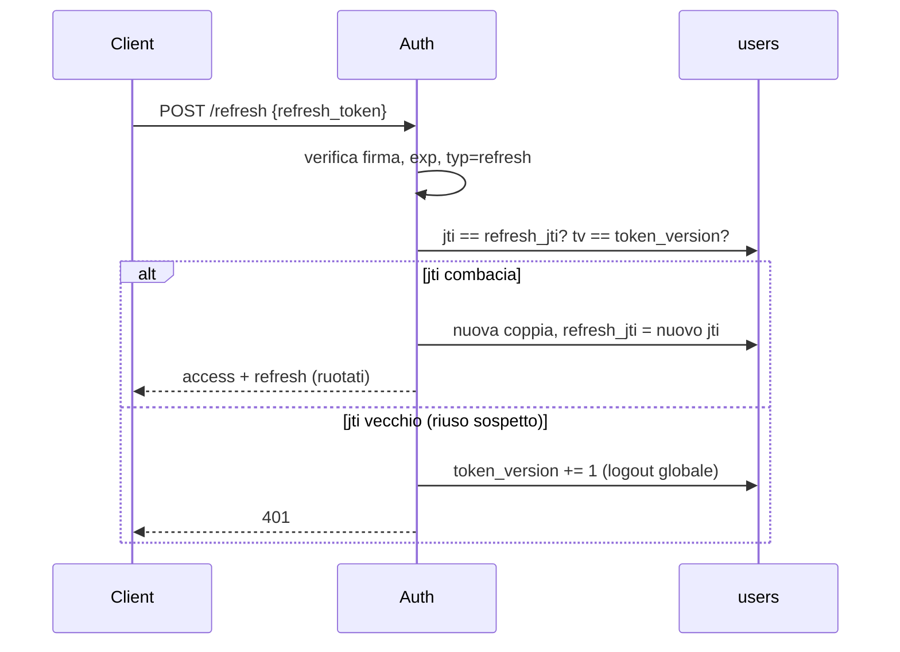

# Auth / Session

> **Layer 4 — Capability** · Audience: developer · Pseudocodice ammesso. Postura: [security-posture](../../2-architecture/security-posture.md) · Feature admin: [user-management](../../3-features/admin/user-management.md).

## Scopo

Autenticazione JWT stateless con invalidazione leggera, due ruoli, gestione account by-admin. Dimensionata per ≤5 utenti: niente OAuth/SSO/MFA.

La rotazione del refresh è il punto delicato: ogni refresh emette una coppia nuova e invalida la precedente; il riuso di un refresh vecchio è trattato come furto.



## Requisiti

- **AUTH-R1** — `access_token` (15 min) verificato **senza DB** (firma + scadenza + tipo); `refresh_token` (7 giorni) verificato **con DB** al solo refresh. Durate configurabili da bootstrap.
- **AUTH-R2** — Claim dei token: `sub` (user_id), `role`, `tv` (token_version), `jti` (solo refresh), `mcp` (`must_change_password`, solo access), `typ` (`"access"` | `"refresh"`), `exp`. La verifica **rifiuta** un token col `typ` sbagliato per il contesto: un refresh non è spendibile come access. Il claim `mcp` consente alla guardia per-request di applicare AUTH-R7 **senza leggere il DB** (AUTH-R1).
- **AUTH-R3** — Firma HS256 con `WEA_SECRET_KEY` (≥256 bit di entropia, da `.env`).
- **AUTH-R4** — **Rotazione del refresh**: a ogni refresh si emette una nuova coppia e si persiste il nuovo `jti` in `users.refresh_jti`. Un refresh è valido solo se `jti == users.refresh_jti` **e** `tv == users.token_version`. Il riuso di un refresh vecchio (jti mismatch) è trattato come possibile furto: `token_version += 1` (logout globale) + warning nel log.
- **AUTH-R5** — **Invalidazione globale** via `token_version += 1`: logout, cambio password, reset password, disabilitazione. Tolleranza dichiarata: un access già emesso vale fino a 15 min.
- **AUTH-R6** — Login con **rate limit** in-memory per IP+username (es. 5 tentativi/min, backoff; 429 oltre soglia) e hashing password bcrypt (o argon2), lunghezza minima 8.
- **AUTH-R10** — Account **disabilitato o in cancellazione** ([user-management](../../3-features/admin/user-management.md), USR-R12): il login con **credenziali corrette** risponde con codice dedicato (`account_disabled`) e la UI mostra "l'accesso non è più possibile, contatta l'amministratore". Con credenziali errate: errore generico, indistinguibile da un account inesistente — lo stato dell'account non è enumerabile.
- **AUTH-R7** — `must_change_password`: imposto alla creazione account e al reset; finché attivo, gli endpoint funzionali rispondono **403** con codice dedicato (`must_change_password`) e la UI forza il flusso di cambio. **Esenti**: `change-password`, `logout` e **`GET /api/me`** (quest'ultimo serve al boot della SPA per leggere l'utente — incluso il flag — e instradare al cambio). Il **cambio forzato** compare subito dopo il primo login e **non richiede la password attuale** (sarebbe ridondante); il cambio **normale** (da Profilo) richiede e verifica sempre la password attuale.
- **AUTH-R8** — Nessuna auto-registrazione; account creati/gestiti dall'admin. Bootstrap: primo avvio senza utenti → admin iniziale da `.env` con cambio forzato.
- **AUTH-R9** — Multi-device: `token_version` è per-utente → logout/invalidation è **globale** (tutti i dispositivi). Dichiarato e accettato.

## Flussi

```
POST /api/auth/login {username, password}
  → verifica hash, rate limit
  → hash ok ma is_active=false o in cancellazione → 403 {code: "account_disabled"}  # AUTH-R10
  → hash errato → 401 generico (mai rivelare lo stato dell'account)
  → access(typ=access, tv) + refresh(typ=refresh, tv, jti=nuovo); users.refresh_jti = jti
  → users.last_login_at = now()                     # ultimo accesso, mostrato all'admin (USR-R13)
  → { access_token, refresh_token, expires_at }     # expires_at = scadenza dell'ACCESS

POST /api/auth/refresh {refresh_token}
  → verifica firma, exp, typ=refresh, tv == users.token_version, jti == users.refresh_jti
  → jti mismatch → token_version += 1; 401 (riuso sospetto)
  → ok → nuova coppia, users.refresh_jti = nuovo jti

POST /api/auth/logout (Bearer)            → token_version += 1 → 204
POST /api/auth/change-password (Bearer) {old_password?, new_password}
  → se must_change_password (cambio forzato): ignora old_password
  → altrimenti (cambio normale): old_password obbligatoria + verificata, e ≠ new
  → set hash, must_change_password=false, token_version += 1 → 204
```

Verifica per-request (middleware):

```
def authenticate(request):
    t = decode_jwt(bearer(request))          # firma + exp
    require(t.typ == "access")               # AUTH-R2
    request.user = UserCtx(t.sub, t.role)    # nessuna lettura DB (AUTH-R1)
    # nota dichiarata: tv NON è verificato qui — un access sopravvive
    # max 15 min a logout/disable (security posture)
```

## Ruoli e guardie

| Guardia | Comportamento |
|---|---|
| `require_user` | qualunque autenticato; le query usano sempre `request.user.id` |
| `require_admin` | `role == "admin"`; gli endpoint admin non toccano dati operativi utente |
| Multi-tenancy | ogni query operativa filtra per `user_id` del token: è la barriera non negoziabile |

## Tabella `users` (campi auth)

`username` (UNIQUE), `password_hash`, `role`, `is_active`, `locale`, `must_change_password`, `token_version`, `refresh_jti`, `last_login_at` — schema completo in [database/schema.md](../database/schema.md).
