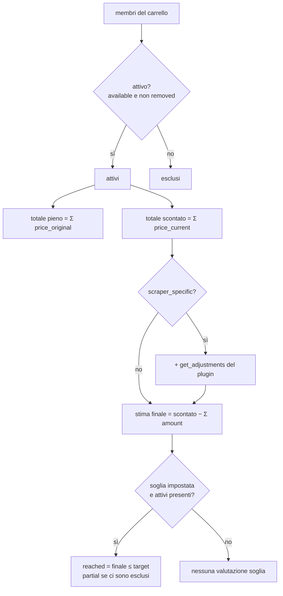

# Cart Engine

> **Layer 4 — Capability** · Audience: developer · Pseudocodice ammesso. Feature: [carts](../../3-features/user/carts.md) · Contratto: [adjustment](../contracts/adjustment.md).

## Scopo

Calcolare lo stato economico dei carrelli: totali, adjustments, stima finale, stato della soglia. È una pura funzione di lettura dello stato corrente (catalogo + definizione del carrello): non persiste risultati, li calcola on demand per UI, alert engine e summary.



## Definizioni

- **Prodotto attivo** = membro del carrello con `is_available = true` e `removed = false`. Solo gli attivi entrano nei totali.
- **Totale pieno** = Σ `price_original` degli attivi · **Totale scontato** = Σ `price_current` degli attivi.
- **Stima finale** = totale scontato − Σ `adjustments.amount` (solo carrelli scraper-specific; per i cross, stima finale = totale scontato).
- **Soglia** = percentuale di sconto richiesta, salvata sempre come `threshold_pct`; il valore assoluto eventualmente inserito dall'utente è convertito alla creazione/modifica usando il totale pieno corrente.

## Pseudocodice di valutazione

```
def evaluate(cart) -> CartState:
    active   = [m for m in cart.members if m.is_available and not m.removed]
    excluded = [m for m in cart.members if m not in active]

    total_full       = sum(p.price_original for p in active)
    total_discounted = sum(p.price_current  for p in active)

    adjustments = []
    if cart.mode == "scraper_specific" and active:
        plugin = registry.get(cart.scraper_id)
        adjustments = plugin.get_adjustments(total_discounted)   # logica nel plugin
    final_price = total_discounted - sum(a.amount for a in adjustments)

    threshold = None
    if cart.threshold_pct is not None and active:                 # CART-R12: niente soglia senza attivi
        target = total_full * (1 - cart.threshold_pct / 100)      # soglia in € sul pieno corrente
        threshold = ThresholdState(
            pct     = cart.threshold_pct,
            target  = target,
            current = final_price,                                # CART-R11: confronto sulla stima finale
            reached = final_price <= target,
            partial = bool(excluded),                             # raggiunta con esclusi → "parziale"
        )
    return CartState(active, excluded, total_full, total_discounted,
                     adjustments, final_price, threshold)
```

Note normative:

- La soglia in € (`target`) **segue il perimetro degli attivi**: percentuale fissa, valore assoluto ricalcolato (esempio normativo in [carts.md](../../3-features/user/carts.md)).
- Il confronto avviene sulla **stima finale** (adjustments inclusi): è il prezzo reale dell'acquisto in blocco (UC-1).
- `get_adjustments` è invocato con il totale scontato corrente; il core non interpreta le voci, le somma. Voci positive = risparmi, negative = costi.
- Carrello senza attivi: nessuna valutazione di soglia, totali a zero, stato "tutti esclusi" reso dalla UI.

## Persistenza

Tabelle `carts` (con `mode` e `scraper_id` nullable per i cross, `threshold_pct` nullable), `cart_members`, `cart_alert_types` — schema in [database/schema.md](../database/schema.md). La soglia è una colonna di `carts` (relazione 1:1, niente tabella separata); i tipi di alert sono righe presenti = tipo abilitato (niente flag).

## Interazioni

| Chi chiama | Per cosa |
|---|---|
| API carrelli | card, dettaglio, validazioni |
| [Alert Engine](alert-engine.md) | stato corrente da confrontare con la baseline |
| [Summary](summary-report.md) | snapshot periodico |
| [Price History](price-history.md) | serie aggregata del carrello (composizione corrente) |
