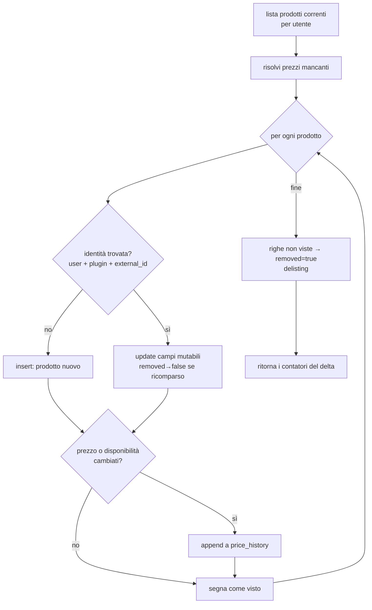

# Catalog Update Service

> **Layer 4 — Capability** · Audience: developer · Pseudocodice ammesso. Feature: [catalog-and-product-picker](../../3-features/user/catalog-and-product-picker.md) · Contratto: [product](../contracts/product.md).

## Scopo

Unico punto in cui i dati degli scraper diventano stato persistente: riceve la lista corrente dei prodotti per utente (callback `update_catalog`), calcola i **delta** e scrive solo i cambiamenti. Lo scraper è stateless: storico, disponibilità e delisting si decidono interamente qui.



## Requisiti

- **CATSVC-R1** — Espone ai plugin il callback `update_catalog(user_id, products)` via Plugin Context; è l'**unica via di scrittura** del catalogo (lo scraper non tocca mai le tabelle core).
- **CATSVC-R2** — Matching per identità `(user_id, plugin_id, external_id)` (vincolo UNIQUE sul DB): trovata → aggiorna; non trovata → prodotto nuovo; riga esistente assente dalla lista → delistata (`removed = true`).
- **CATSVC-R3** — Risolve i prezzi mancanti secondo il contratto Product (sotto).
- **CATSVC-R4** — Scrive in `price_history` **solo** se cambia il **prezzo corrente** o la **disponibilità** rispetto all'ultima entry (append-only; ogni entry porta anche `is_available`).
- **CATSVC-R5** — Aggiorna sul record di catalogo tutto ciò che può cambiare: `name`, `url`, `image_url`, `extra_json`, `is_available`, `removed` (un delistato che ricompare torna `removed = false`).
- **CATSVC-R6** — Restituisce al chiamante i **contatori del delta** (found/new/price_changes/removed) per il record di run del runner.
- **CATSVC-R7** — Un prodotto non disponibile **non viene mai escluso**: resta con `is_available = false`. Le esclusioni specifiche del sito avvengono prima, nel plugin.

## Risoluzione prezzi (normativa)

```
# price_original = "listino": se lo scraper non lo fornisce, si usa l'ultimo
# listino noto; se non c'è storico, il prezzo corrente (nessuno sconto deducibile).
if p.price_original is None:
    last = last_history_entry(product)            # None se nessuna
    p.price_original = last.price_original if last else p.price_current

if p.discount_pct is None:
    if p.price_original > p.price_current:
        p.discount_pct = round((p.price_original - p.price_current) / p.price_original * 100, 2)
    else:
        p.discount_pct = 0     # prezzo pieno (o sopra il listino noto)
```

Predicato "in offerta" usato da alert e UI: `discount_pct > 0`.

## Pseudocodice del delta

```
def update_catalog(user_id, products: list[Product]) -> DeltaCounters:
    seen, counters = set(), DeltaCounters()
    for p in products:
        resolve_prices(p)
        row = find(user_id, p.plugin_id, p.external_id)        # CATSVC-R2
        if row is None:
            row = insert_product(user_id, p); counters.new += 1
        else:
            update_mutable_fields(row, p)                       # CATSVC-R5 (removed→false se ricomparso)
        last = last_history_entry(row)
        if last is None or last.price_current != p.price_current \
                        or last.is_available != p.is_available:  # CATSVC-R4
            append_history(row, p); counters.price_changes += 1
        seen.add(row.id)
    # delisting: righe del plugin non viste in questa consegna
    for row in rows(user_id, plugin_id) where row.id not in seen and not row.removed:
        row.removed = True; counters.removed += 1
        # nessuna entry di history: il delisting non è un evento di prezzo
    counters.found = len(products)
    return counters
```

## Azioni utente sul catalogo

| Azione | Comportamento | Note |
|---|---|---|
| Rimuovi delistati | DELETE delle righe `removed = true` dell'utente | cascata su membri carrello e storico |
| Rimozione selettiva | DELETE delle righe indicate | idem; conferma con conseguenze |
| Svuota catalogo | DELETE di tutte le righe dell'utente | idem |
| Scrape ora | Solo a catalogo vuoto (il server **riverifica** e risponde 409 se non vuoto); job con le regole del runner, trigger `manual`, un utente solo | [scraper-pool](scraper-pool.md) |

La **cascata** (membri dei carrelli + storico) è una FK `ON DELETE CASCADE`: decisione presa, niente orfani; la UI dichiara le conseguenze prima della conferma.
