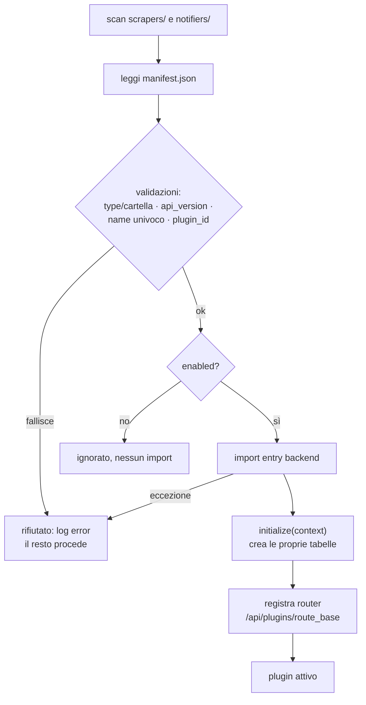

# Plugin Registry

> **Layer 4 — Capability** · Audience: developer · Pseudocodice ammesso. Feature: [dynamic-integration](../../3-features/plugins/dynamic-integration.md).

## Scopo

Scoprire, validare e caricare i plugin all'avvio (in `web` e `worker`, stessa sequenza), registrando route e contesti. Deterministico e statico: nessun plugin switching a runtime.



## Requisiti

- **REG-R1** — Scan di `src/plugins/scrapers/*` e `src/plugins/notifiers/*`; per ogni cartella, lettura e validazione del `manifest.json`.
- **REG-R2** — Validazioni che **rifiutano** il plugin (errore esplicito, il resto procede): `type` non combaciante con la cartella; `api_version` diversa da quella del core; `name` duplicato; `name` diverso dal `plugin_id` dichiarato dalla classe; entry point non importabile.
- **REG-R3** — `enabled: false` → plugin ignorato completamente (nessun import).
- **REG-R4** — Per ogni plugin accettato: import dinamico dell'entry backend (path **relativo alla cartella del plugin**), `initialize(context)` con il [Plugin Context](plugin-context.md) dedicato (qui il plugin crea le proprie tabelle), registrazione del router sotto `/api/plugins/{route_base}`.
- **REG-R5** — Un'eccezione in `initialize` o nella registrazione route isola il plugin (rifiutato, log `error`), mai il processo.
- **REG-R6** — Espone la discovery al frontend: `GET /api/plugins` → `[{name, type, route_base, icon, display_name}]` — **solo plugin abilitati e caricati**, nessun percorso interno.
- **REG-R7** — Modifiche al manifest hanno effetto al **rebuild + restart** (il bundle frontend è cucinato a build time).

## Pseudocodice

```
CORE_PLUGIN_API_VERSION = 1

def load_plugins(app):
    loaded, names = [], set()
    for folder_type, base in [("scraper", "src/plugins/scrapers"),
                              ("notifier", "src/plugins/notifiers")]:
        for dir in subdirs(base):
            try:
                m = parse_manifest(dir / "manifest.json")
                require(m.type == folder_type,        "type/cartella non combaciano")
                require(m.api_version == CORE_PLUGIN_API_VERSION, "api_version incompatibile")
                require(m.name not in names,          "name duplicato")
                if not m.enabled: continue
                plugin = import_entry(dir / m.backend.entry)     # relativo alla cartella
                require(plugin.plugin_id == m.name,   "plugin_id != manifest.name")
                ctx = build_context(plugin, m)                   # plugin-context.md
                plugin.initialize(ctx)                           # crea tabelle proprie
                app.include_router(plugin.router(), prefix=f"/api/plugins/{m.route_base}")
                loaded.append((m, plugin)); names.add(m.name)
            except Exception as e:
                log_error("worker", f"plugin {dir.name} rifiutato: {e}")   # REG-R5
    return loaded
```

## Note

- `worker` esegue la stessa load senza registrare i router HTTP (gli serve solo `initialize` + istanze per il runner).
- L'`icon` dichiarata nel manifest è servita come asset statico e referenziata dalla risposta di discovery: è la **provenienza** in tutta la UI.
- Il registry mantiene la mappa `plugin_id → istanza` usata da runner, cart engine (adjustments) e dispatch notifiche.
