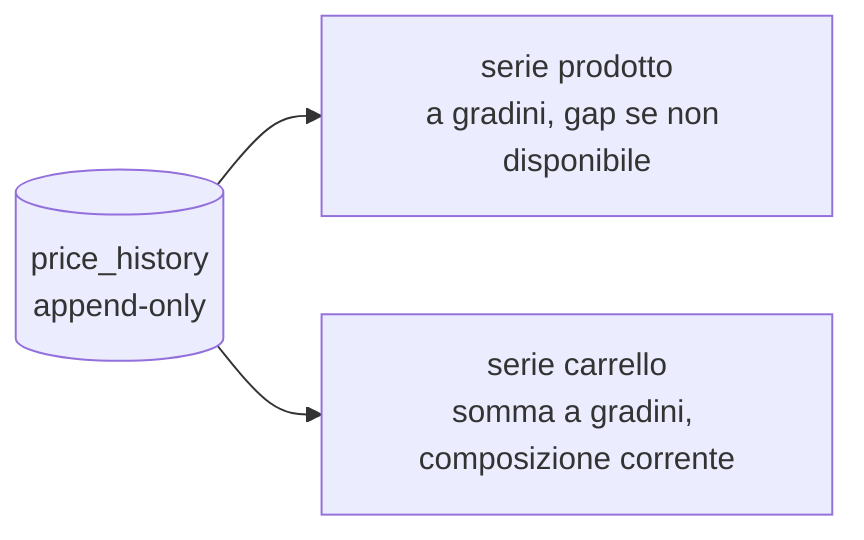

# Price History — serie per i grafici (spec-ahead)

> **Layer 4 — Capability** · Audience: developer · Pseudocodice ammesso. Feature: [price-history (utente)](../../3-features/user/price-history.md).
>
> La **registrazione append-only** (schema della entry, scrittura dal Catalog Update Service, HISTC-R1/R2/R3/R5) è già rilasciata ed è documentata in inglese in [`docs/4-capabilities/core/price-history.md`](../../../docs/4-capabilities/core/price-history.md). Resta qui il lato **lettura** ancora spec-ahead: le serie servite ai grafici (prodotto e carrello), fase charts.

## Scopo

Servire dallo storico `price_history` le serie pronte per i grafici — prodotto e carrello — senza che la SPA aggreghi. La stessa tabella codifica sia la linea del prezzo sia gli intervalli di indisponibilità (`is_available`), quindi le serie derivano tutto da lì.



## Serie per il grafico prodotto

```
def product_series(product_id, range):           # range: week=7gg, month=30gg, all
    entries = history(product_id, since(range))  # ordinate per recorded_at
    # la serie è a gradini: il valore resta costante tra due entry.
    # gap di indisponibilità: dall'entry con is_available=false
    # alla successiva con is_available=true la linea è interrotta.
    return [{t: e.recorded_at, price: e.price_current, available: e.is_available}
            for e in entries]
```

Per i range limitati (week/month) la serie include anche **l'ultima entry precedente** l'inizio del range, così il grafico parte dal valore corretto e non da zero.

## Serie per il grafico carrello (semplificata, HISTC-R4)

```
def cart_series(cart_id, range):
    members = current_active_member_ids(cart_id)     # composizione ATTUALE (no storico membership)
    series  = [product_series(pid, range) for pid in members]
    # somma a gradini: a ogni timestamp-evento di una qualunque serie,
    # somma i valori correnti delle serie dei prodotti DISPONIBILI in quell'istante
    return stepwise_sum(series, skip_unavailable=True)
```

Semplificazione dichiarata: si proietta la composizione **corrente** del carrello sul passato. Non si ricostruisce chi fosse membro in una certa data (servirebbe lo storico delle membership): complessità non giustificata per il valore aggiunto.

## Requisiti (lato lettura)

- **HISTC-R4** — Le serie sono servite già pronte dal backend (la SPA non aggrega): endpoint in [api/endpoints.md](../../api/endpoints.md).
