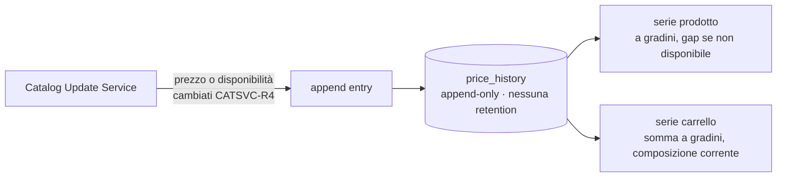

# Price History

> **Layer 4 — Capability** · Audience: developer · Pseudocodice ammesso. Feature: [price-history (utente)](../../3-features/user/price-history.md).

## Scopo

Persistere le variazioni di prezzo **e disponibilità** in una sola tabella append-only e servire le serie per i grafici (prodotto e carrello). Design deliberatamente semplice: una entry solo quando qualcosa cambia, nessuna tabella ausiliaria.



## Schema della entry

| Campo | Note |
|---|---|
| `product_id`, `user_id` | identità della serie |
| `price_current` | prezzo scontato (la linea del grafico) |
| `price_original`, `discount_pct` | listino e sconto al momento |
| `is_available` | stato di disponibilità al momento della entry |
| `recorded_at` | timestamp |

Scrittura: solo dal [Catalog Update Service](catalog-update-service.md) (CATSVC-R4), quando cambia `price_current` **o** `is_available`. La stessa tabella codifica quindi sia la linea del prezzo sia gli intervalli di indisponibilità — è la semplificazione che evita una "availability history" separata.

## Serie per il grafico prodotto

```
def product_series(product_id, range):           # range: week=7gg, month=30gg, all
    entries = history(product_id, since(range))  # ordinate per recorded_at
    # la serie è a gradini: il valore resta costante tra due entry.
    # gap di indisponibilità: dall'entry con is_available=false
    # alla successiva con is_available=true la linea è interrotta.
    return [{t: e.recorded_at, price: e.price_current, available: e.is_available}
            for e in entries]
```

Per i range limitati (week/month) la serie include anche **l'ultima entry precedente** l'inizio del range, così il grafico parte dal valore corretto e non da zero.

## Serie per il grafico carrello (semplificata, HIST-R4)

```
def cart_series(cart_id, range):
    members = current_active_member_ids(cart_id)     # composizione ATTUALE (no storico membership)
    series  = [product_series(pid, range) for pid in members]
    # somma a gradini: a ogni timestamp-evento di una qualunque serie,
    # somma i valori correnti delle serie dei prodotti DISPONIBILI in quell'istante
    return stepwise_sum(series, skip_unavailable=True)
```

Semplificazione dichiarata: si proietta la composizione **corrente** del carrello sul passato. Non si ricostruisce chi fosse membro in una certa data (servirebbe lo storico delle membership): complessità non giustificata per il valore aggiunto.

## Requisiti tecnici

- **HISTC-R1** — Append-only: mai update/delete di entry (eccetto la cascata da eliminazione prodotto).
- **HISTC-R2** — Indice `(product_id, recorded_at)`: query "ultima entry" del delta e query di range dei grafici.
- **HISTC-R3** — Nessuna retention: lo storico si conserva per sempre (è il valore del sistema).
- **HISTC-R4** — Le serie sono servite già pronte dal backend (la SPA non aggrega): endpoint in [api/endpoints.md](../../api/endpoints.md).
- **HISTC-R5** — `Decimal` serializzato come stringa nelle API e nei JSON persistiti (mai float per i prezzi).
