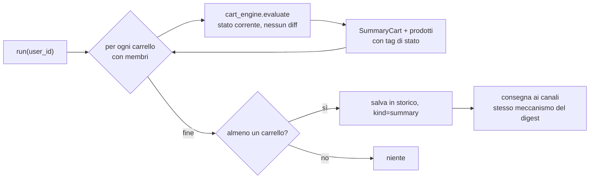

# Summary Report Module

> **Layer 4 — Capability** · Audience: developer · Pseudocodice ammesso. Feature: [summary-report](../../3-features/user/summary-report.md).

## Scopo

Generare lo **snapshot periodico** dei carrelli dell'utente e consegnarlo con lo stesso meccanismo dei digest. Nessuna baseline, nessun diff: fotografia dello stato corrente.



## Modello del payload

```python
class SummaryProduct(BaseModel):
    product_id: int
    name: str
    plugin_id: str                     # provenienza (icona/nome in resa)
    price_full: Decimal
    price_discounted: Decimal
    currency: str = "EUR"
    tags: list[AlertType]              # SOLO stati: PRODUCT_ON_SALE / PRODUCT_UNAVAILABLE

class SummaryCart(BaseModel):
    cart_id: int
    cart_name: str
    mode: str                          # "cross" | "scraper_specific"
    total_full: Decimal
    total_discounted: Decimal
    final_price: Decimal               # dopo adjustments (se scraper-specific)
    threshold: ThresholdInfo | None
    products: list[SummaryProduct]

class SummaryReport(BaseModel):
    kind: NotificationKind = NotificationKind.SUMMARY
    user_id: int
    generated_at: datetime
    carts: list[SummaryCart]
```

`ThresholdInfo`, `AlertType` e `NotificationKind` sono condivisi con il digest ([alert-event](../contracts/alert-event.md)): stesso vocabolario, payload diverso, distinto da `kind` — il notifier formatta in base a quello.

## Pseudocodice

```
def run(user_id):
    carts = []
    for cart in user_carts(user_id) where cart.members:
        state = cart_engine.evaluate(cart)
        products = [SummaryProduct(m, tags=state_tags(m)) for m in cart.members if not m.removed]
        carts.append(SummaryCart(cart, state, products))
    if not carts:
        return
    report = SummaryReport(user_id=user_id, generated_at=now(), carts=carts)
    alert_id = save_alert_log(report)            # kind = summary, sempre nello storico
    dispatch_to_channels(user_id, report, alert_id)   # stesso meccanismo del digest

def state_tags(m) -> list[AlertType]:
    tags = []
    if m.discount_pct > 0:   tags.append(PRODUCT_ON_SALE)
    if not m.is_available:   tags.append(PRODUCT_UNAVAILABLE)
    return tags
```

## Configurazione (`summary_config`)

```python
class SummaryConfig(BaseModel):
    user_id: int
    enabled: bool = False              # opt-in
    frequency: Literal["weekly", "monthly"] = "weekly"
    weekday: int | None = None         # 0=lun .. 6=dom, se weekly
    scheduled_time: time = time(9, 0)
    last_run_date: date | None = None  # guardia anti-doppione + recupero intra-day
```

Trigger e regole del "dovuto" nel [Cron Worker](cron-worker.md) (CRON-R4); consegna e registrazione esiti come per i digest ([alert-engine — dispatch](alert-engine.md)).
