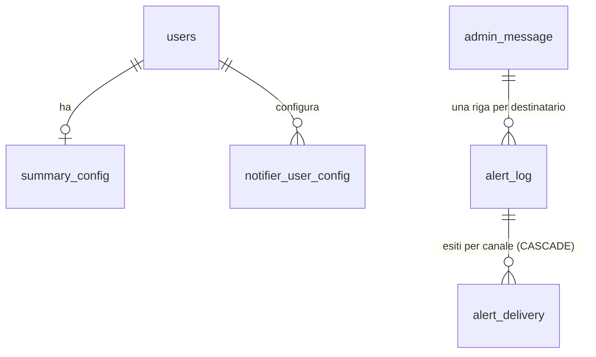

# Database — Schema logico (tabelle spec-ahead)

> **Layer 4 — Capability** · Audience: developer · Riferimenti tecnici ammessi. Architettura: [data-and-multitenancy](../../2-architecture/data-and-multitenancy.md).
>
> Le tabelle **già rilasciate** (`users`, `products`, `price_history`, `carts`, `cart_members`, `scrape_cooldown`, `scraper_schedule`, `scraper_admin_config`, `feature_flags`, `scrape_run`, `scrape_user_log`, `scrape_cache`, `system_settings`, `system_log`, e — da fase 6 — `cart_alert_types`, `alert_snapshot`, `alert_log`) sono documentate in inglese in [`docs/4-capabilities/database/schema.md`](../../../docs/4-capabilities/database/schema.md). Restano qui solo le tabelle ancora **spec-ahead** (consegna sui canali, summary, messaggi admin — fasi 7/10/11) più le regole trasversali dello schema.

Motore **PostgreSQL 16**, accesso via SQLAlchemy, validazione I/O Pydantic v2. Schema creato idempotentemente all'avvio da web e worker; tabelle dei plugin create dai plugin stessi.

Le relazioni spec-ahead pendono da `users` e da `alert_log` (già rilasciato, mostrato per contesto):

## Notifiche (spec-ahead)

| Tabella | Colonne | Note |
|---|---|---|
| `summary_config` | user_id PK/FK, enabled, frequency (`weekly`\|`monthly`), weekday, scheduled_time, last_run_date | opt-in; monthly = giorno 1 |
| `admin_message` | id, target_user_id FK (null = broadcast a tutti), title, body, created_at | il messaggio master; una riga `alert_log` per destinatario; gli esiti si leggono via `alert_delivery` |
| `system_message_template` | key PK (es. `user.disabled`), title, body, updated_at | **solo override** dei messaggi di sistema: assenza di riga = default del core; ripristino = DELETE (ADMSG-R9) |
| `alert_delivery` | id, alert_id FK **CASCADE**, plugin_id (null = nessun canale), status (`delivered`\|`failed`\|`skipped_no_notifier`), error_message, delivered_at | **un esito per canale** |
| `notifier_admin_config` | plugin_id PK, config_json, **enabled** (default true), updated_at | parametri di sistema del canale; enabled = interruttore globale admin (PCFG-R8) |
| `notifier_user_config` | plugin_id, user_id FK, **enabled** (flag attivazione), config_json — PK (plugin_id, user_id) | disattivare ≠ cancellare la config |

## Regole trasversali

- **DB-R1** — Ogni tabella operativa ha `user_id`: ogni query applicativa filtra per l'utente del token (multi-tenancy).
- **DB-R2** — Purge di un utente (automatico, dal job giornaliero del worker sugli account con `deletion_due_at` scaduta — USR-R9) → cascata completa dei suoi dati core, **dopo** che ogni plugin ha eliminato i propri (`delete_user_data`, in sequenza; solo se tutti completano si procede — USR-R10). La marcatura "in cancellazione" non elimina nulla.
- **DB-R3** — Serializzazione nei campi `*_json`: `Decimal` come stringa, `datetime` ISO-8601 UTC; i confronti "è cambiato?" avvengono sul dato deserializzato.
- **DB-R4** — **Migrazioni V1**: schema additivo con `CREATE ... IF NOT EXISTS`; per i breaking change, script SQL manuali documentati nel changelog — **mai** drop&recreate dell'intero schema: `price_history` non è ricostruibile. (Alembic: [future improvement](../../future-improvements/README.md).)
- **DB-R5** — Backup/export/ripristino: script versionati in `ops/` e cucinati nell'immagine `ops`, eseguiti a mano (`docker compose run --rm ops …`); il dump include tutte le configurazioni (config DB-first) e l'archivio anche i file di bootstrap locali ([backup-and-restore](../../../docs/infrastructure/backup-and-restore.md)).
- **DB-R6** — Ispezione dev: pgweb, nello stack di sviluppo (`compose-dev.yml`; assente dal release, in cui si usa `docker compose exec db psql` o il container `ops`).
- **DB-R7** — Ogni plugin che possiede tabelle (`plugin_<id>_*`) **dichiara la propria `MetaData`** con l'attributo `table_metadata` su `BasePlugin` (la `_Base.metadata` del plugin; `None` se non ha tabelle). Il registry lo **impone al load** per convenzione di naming: un plugin con tabelle `plugin_<id>_*` non coperte da `table_metadata` è rifiutato (`PluginLoadError`). La **guardia di disallineamento schema** (4.B0) itera `Base.metadata` + le `table_metadata` dei plugin e segnala tabelle/colonne presenti nel modello ma assenti nel DB; gira sempre e logga, esposta sul feed **admin-only** `GET /api/admin/errors` (dietro `WEA_SCHEMA_DRIFT_ALERT`), mai sulla sonda pubblica `/api/health`.
