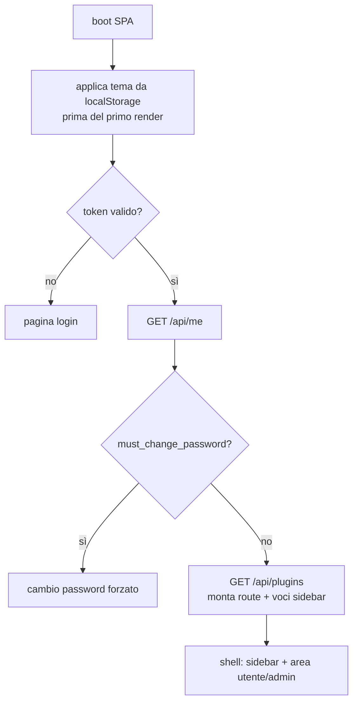

# Frontend — App shell e pagine

> **Layer 4 — Capability** · Audience: developer · Riferimenti tecnici ammessi. UX: [user-experience](../../1-business/user-experience.md).

## Stack

**SvelteKit 2** (Svelte 5, runes) in modalità **SPA** (CSR, adapter-static con fallback; nessun SSR: app dietro login, plugin montati dinamicamente lato client), TypeScript strict, **Tailwind CSS 4** (dark mode a classe), store Svelte per lo stato condiviso (runes per lo stato locale dei componenti), Fetch API via Auth Manager, Zod per la validazione client, **svelte-i18n** (dizionari registrati a runtime: namespace per-plugin caricati lazy, fallback su `en`), Day.js, markdown-it + DOMPurify per il render dei messaggi testuali (stessa famiglia di parser del backend: anteprima e consegna identiche). Toolchain **Node 22 LTS**; build unificato app+plugin ([build-system](../../infrastructure/build-system.md)).

## Struttura

```
src/frontend/src/
├── routes/            # +layout.svelte (shell), dashboard/, picker/, carts/,
│                      # history/, alerts/, profile/, admin/, plugins/[...]
├── lib/
│   ├── components/    # design system condiviso (anche per i plugin: $lib/components)
│   ├── stores/        # auth, theme, locale, plugins
│   ├── api/           # client tipizzati per endpoint (usa lib/auth)
│   └── auth/          # Auth Manager
├── generated/         # plugin-registry.ts (GENERATO, mai a mano)
└── i18n/              # file di lingua del core: V1 solo en.json (le lingue future si aggiungono qui); i plugin hanno le proprie cartelle i18n
```

## Sequenza di boot



Il **cambio password forzato** (CHG) mostra solo *nuova password* + *conferma*: la password attuale **non** è richiesta (la richiesta compare subito dopo il primo login, sarebbe ridondante); il cambio dal Profilo la richiede sempre. `GET /api/me` è **esente** dal gate `must_change_password`, così il boot può leggere nome e flag e instradare correttamente.

## Shell e navigazione

- **Sidebar sinistra persistente**: Dashboard · Product Picker · Carrelli · Storico prezzi · Storico alert (badge non letti) · Profilo · *(separatore)* · gruppo **SCRAPERS** collassabile (default aperto), **ultimo** così cresce senza spostare le voci core; voci dinamiche da `GET /api/plugins` con icona e route del plugin.
- **Header**: toggle tema (il selettore lingua è previsto ma non esposto in V1, English-only). I notifier **non** sono in nav (stanno in Profilo).
- **Area admin**: sezione separata visibile solo con ruolo admin (dashboard di sistema, utenti, scheduler, monitoraggio, config plugin, log, impostazioni).

## Tema e lingua

- Tema chiaro/scuro, **default scuro**; preferenza per-browser in `localStorage`, applicata **prima del primo render** (niente flash). Dark mode Tailwind con classe su `<html>`.
- Lingua: per-account (`users.locale`), ricevuta al login e applicata al boot. **V1 è English-only**: `locale` fisso a `en`, selettore non esposto; l'intera macchina (chiavi, file di lingua, namespace dei plugin, risoluzione per-utente) resta in piedi — attivare una seconda lingua = tradurre i file e mostrare il selettore ([future improvement](../../future-improvements/platform.md)).

## Pagine utente (mappa di responsabilità)

| Pagina | Responsabilità | Feature di riferimento |
|---|---|---|
| Dashboard | saluto con il **nome** dell'utente ("Welcome, &lt;nome&gt;"), stato carrelli, badge alert non letti, banner "nessun notifier attivo" | — |
| Product Picker | tabella catalogo paginata server-side; provenienza; azioni di pulizia; scrape-now a catalogo vuoto | [catalog](../../3-features/user/catalog-and-product-picker.md) |
| Carrelli | card dei carrelli, creazione/modifica, tipi di alert, soglie | [carts](../../3-features/user/carts.md) |
| Storico prezzi | **un componente grafico unico** (serie prodotto o carrello, selettori week/month/all, gap) | [price-history](../../3-features/user/price-history.md) |
| Storico alert | elenco paginato, letto/non letto, categorie sistema/admin (notifiche admin con icona e colore dedicati), render Markdown dei messaggi testuali, dettaglio con esiti di consegna per canale | [alerts](../../3-features/user/alerts-and-notifications.md) |
| Profilo | **dati account** (username, nome, cognome, ruolo, in sola lettura), cambio password (richiede sempre la password attuale; campo `username` nascosto per i password manager), lingua, cadenza, summary, canali notifier (form dinamici + test + flag) | [profile](../../3-features/user/profile-and-notifiers.md) |
| Pagine plugin | montate dinamicamente sotto la route del plugin | [plugin-discovery](plugin-discovery.md) |

## Pagine admin

| Pagina | Responsabilità |
|---|---|
| Dashboard di sistema | statistiche globali e ranking per utente — solo aggregati, mai contenuti ([admin-dashboard](../../3-features/admin/admin-dashboard.md)) |
| Utenti | CRUD account, reset password, colonna **ultimo accesso** ordinabile, filtro stato (attivo/disabilitato/in cancellazione), icone abilita/disabilita e cancella (soft con scadenza), **annulla cancellazione** (→ disabilitato) |
| Scheduler scrapers | slot 1..N per scraper, sospensione, **vista calendario del giorno** (read-only, click → config dello scraper), impostazioni globali (timeout, retention, periodo cancellazione utenti) |
| Monitoraggio scrapers | ultima run, trend, elenco run, drill-down per utente |
| Config plugin | pagine admin dei plugin (form dinamici + Test Scraper / test canale + svuota cache per gli scraper) |
| Notifiche agli utenti | composizione Markdown con anteprima live, invio a tutti/un utente, elenco inviati con esiti; tab **messaggi di sistema**: catalogo template con override/ripristino, stesso editor ([admin-notifications](../../3-features/admin/admin-notifications.md)) |
| Log di sistema | polling incrementale con cursore, filtri, heartbeat del worker evidenziato |
| Manutenzione | purge storico alert per data |

## Componenti condivisi rilevanti

- **Tabella prodotti** (Product Picker + risultati dry-run dei plugin): colonne standard, ordinamento, provenienza.
- **Form dinamico da `ConfigField[]`**: un componente per tutti i form di config dei plugin (admin e utente), con gestione campi secret (`is_set`, write-only) e bottone Test per i notifier.
- **Grafico storico**: unico componente, due sorgenti dati.
- **Card carrello**: layout della card ([carts](../../3-features/user/carts.md)).
- **Markdown**: un componente di render (markdown-it + DOMPurify, usato da Storico alert e anteprima) e l'editor textbox+anteprima della pagina admin.
