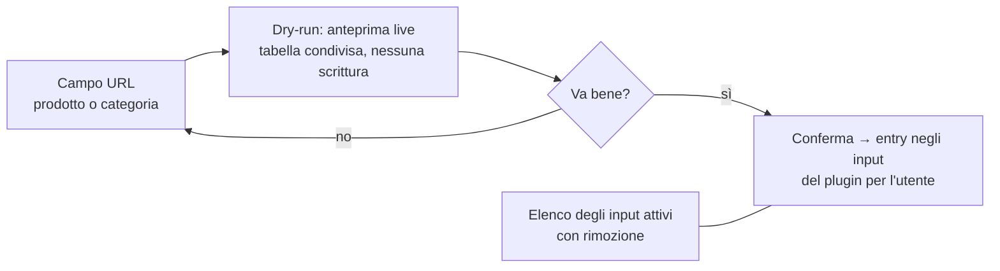

# Dragon Store — Features

> **Implemented plugin** · Dettaglio comportamentale (testo + Mermaid). Contratto generico: [scraper-plugin](../../3-features/plugins/scraper-plugin.md).

## Requisiti specifici del plugin

- **DRG-R1** — Due tipi di input per utente: **URL prodotto singolo** e **URL categoria**.
- **DRG-R2** — Una categoria viene enumerata per intero (tutte le pagine) a ogni run; i prodotti trovati entrano nel catalogo dell'utente.
- **DRG-R3** — In caso di sovrapposizione tra input (prodotto singolo presente anche in una categoria osservata), la **categoria ha priorità** e il prodotto è consegnato una sola volta (dedup su `external_id`).
- **DRG-R4** — Prodotti **"ammaccati"**: ogni **categoria** osservata ha un **selettore "includi ammaccati"**, di default **disattivato** (gli ammaccati sono esclusi e conteggiati in `products_excluded`). L'utente che li vuole può attivarlo **categoria per categoria**. Gli out-of-stock sono sempre inclusi con `is_available=false`.
- **DRG-R7** — Un prodotto ammaccato inserito come **prodotto singolo** è **sempre incluso**: averlo aggiunto esplicitamente è una scelta voluta. La UI lo segnala con un **piccolo avviso in rosso** ("Prodotto in stato AMMACCATO") nell'anteprima dry-run e nella lista degli input.
- **DRG-R8** — In caso di sovrapposizione tra fonti con scelte diverse (es. ammaccato escluso dalla categoria A ma incluso dalla categoria B o aggiunto come singolo), **l'inclusione vince**: il prodotto è consegnato.
- **DRG-R5** — Adjustments: applica al totale del carrello la **soglia di sconto massima raggiunta** tra quelle configurate (voce positiva); eventuali spese di spedizione come voce negativa — *se previste: da definire, vedi capabilities*.
- **DRG-R6** — Il concetto di categoria resta interno: il core e il Product Picker non lo vedono mai.

## UI utente (pagina del plugin)

Navigazione del negozio per scegliere cosa osservare:

- L'utente incolla un URL (il plugin riconosce da sé se è un prodotto o una categoria, grazie ai pattern URL del sito — vedi [pre-analisi](capabilities.md#pre-analisi-del-sito-giugno-2026-una-pagina-di-categoria)), vede l'anteprima dei prodotti che verrebbero osservati, conferma.
- Se l'URL è una **categoria**, il form di conferma include il toggle **"Includi prodotti ammaccati"** (default: off); l'anteprima riflette la scelta. Il toggle è modificabile in seguito dalla lista degli input.
- Se l'URL è un **prodotto singolo in stato AMMACCATO**, l'anteprima mostra un piccolo **avviso in rosso**: il prodotto viene comunque osservato (scelta esplicita, DRG-R7).
- La lista degli input attivi (con tipo, conteggio prodotti dell'ultima run e — per le categorie — lo stato del toggle ammaccati) è gestibile dalla stessa pagina.

## UI admin (pagina admin del plugin)

| Sezione | Contenuto |
|---|---|
| Soglie di sconto | editor delle coppie `{importo minimo, % sconto}` usate dagli adjustments |
| Parametri operativi | timeout richieste, ritardo di politeness, user-agent |
| Test Scraper | dry-run on-demand su un URL, risultati nella tabella condivisa, nessuna scrittura |

## Esempio di adjustments

Carrello scraper-specific da 120 € (totale scontato), soglie configurate `{50 → 10%, 100 → 15%}`:

| Voce | Importo |
|---|---|
| Sconto soglia 100 € (15%) | **+18.00** (risparmio) |
| Stima finale | 120 − 18 = **102.00** |

La soglia del carrello dell'utente si confronta con la stima finale (CART-R11): è il prezzo che pagherebbe davvero al checkout di Dragon Store.
