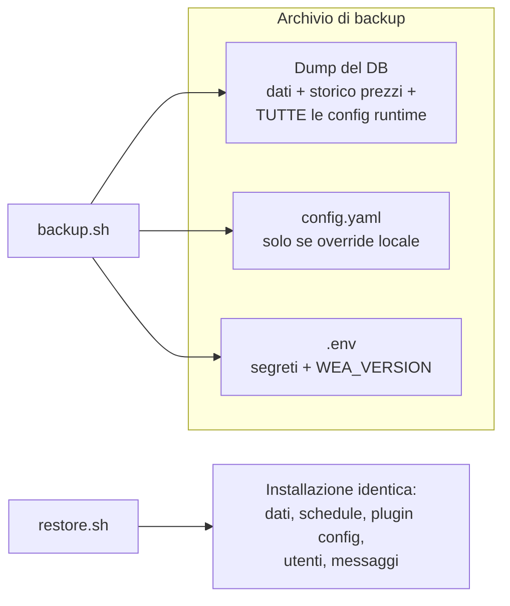

# Backup, export e ripristino

> **Infrastruttura** · Audience: DevOps, system engineer. Snippet di configurazione ammessi.

## Principio

L'unico dato non ricostruibile è il **database** (in particolare lo storico prezzi), e grazie al principio config DB-first ([configuration](configuration.md)) il DB contiene **anche tutte le configurazioni**: impostazioni di sistema, schedule, config admin/utente dei plugin. Fuori dal DB restano solo i due file di bootstrap (`config.yaml`, `.env`): il backup li include.

Gli strumenti sono **script versionati nel repo** (cartella `ops/`) e **cucinati nell'immagine `ops`** pubblicata insieme a web e worker ([deployment](deployment.md), INF-17): l'immagine è `postgres:16` + gli script (`pg_dump`/`psql` della stessa versione del server per costruzione, zero drift). Si eseguono **a mano** come container effimero (`docker compose run --rm`) — nessun software da installare sull'host (INF-15), nessuna automazione obbligatoria (un cron sull'host che invoca lo stesso comando è il passo successivo naturale, a discrezione di chi hosta). Il servizio `db` resta **stock**, senza mount estranei; gli script raggiungono il database **via rete** (`db:5432`, credenziali da `.env`).

## Gli script

| Script | Cosa fa | Output |
|---|---|---|
| `backup.sh` | **Backup completo**: `pg_dump` in formato custom + copia di `.env` e — se presente — dell'override locale di `config.yaml`, in un unico archivio timestampato | `backups/watchemall-backup-<data>.tar.gz` |
| `export.sh` | **Export portabile**: dump SQL **leggibile** (plain), per ispezione, diff o migrazione verso un'altra installazione | `backups/watchemall-export-<data>.sql.gz` |
| `restore.sh <archivio>` | **Ripristino** da un archivio di backup: ricrea il database dal dump e riposiziona i file di bootstrap accanto al compose | DB e config allo stato del backup |

Esecuzione (dall'host o dal dev container, nella cartella del compose):

```bash
docker compose run --rm ops backup.sh
docker compose run --rm ops export.sh
docker compose run --rm ops restore.sh /backups/watchemall-backup-2026-06-12.tar.gz
```

## Il servizio `ops` nel compose

Effimero (profilo `ops`, mai in esecuzione da solo), con questi mount:

| Mount | Modo | Scopo |
|---|---|---|
| `./backups` → `/backups` | rw | destinazione di backup ed export (cartella **gitignorata**) |
| `./.env` → `/host/.env` | ro | incluso nel backup (scelta dichiarata: l'archivio di backup **contiene segreti** e va custodito di conseguenza) |
| `./config.yaml` → `/host/config.yaml` | ro | **solo se esiste un override locale** ([deployment](deployment.md)): il default vive nell'immagine e non serve salvarlo; `backup.sh` gestisce l'assenza |

In sviluppo gli stessi script si possono montare dal repo (`./ops:/ops:ro` nel compose di sviluppo) per iterarci senza rebuild.

## Regole di comportamento degli script

- **Idempotenti e prudenti** (INF-14): `restore.sh` chiede conferma esplicita, verifica che l'archivio sia integro **prima** di toccare il DB e rifiuta di girare se `web`/`worker` risultano connessi al database (lo stack applicativo va fermato: `docker compose stop web worker`).
- Il ripristino **ricrea il database dal dump**: è l'unica eccezione legittima al divieto di drop dello schema (INF-13/DB-R4, che riguarda le migrazioni) — il dump *è* lo stato che si sta riportando in vita.
- `backup.sh` ed `export.sh` non interrompono il servizio: `pg_dump` lavora su uno snapshot consistente (MVCC), si possono lanciare a stack caldo.
- Ogni modifica che tocca ciò che gli script salvano (nuovi file di config, nuovi volumi) aggiorna gli script **nella stessa PR** (INF-16).

## Cosa viene salvato, riassunto



Verifica consigliata dopo ogni primo setup: backup → `docker compose down -v` (distruzione del volume) → `up` → restore → login e controllo che dati e configurazioni siano identici.
