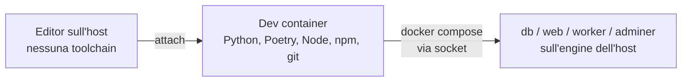
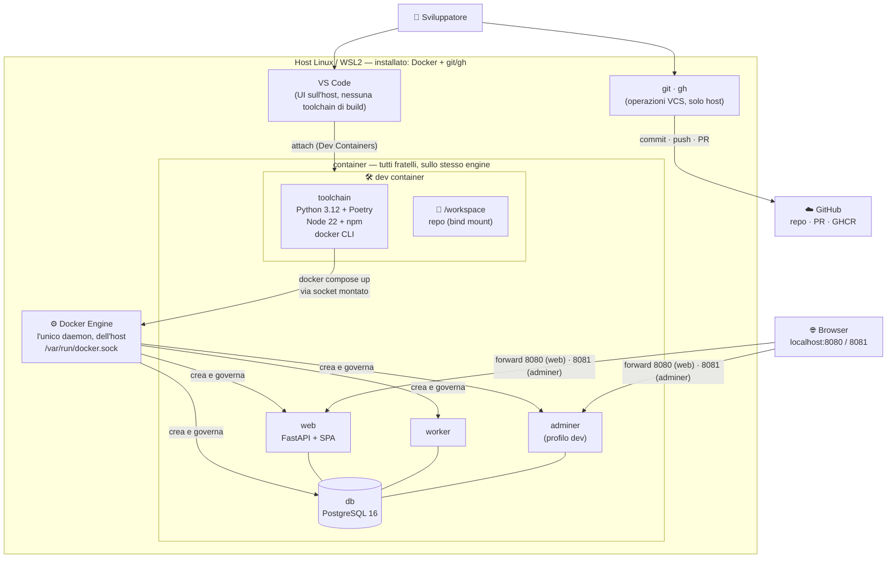

# Dev container (sviluppo zero-install)

> **Infrastruttura** · Audience: developer, DevOps. Snippet di configurazione ammessi.

## Principio: niente toolchain sull'host

Il portale è hostato su **Linux** — in locale dentro **WSL2**, oppure su un **server dedicato**. Su nessuna macchina (di sviluppo o di hosting) si installa software di sviluppo: **tutto vive nei container** (INF-15).

| Macchina | Cosa serve sull'host | Cosa NON si installa |
|---|---|---|
| Dev (WSL2 o Linux) | Docker Engine + Compose plugin, un editor con supporto Dev Containers (es. VS Code) | Python, Poetry, Node, npm, psql, … |
| Server di hosting | Docker Engine + Compose plugin | qualunque toolchain: le immagini sono multi-stage e autosufficienti (INF-5) |

## Il dev container

La cartella `.devcontainer/` alla radice del repo definisce l'ambiente di sviluppo completo: l'editor si attacca al container, e lì dentro esistono tutti gli strumenti.

```
.devcontainer/
├── devcontainer.json    # entrypoint per l'editor
├── Dockerfile           # toolchain: Python 3.12 + Poetry, Node 22 LTS + npm, git, docker CLI
└── post-create.sh       # install tollerante: si attiva da solo quando i file toolchain esistono
```

```jsonc
// .devcontainer/devcontainer.json
{
  "name": "watch-em-all-dev",
  "build": { "dockerfile": "Dockerfile" },
  "mounts": [
    // docker-outside-of-docker: il dev container comanda il Docker dell'host
    "source=/var/run/docker.sock,target=/var/run/docker.sock,type=bind"
  ],
  "forwardPorts": [8080, 8081],
  "postCreateCommand": "bash .devcontainer/post-create.sh",
  "remoteUser": "root"
}
```

Scelte dichiarate:

- **docker-outside-of-docker**: il dev container monta il socket Docker dell'host e lancia `docker compose` da dentro — i container applicativi (`db`, `web`, `worker`, `adminer`) girano sull'engine dell'host, non annidati. Più semplice e leggero del Docker-in-Docker.
- La toolchain del dev container (Python+Poetry, Node+npm) **rispecchia gli stage di build** dei Dockerfile dei package: stessa versione maggiore, così "funziona nel dev container" implica "builda nell'immagine".
- **Git e GitHub si usano dall'host, mai dal container**: il dev container serve a buildare ed eseguire; commit, push e PR (`git`, `gh`) si fanno **fuori**, dall'host — è l'unica eccezione dichiarata allo zero-install (la CLI `gh` si installa sull'host). Il binario `git` resta comunque nell'immagine perché poetry/npm ne hanno bisogno per le dipendenze da repository.
- **Utente `root` nel container** (semplificazione dichiarata): l'accesso al socket Docker da non-root richiederebbe l'allineamento del GID del gruppo `docker` dell'host; dentro un dev container locale il root è prassi accettata e azzera quella complessità.
- **Post-create tollerante**: `post-create.sh` installa le dipendenze solo se i file toolchain esistono (`pyproject.toml` arriva con 1.B1, `src/frontend/package.json` con 1.F1) — il dev container nasce in fase 0, prima del codice, senza fallire.
- Il flusso quotidiano non cambia: `docker compose --profile dev up` (dal terminale **dentro** il dev container), hot-reload tramite i bind-mount del profilo dev.

## Flusso di lavoro



1. Clona il repo in WSL2 (o sul server di sviluppo Linux).
2. Apri la cartella nell'editor → "Reopen in Container".
3. Dentro il container: `cp .env.example .env`, `docker compose --profile dev up`.
4. Test, lint, build: sempre dal terminale del dev container — mai dall'host.
5. Commit, push e PR: **dall'host** (`git` e `gh` vivono fuori dal container).

## Architettura completa

La vista d'insieme del docker-outside-of-docker: un solo engine (dell'host), il dev container come fratello — non genitore — dei container applicativi, e l'editor che è solo UI.



Da leggere nel disegno: i container applicativi creati da dentro il dev container nascono **accanto** a lui (un `docker ps` dall'host vede tutto, dev container incluso); il confine è netto — **dentro** il container si builda, si testa e si esegue, **dall'host** si fanno commit, push e PR (`git`/`gh`, l'eccezione dichiarata allo zero-install); verso l'esterno escono solo le porte forwardate e il traffico VCS dell'host.

## Hosting

Il deployment su server o su WSL2 **non richiede il dev container né i sorgenti**: è pull-based — deploy kit (compose di release + `.env`) e immagini pubblicate su GHCR ([deployment](deployment.md)). Il dev container usa invece il **compose di sviluppo** del repo (`docker-compose.yml`, con `build:`): stessa forma, sorgenti locali. L'unico prerequisito dell'host, in entrambi i casi, resta Docker.
