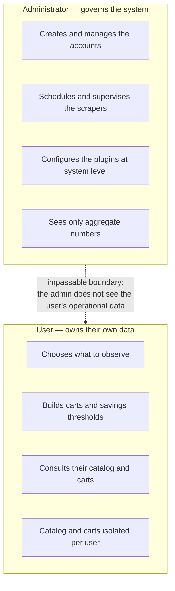

# Personas and roles

> **Layer 1 — Business** · Audience: everyone · Descriptive text only.
>
> English mirror of the Italian reference [`docs-ita/1-business/personas-and-roles.md`](../../docs-ita/1-business/personas-and-roles.md), limited to what is implemented (DOC-12). The two roles, their non-overlapping duties and the privacy boundary are realized today. The responsibilities that depend on not-yet-built capabilities — receiving alerts and reports, configuring delivery channels — stay in the Italian document.

The system knows exactly two roles, with sharply separated responsibilities. The separation is a deliberate choice: the administrator governs the system, the user governs their own data, and the two spheres do not overlap.

## The user

The person who wants to be told when it is worth buying. Their responsibilities:

- **Decide what to observe**: for each supported site (scraper), configures the products or categories to monitor. They do it from each scraper's dedicated pages.
- **Organize the carts**: groups their own catalog products into carts and sets savings thresholds on them.
- **Consult**: the state of their carts, their catalog.

The user sees **only their own data**: catalog and carts are personal and isolated from those of the other users.

## The administrator

The person who hosts and governs the installation (often physically the same person as one of the users, but with a separate account). Their responsibilities:

- **Manage the users**: creates the accounts (there is no self-registration) and assigns the roles. *(The richer account lifecycle — reset, disable, deferred deletion — arrives in a later phase.)*
- **Govern the scrapers**: decides **how many times a day** and **at what time** each scraper runs (independent schedules, one execution at a time) and the "good manners" limits toward the observed sites (the system must never hammer a site with requests).
- **Supervise the work**: a near-real-time system log of executions, recoveries, skips and errors.
- **Configure the plugins at system level**: the shared parameters of the scrapers are the admin's responsibility; each user then adds their own personal parameters.
- **Maintenance**: global operational parameters and retention rules by date.

By design the administrator **does not access the users' operational data**: the admin does not see their carts. Global cleanup rules (by date) can be applied without reading any content.

## Roles and accounts

- An account has exactly one role: `admin` or `user`.
- An admin who also wants to monitor prices for themselves uses **a second account** with the `user` role. This separation keeps both the permission model and the interface simple.
- At first startup the system creates the initial administrator account; users are created by the admin with a temporary password, to be changed mandatorily at first login.

## Documentation audience (beyond the application roles)

This documentation also serves figures who do not use the application but work on top of it: the **stakeholder** (Layer 1), the **software architect** and the **system engineer** (Layer 2–3), the **DevOps** ([infrastructure/](../infrastructure/)), the **developer** (Layer 4) and the **plugin developer** ([plugin-development/](../plugin-development/)).
