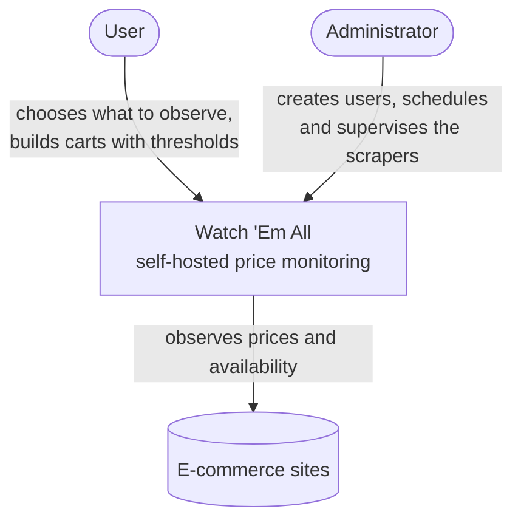
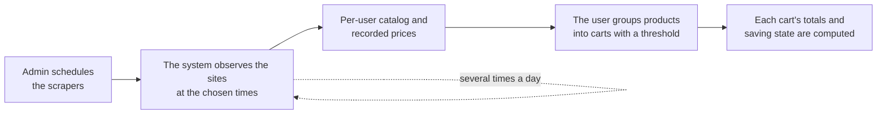

# What Watch 'Em All is

> **Layer 1 — Business** · Audience: everyone · Descriptive text only.
>
> English mirror of the Italian reference [`docs-ita/1-business/product-overview.md`](../../docs-ita/1-business/product-overview.md), limited to what is implemented (DOC-12). This overview describes the product **as it exists today** (phases 0–5): automated observation of chosen products on chosen sites, a per-user catalog with price history recorded, and carts with a savings threshold that compute what the products would really cost. The **alerting** that closes the loop — notifications, delivery channels, price-history charts and periodic reports — is the product's north star but arrives in later phases; those slices stay in the Italian document.

## The problem

Anyone who shops online with an eye on savings ends up checking the same products on the same sites by hand, day after day: has the price dropped? Is it back in stock? Is it worth buying now or waiting? When the products to keep an eye on grow into the dozens, manual checking becomes impractical and the deals slip away.

## The solution

Watch 'Em All automates that surveillance. The user tells the system **which products to observe** and on **which sites**; the system checks them automatically several times a day and records their prices and availability over time. The user then groups the products into **carts** and sets a **savings threshold**; the system computes, for each cart, what the products would really cost — including the shop's own cart rules (threshold discounts, shipping) — and shows whether the target has been reached.

The ultimate purpose is always the same: **let the user know when their carts are on sale**, so they can buy at the moment of greatest saving. Today the system observes, records and computes that state; the automatic **notification** that announces it (over the user's channels) arrives in a later phase.

### The big picture

Who touches the system and what the system talks to, at a glance:

## The key concepts, in plain words

- **Scraper**: a specialized "observer" for a single e-commerce site. Every site has its own scraper. Scrapers are add-on modules (plugins): new ones can be added without touching the rest of the system.
- **Catalog**: the set of products the scrapers have extracted for a user. It is personal: each user sees only their own catalog.
- **Product Picker**: the catalog table the user consults, and from which they select the products to put into carts.
- **Cart**: a group of catalog products the user wants to monitor together. On a cart the user sets a **savings threshold**; the system computes its totals and the final estimate.
- **Provenance**: the site/scraper a product comes from, always shown (icon + name) in the catalog, in the cart cards and in the cart detail — indispensable in cross-store carts.

### How it works, end to end

The value cycle, in simple terms: the admin prepares, the system observes on its own, the user gathers products into carts, and each cart's saving state is computed for them.

## Who it is for

It is a personal, self-hosted project: whoever uses it installs it (typically on their own home server), for themselves and a few other users — family or friends. It is not meant for a wide audience nor for commercial use. Two roles:

- the **user**, who configures what to monitor and organizes their carts;
- the **administrator**, who installs the system, creates the users, decides when and how much the scrapers work, and supervises the health of the system.

## What it is NOT

- It is not a public price comparator: it has no global search and no rankings.
- It buys nothing on the user's behalf: it stops at informing.
- It is not a multi-organization cloud service: it is a single private installation.

## Layer 1 documents

| Document | Content |
|---|---|
| [use-cases.md](use-cases.md) | The founding use cases, told as stories |
| [personas-and-roles.md](personas-and-roles.md) | Who uses the system and with what responsibilities |
| [user-experience.md](user-experience.md) | The user's experience, step by step |
| [admin-experience.md](admin-experience.md) | The administrator's experience |
| [glossary.md](glossary.md) | Glossary of recurring terms |
