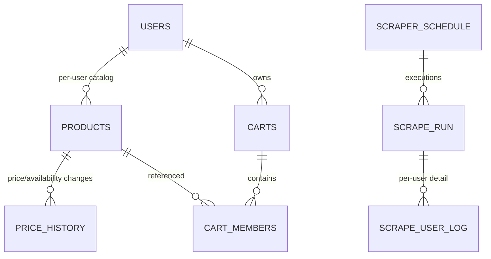
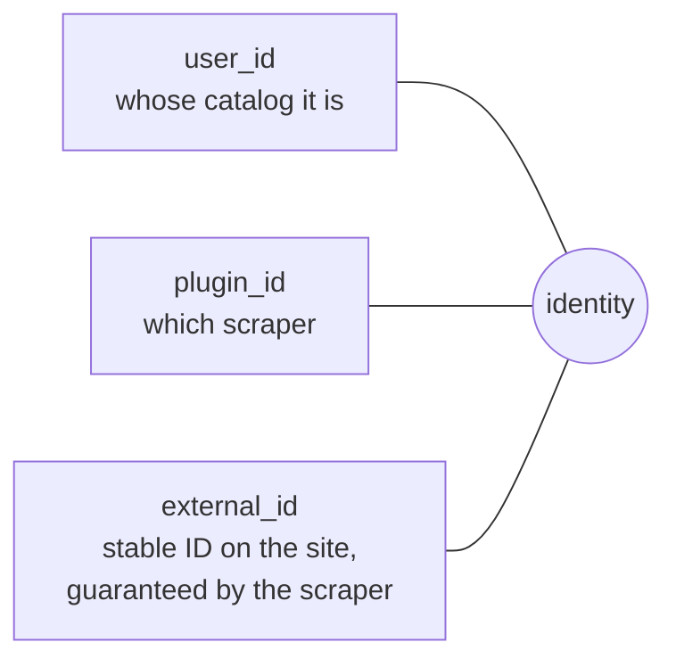
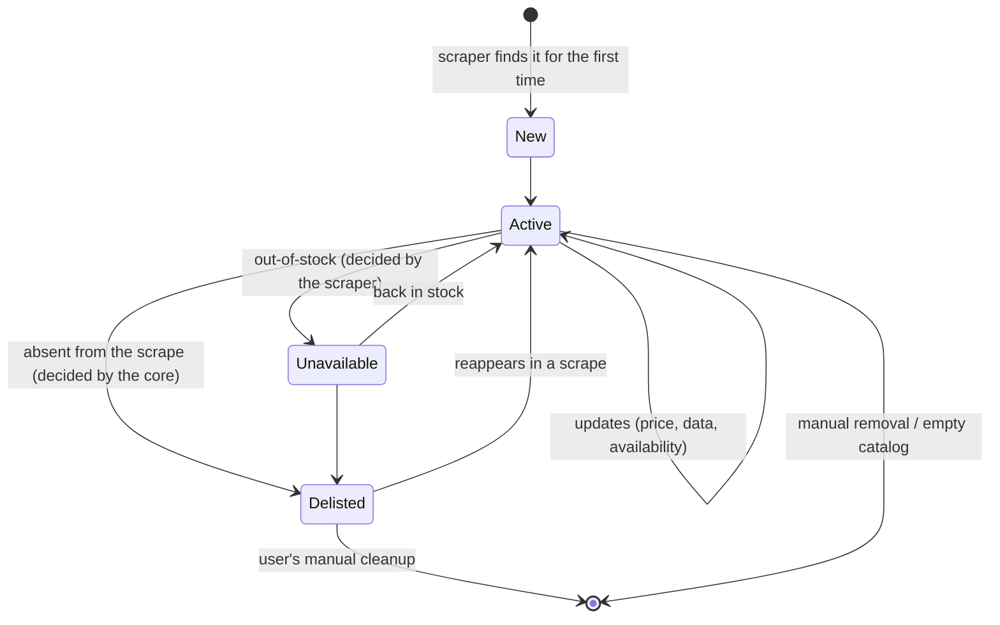

# Data and multi-tenancy

> **Layer 2 — Architecture** · Audience: SW architects, system engineers · Text + Mermaid, no code.
>
> English translation of the Italian reference [`docs-ita/2-architecture/data-and-multitenancy.md`](../../docs-ita/2-architecture/data-and-multitenancy.md), limited to what is implemented (phases 0–5). The notification/alert data model (cart alert types, alert schedule, summary config, alert log and per-channel delivery, the per-cart baseline, per-user notifier config) arrives with the alerts phase and stays in the Italian reference.

## Principle

Every operational datum belongs to a user (`user_id`) and is completely isolated from the others'. The system's only shared state is the PostgreSQL database; there are no state files nor any direct communication between processes.

## Logical data map

Areas (full schema in the [Layer 4 — database](../4-capabilities/database/schema.md)):

| Area | Data | Data owner |
|---|---|---|
| Auth | users, roles, token versions | admin (account), user (password/language) |
| Catalog | per-user products, price/availability history | core (written via the scraper) |
| Carts | carts, members, thresholds | user |
| Scheduling & monitoring | scraper schedules, runs, per-user detail, system log, global settings | admin |
| Plugin tables | each plugin's own inputs and parameters, namespaced | the plugin |

The notification areas (alert history and per-channel delivery outcomes, baseline, cadence, reports, per-user notifier config) arrive with the alerts phase; see the Italian [data-and-multitenancy](../../docs-ita/2-architecture/data-and-multitenancy.md).

## Product identity

Recognising the "same product across two observations" is the foundation of deltas, history and delisting. The identity is the triple:

- The `external_id` must be **stable** across runs and **unique** in its space. The scraper provides only the site-specific **seed** (a mandatory abstract method); its transformation into an id — normalisation and deterministic hashing — is imposed by the core, identical for every scraper. If the seed is not stable, the system sees a new product and the history breaks: it is the most delicate point of every scraper.
- The database key is only an internal surrogate.
- Consequence for cross carts: the "same" product on two sites is — correctly — **two distinct rows** of the catalog (different plugins ⇒ different identities), which makes it natural to add it twice to a cross cart, once per site.

## Life cycle of a catalog datum

- **Unavailable** ≠ **delisted**: the first is temporary and decided by the scraper; the second is "vanished from the site", decided by the core, kept for life until the user cleans up.
- **Deletion**: removing a product from the catalog removes it in cascade from the carts that contain it and deletes its history; the UI declares this before confirming. (Decision taken: explicit cascade, no orphans.)

## History: what is kept and what is not

- **Price/availability history**: append-only, one entry **only when something changes** (price or availability). No daily snapshots: compact by nature, kept forever.
- **Operational logs** (scrape runs, system log): retention configurable by the admin, automatic cleanup.

The alert history (every generated notification, with per-channel delivery outcome and read state) arrives with the alerts phase.

## Configuration: DB-first

The **operational** configuration (schedules, limits, plugin parameters, channels) lives in the DB and is editable from the UI without restarts. The configuration file holds **only the bootstrap** (DB connection, signing key, token durations): what is needed before the DB is reachable. Secrets live in environment variables. Details: [infrastructure/configuration.md](../infrastructure/configuration.md).
