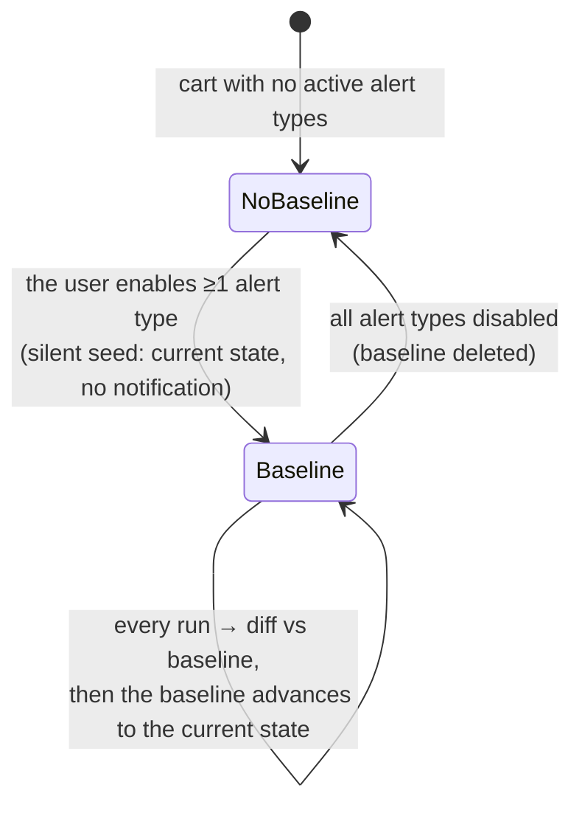
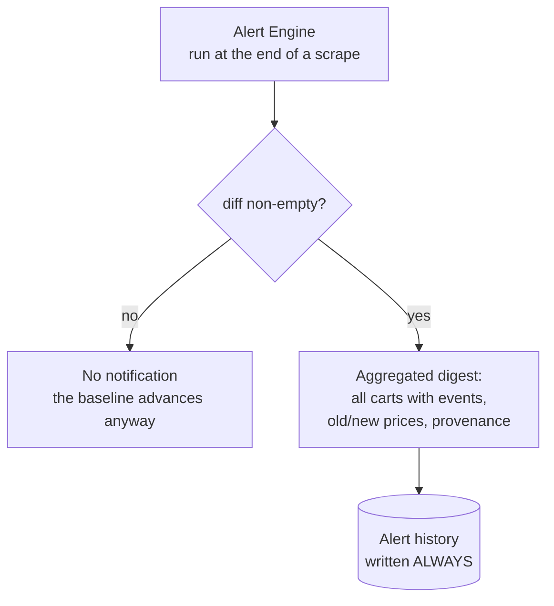

# Notification architecture

> **Layer 2 — Architecture** · Audience: SW architects, system engineers · Text + Mermaid, no code.
>
> English mirror of the Italian reference [`docs-ita/2-architecture/notification-architecture.md`](../../docs-ita/2-architecture/notification-architecture.md), limited to what is implemented (DOC-12). Phase 6 ships the **what** (diff against a baseline), the **when** (event-driven, after each scrape) and the **one aggregated digest always written to the in-app history**. **Delivery to external channels** (notifiers, per-channel outcome, retry), the **periodic summary report** and the **admin notifications / categories** are spec-ahead (phases 7/10/11) and stay in the Italian reference.

Notifications are the product: everything else in the system exists to reach this moment. The implemented architecture answers three questions: **what** to notify, **when**, and **what remains**.

## What: diff, not state

The system notifies **only what has changed** since the last run, never the current state repeated (no "still on sale" every day). The mechanism is a **baseline**: one reference snapshot per user + cart with active alert types, against which the diff is computed at every run.

Properties that follow (all intended):

- **First run silent**: right after the alert types are enabled nothing fires (no delta against a freshly seeded baseline).
- **No backlog, no flood**: turning alerts off and on again restarts from "now".
- **Independence from intermediate scrapes**: between two notifications there may be 1 or 10 scrapes; the diff is always "vs the last run". A price that dropped and rose again between two runs produces no noise.
- **New elements without a baseline** (e.g. a product just added to the cart): seeded silently by the first run that meets them.

## When: after each scrape (event-driven)

- *When* to receive: **at the end of a scrape** — the alert engine runs at the end of every scrape that changed the user's catalog (scheduled scrape in the worker, manual scrape-now, the TP's "simulate scrape"). No per-account configuration of days or time. Each scrape run produces **one aggregated digest per user**: a per-cart cadence would make the single aggregated message impossible.
- *What* to receive: **per-cart** — the user chooses the event types that interest them on each cart (sales, availability, threshold…). Default: none active.

## One aggregated digest, always in the history

Design decisions:

1. **One message per run** (`alert_digest`), aggregating all carts with events. Never one notification per cart or per product: a user with 10 carts receives one message, not ten.
2. **The internal history is the primary source**: every notification is recorded **always**, before anything else. No feature depends on any external channel; delivery to notifier channels is an *additional* layer added later (phase 7).
3. **Self-sufficient content**: the digest carries everything needed to decide without opening the app — per product: the event tags, the previous and current price, the discount, the **provenance** (essential in cross carts), the product link; per cart: totals and threshold state.

## What remains: the alert history

- In-app browsable list of all digests, with **read/unread** state (opening a notification marks it read; an unread badge on the dashboard is kept live by polling).
- A detail view showing the full digest.
- **Multi-select delete** of history entries.

## Further reading

- Detailed behaviour: [3-features/user/alerts-and-notifications.md](../3-features/user/alerts-and-notifications.md)
- Diff algorithm and pseudocode: [alert-engine](../4-capabilities/core/alert-engine.md)
- Payload contract: [alert-event](../4-capabilities/contracts/alert-event.md)
